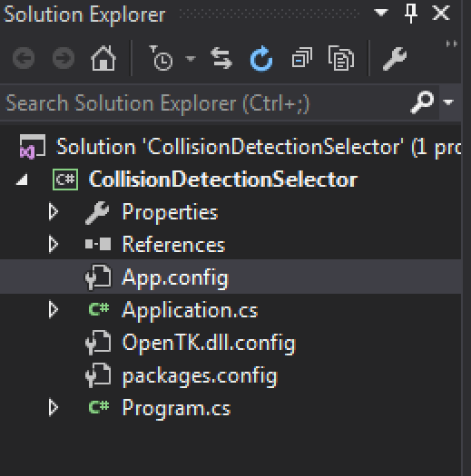

#New Repo Time!

Now that we're done with OpenGL it's time to start a new repo on github. Let's call this one "CollisionDetection". Make the repo, clone it, add the appropriate .gitignore, commit the changes. Make a new Visual Studio solution, inside the cloned repo. The solution only needs to have 1 project in it.

Once you have a solution and project set up, put the math libary we wrote into it. Collisions are going to be math heavy. Also set up OpenTK. Even tough we will not focus on rendering, we will want to visualize this stuff.

## Sample Framework

I'll provide you with code for a compleate sample framework. The way it will work is there is a base class ```Application```, you will subclass this to make your own samples. When you run the application a console will pop up, it will scan your code for all subclasses of application. Then it will ask you which one to run.

This should make running sample application super simple! __Program.cs__ already exists in your application, go ahead and add a new class, name it __Application.cs__

At this point, your directory tree should resamble this, only two .cs files.

