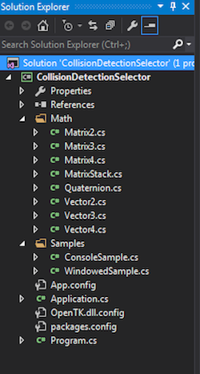

# Samples

Let's go trough and implement two samples real quick. This should give you a general idea of how to make new samples. We're also going to be creating all these in a folder to keep our project orgonized.

* First, add a new folder, lets call it __Samples__
* Add a new file __ConsoleSample.cs__
* Add a new file __WindowedSample.cs__

From now on, all new samples will be made in this folder. ONLY put classes that create a window (or console) in here. No helper classes! We are going to make lots of classes that are just objects, don't put them in here. If you want you can create a new "Collision" directory for those, or just put them into the root, next to Program.cs; but keep the "Samples" directory clean!

The project layout should look like this:

