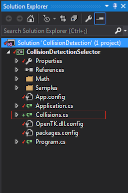

##Shapes & Points

We're going to start out by implementing some basic shapes (We're going to make classes for each shape) and methods to test if a point is inside any of the shapes. This may seem simple but it's the basis of collision detection. In later chapters we're going to add functionality to our existing shape classes.

You SHOULD NOT out put primitives in the __Samples__ directory. Remember, only code that creates a window (or console) goes in sample. You might want to consider making a "Collision" directory or something.

##Collision class
 
Aside from shapes and points, we're going to make a helper class called ```Collision```. This class will hold the actual collision logic. It's going to contain only public static methods. This is an example of how collisions will work when we're done:

```cs
// THIS IS JUST SAMPLE CODE, DON'T COPY IT!

// Integrate function causes moving sphere to rest on plane
void Integrate(Sphere sphere, Plane plane, float velocity) {
    // CollisionResult is a helper class, it contains information
    // about a collision that could happen
    CollisionResult collision = Collision.MovingSpherePlane(sphere, plane, velocity);
    if (collision.happened) {
        // Collision happened, offset the sphere to be above the plane
        sphere.position = collision.point - collision.incident;
    }
}
```

## Let's Get Started!

* Add a new ```Collision.cs``` file to the project
* For now, this class is going to be empty



And let's just add the skeleton, like ```Program``` and ```Application``` this class is going to live in global scope.
