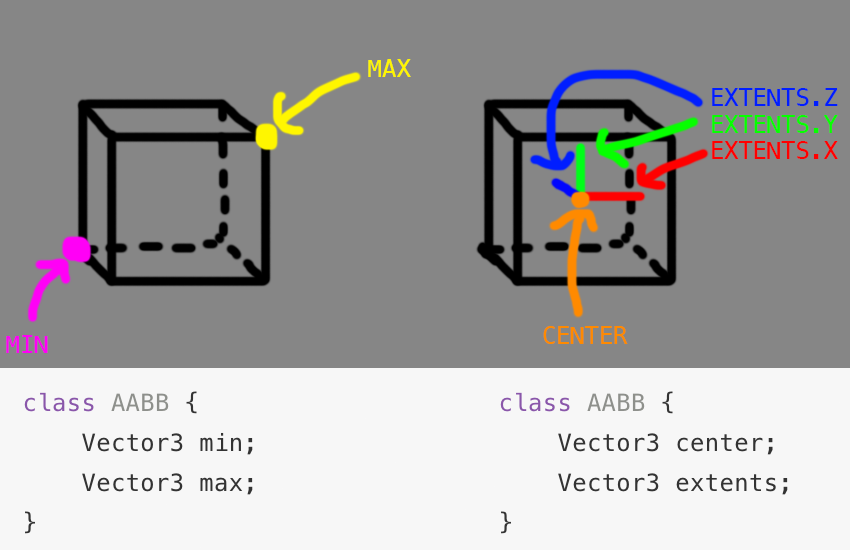

#WIP - This section is being worked on

#AABB - Axis Aligned Bounding Box

An AABB (Axis Aligned Bounding Box) is a 3D box. It's width / height / depth don't have to be equal, but the width is always aligned to the X axis, the height to the Y axis and depth to the Z axis. That is to say, this box can't be rotated.

AABB's are pivotal to spacial partitioning, they let us cut a section of 3D space up into smaller sections of 3D space. AABB's also serve as a great acceleration structure for hit detection, but more on that later.

The first question we have to ask is how to represent an AABB? There are two common ways, by storing the leftmost and rightmost corners, OR by storing the center point and a vector of how far the box extends on each side.

Most mathematical texts describe an AABB as a min and max point. Because of this, i like to design my AABB classes as such. However, there is a bit of a problem, what if a user sets the min.X of the AABB to be greater than the max.X?

