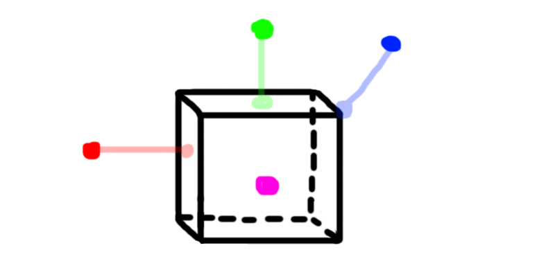

#Closest point on AABB

Finding the closest point on a plane is not too difficult. Consider the following image:



The red, green and blue dots are outside the AABB, the closest point to them on the AABB is shown in a transparent projection. The purple dot is INSIDE the aabb. The closest point to the purple one is its-self.

Given that image, can you figure out the rules of the closest point?

### The algorithm

To find the closest point on an AABB, we just clamp the X, Y and Z positions of the point to the AABB! Consider the following if sequence for the X axis test:

* If point.X > aabb.max.X
  * Set result.X = aabb.max.X
* Else if point.X < aabb.min.X
  * Set result.X = aabb.min.X
* Else
  * Set result.X = point.X

You might have noticed something odd, if the point is outside the min or max x it is clamped to either the min or max. This puts the point on the edge of the AABB. But if the test point is inside of the aabb, it is not clamped to an edge, rather it just returns the test point's position (on the axis being tested).

This might sound like a bug at first, but it's not. In order to use the closest-point algorithm, we need the closest point to be inside the volume sometimes. 

## On Your Own

Add the following function to the ```Collisions``` class:

```cs
public static Point ClosestPoint(AABB aabb, Point point)
```

And provide an implementation for it!

### Unit Test

