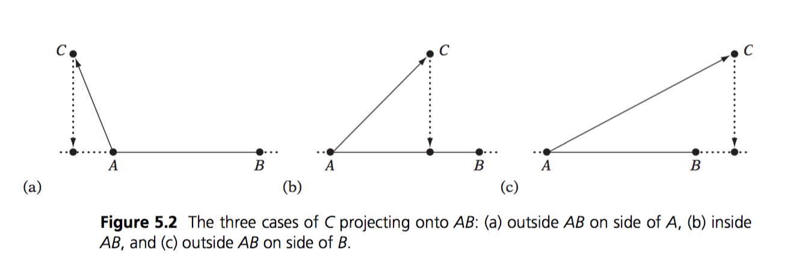
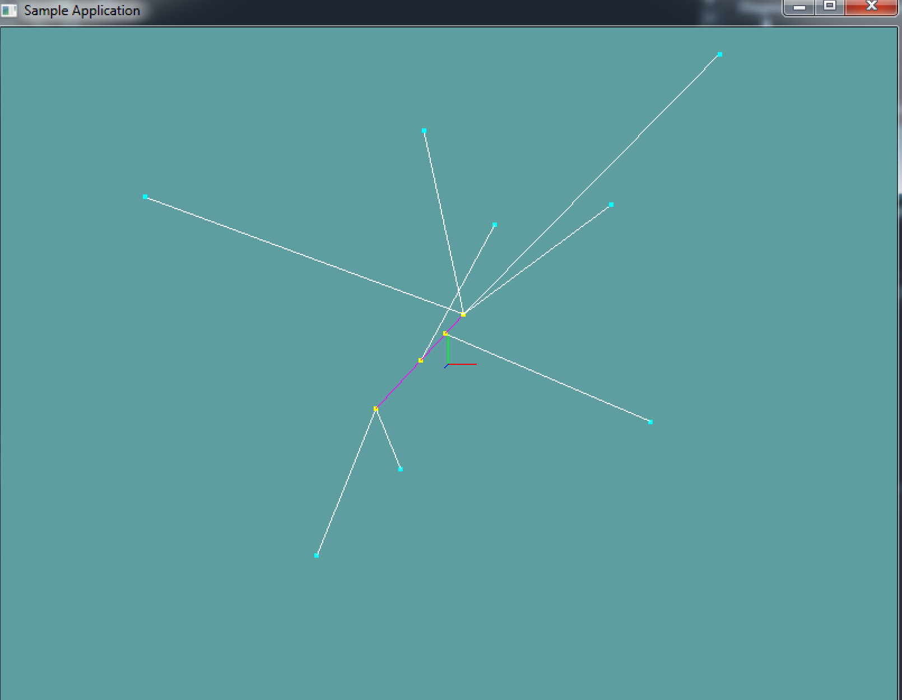

# Closest Point On Line

Finding the closest point on a line to another point is simple vector math. Think of the line as a vector, let's call it AB. The point is another vector, C. To get the closest point on the line to the vector we simply project C onto AB. 

This works for a Line, but we don't actually have a line, we have a __line segment__. For this, you also have to interpolate the projected point. The interpolation formula is simple:

```
I(t) = START + t * (END - START)
```

```t``` in the above example is time. It's how far we've interpolated. ```I``` is the interpolation result. ```START``` and ```END``` are self explanatory. This also works with regular numbers, let's try to interpolate 25% (0.25f) between 1 and 3:

```
// Formula
I(t) = START + t * (END - START)
// Substitute start and end
I(t) = 1 + t * (3 - 1)
// Substitute t
I(0.25) = 1 + 0.25 * (3 - 1)
// Evaluate
I(0.25) = 1.5
```

This works, let's reason it out. The range from 1 to 3 is 2. So the total distance between 1 and 3 is 2. 1/4 (0.25) of 2 is .5. If we want to interpolate 25% between 1 and 3 we add .5 to 1, resulting in 1.5.

Similarly, if you wanted to interpolate 1/2 between 1 and 3, the result would be 2. This is becuase 2 is half-way between 1 and 3.

### The algorithm

The above formula will intepolate in all dimensions. Back to what i was saying, there are 3 ways to project a point (C) onto a line (AB):



In the first and last example T would be __< 0__ and __> 1__. In the middle example T is between 0 and 1. In order for the projected point to be ON THE SEGMENT, we need to clamp T between 0 and 1. 

```cs
// This is Pseudo code, the types are not 100% correct,
// that is, casting is needed. But the formula is fully 
// implemented for demonstration purposes

// Given segment AB and Point C, compute the closest point D
// on segment AB. Also return T where D(T) = A + T * (B - A)
Point ClosestPoint(Line ab, Point c, out float t) {
  // Break ab appart into components a and b
  Vector a = ab.start;
  Vector b = ab.end;
  
  // Project c onto ab, computing the 
  // paramaterized position d(t) = a + t * (b - a)
  t = Dot(c - a, ab) / Dot(ab, ab);
  
  // Clamp T to a 0-1 range. If t was < 0 or > 1
  // then the closest point was outside the line!
  t = Clamp(t, 0f, 1f);
  
  // Compute the projected position from the clamped t
  Point d = new Point(a + t * ab.ToVector());
  
  // Return result
  return d;
}

// Provide a useful overload, we don't always care about T
Point ClosestPoint(Line ab, Point c) {
    float t = 0f;
    return ClosestPoint(ab, c, out t);
}
```

## On Your Own

Add the following functions to the ```Collisions``` class:

```cs
public static Point ClosestPoint(Line ab, Point c, out float t)
public static Point ClosestPoint(Line ab, Point c)
```

And provide an implementation for them! The second function can just call the first function. It's for conveniance, because we don't always care about t.

### Unit Test

You can [Download](../Samples/CollisionLine.rar) the samples for this chapter to see if your result looks like the unit test.

This code doesn't spit out any errors. It's all visual. There is 1 line and several points. The points are projected to the line and lines are drawn between the points.



```cs
using OpenTK.Graphics.OpenGL;
using Math_Implementation;
using CollisionDetectionSelector.Primitives;

namespace CollisionDetectionSelector.Samples {
    class ClosestPointLine : Application {
        protected Vector3 cameraAngle = new Vector3(120.0f, -10f, 20.0f);
        protected float rads = (float)(System.Math.PI / 180.0f);

        Line testLine = new Line(new Point(-3, -2, -1), new Point(1, 2, 3));
        Point[] testPoints = new Point[] {
            new Point(7, -2, -1),
            new Point(-4, -7, -8),
            new Point(7, 8, 5),
            new Point(1, 5, -5),
            new Point(-6, 5, 7),
            new Point(1, 6, 8),
            new Point(-7, -10, -4),
            new Point(5, 5, 3)
        };

        public override void Intialize(int width, int height) {
            GL.Enable(EnableCap.DepthTest);
            GL.PointSize(4f);
        }

        public override void Render() {
            Vector3 eyePos = new Vector3();
            eyePos.X = cameraAngle.Z * -(float)System.Math.Sin(cameraAngle.X * rads * (float)System.Math.Cos(cameraAngle.Y * rads));
            eyePos.Y = cameraAngle.Z * -(float)System.Math.Sin(cameraAngle.Y * rads);
            eyePos.Z = -cameraAngle.Z * (float)System.Math.Cos(cameraAngle.X * rads * (float)System.Math.Cos(cameraAngle.Y * rads));

            Matrix4 lookAt = Matrix4.LookAt(eyePos, new Vector3(0.0f, 0.0f, 0.0f), new Vector3(0.0f, 1.0f, 0.0f));
            GL.LoadMatrix(Matrix4.Transpose(lookAt).Matrix);

            DrawOrigin();

            GL.Color3(1f, 0f, 1f);
            testLine.Render();

            GL.Color3(0f, 1f, 1f);
            foreach(Point point in testPoints) {
                point.Render();
            }

            GL.Color3(1f, 1f, 0f);
            foreach (Point point in testPoints) {
                Point closest = Collisions.ClosestPoint(testLine, point);
                closest.Render();
            }

            GL.Color3(1f, 1f, 1f);
            foreach (Point point in testPoints) {
                Point closest = Collisions.ClosestPoint(testLine, point);
                Line newLine = new Line(closest, point);
                newLine.Render();
            }
        }

        public override void Update(float deltaTime) {
            cameraAngle.X += 45.0f * deltaTime;
        }

        protected void DrawOrigin() {
            GL.Begin(PrimitiveType.Lines);
            GL.Color3(1f, 0f, 0f);
            GL.Vertex3(0f, 0f, 0f);
            GL.Vertex3(1f, 0f, 0f);
            GL.Color3(0f, 1f, 0f);
            GL.Vertex3(0f, 0f, 0f);
            GL.Vertex3(0f, 1f, 0f);
            GL.Color3(0f, 0f, 1f);
            GL.Vertex3(0f, 0f, 0f);
            GL.Vertex3(0f, 0f, 1f);
            GL.End();
        }

        public override void Resize(int width, int height) {
            GL.Viewport(0, 0, width, height);
            GL.MatrixMode(MatrixMode.Projection);
            float aspect = (float)width / (float)height;
            Matrix4 perspective = Matrix4.Perspective(60, aspect, 0.01f, 1000.0f);
            GL.LoadMatrix(Matrix4.Transpose(perspective).Matrix);
            GL.MatrixMode(MatrixMode.Modelview);
            GL.LoadIdentity();
        }
    }
}
```