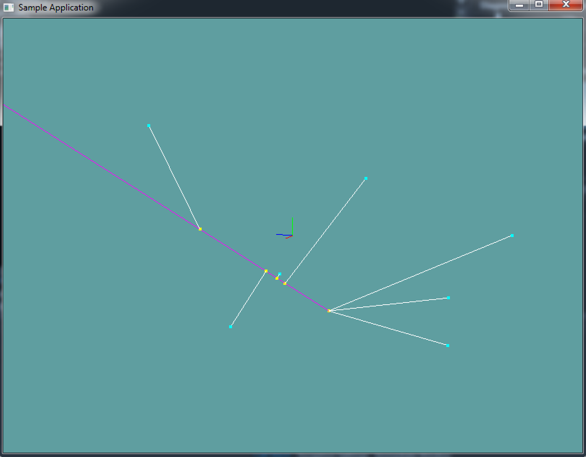

#Closest point on Ray

Finding the closest point on a ray is similar to finding the closest point on a line! When we check if a point is on a line segment, we do so by projecting the point onto an infinate line. Then, we clamp the projection to a range of 0 to 1. The 0 to 1 range is what makes the check be on a line segment.

A ray goes infinatley in one direction. If we change the formula to only cap to 0, the same formula will work! Becuase a ray has no length, the interpolated t value is useless.

Now you might think to yourself, a point has a start and end, a ray only has a start and direction, how do i get an end point?!?! Well, because we don't cap the interpolation at 1, the end point doesn't matter. It just has to be some point on the ray. You can easily get some point by adding the normal to the origin of the ray.

If the above doesn't sound familiar, re-read Closest Point On Line and make sure you understand the algorithm behind it! Call me if you have questions!

### The algorithm

Again, it's so similar to the closest point on line algorithm, i just copied it and made some subtle changes. You shouldn't even need this guide, you should be able to make the same changes based on the above paragraph.

```cs
// This is Pseudo code, the types are not 100% correct,
// that is, casting is needed. But the formula is fully 
// implemented for demonstration purposes

Point ClosestPoint(Ray r, Point c) {
  // t is now local, there is no need to pass it out of the function
  float t = 0f;
  // Construct a line segment out of the ray
  Line ab = new Line(r.Position, r.Position + r.Normal);
  // Break ray into a (start) and b (end) components
  Vector a = r.Position;
  Vector b = r.Position + r.Normal;
  
  // Project c onto ab, computing the 
  // paramaterized position d(t) = a + t * (b - a)
  t = Dot(c - a, ab) / Dot(ab, ab);
  
  // We only want to clamp t in the positive direction.
  // The ray extends infinatley in this direction!
  t = Max(t, 0f);
  
  // Compute the projected position from the clamped t
  // Notice we multiply r.Normal by t, not AB.
  // This is becuase we want the ray in the direction 
  // of the normal, which technically the line segment is
  // but this is much more explicit and easy to read.
  Point d = new Point(a + t * r.Normal);
  
  // Return result
  return d;
}
```

## On Your Own

Add the following function to the ```Collisions``` class:

```cs
public static Point ClosestPoint(Ray r, Point c)
```

And provide an implementation for it!

### Unit Test

You can [Download](../Samples/CollisionRay.rar) the samples for this chapter to see if your result looks like the unit test.

This code doesn't spit out any errors. It's all visual. There is 1 ray and several points. The points are projected to the ray and lines are drawn between the points.

This will look very similar to the Closest Point On Line Sample!




```cs
using OpenTK.Graphics.OpenGL;
using Math_Implementation;
using CollisionDetectionSelector.Primitives;

namespace CollisionDetectionSelector.Samples {
    class ClosestRayLine : Application {
        protected Vector3 cameraAngle = new Vector3(120.0f, -10f, 20.0f);
        protected float rads = (float)(System.Math.PI / 180.0f);

        Ray testRay = new Ray(new Point(-10, -8, 1), new Vector3(1, 2, 3));
        Point[] testPoints = new Point[] {
            new Point(-8, -5, -8),
            new Point(-6, -9, 8),
            new Point(-9, -5, 5),
            new Point(-4, 3, -3),
            new Point(2, 1, -10),
            new Point(8, 5, 2),
            new Point(4, -3, -8)
        };

        public override void Intialize(int width, int height) {
            GL.Enable(EnableCap.DepthTest);
            GL.PointSize(4f);

            /*System.Random r = new System.Random();
            string output = "new Point(" + (r.Next() % 20 - 10) + ", " + (r.Next() % 20 - 10) + ", " + (r.Next() % 20 - 10) + "),\n";
            for (int i = 0; i < 6; ++i) {
                output += "new Point(" + (r.Next() % 20 - 10) + ", " + (r.Next() % 20 - 10) + ", " + (r.Next() % 20 - 10) + "),\n";
            }
            System.IO.File.WriteAllText(@"C:\Users\WinVPC\Desktop\Points.txt", output);*/

        }

        public override void Render() {
            Vector3 eyePos = new Vector3();
            eyePos.X = cameraAngle.Z * -(float)System.Math.Sin(cameraAngle.X * rads * (float)System.Math.Cos(cameraAngle.Y * rads));
            eyePos.Y = cameraAngle.Z * -(float)System.Math.Sin(cameraAngle.Y * rads);
            eyePos.Z = -cameraAngle.Z * (float)System.Math.Cos(cameraAngle.X * rads * (float)System.Math.Cos(cameraAngle.Y * rads));

            Matrix4 lookAt = Matrix4.LookAt(eyePos, new Vector3(0.0f, 0.0f, 0.0f), new Vector3(0.0f, 1.0f, 0.0f));
            GL.LoadMatrix(Matrix4.Transpose(lookAt).Matrix);

            DrawOrigin();

            GL.Color3(1f, 0f, 1f);
            testRay.Render();

            GL.Color3(0f, 1f, 1f);
            foreach (Point point in testPoints) {
                point.Render();
            }

            GL.Color3(1f, 1f, 0f);
            foreach (Point point in testPoints) {
                Point closest = Collisions.ClosestPoint(testRay, point);
                closest.Render();
            }

            GL.Color3(1f, 1f, 1f);
            foreach (Point point in testPoints) {
                Point closest = Collisions.ClosestPoint(testRay, point);
                Line newLine = new Line(closest, point);
                newLine.Render();
            }
        }

        public override void Update(float deltaTime) {
            cameraAngle.X += 45.0f * deltaTime;
        }

        protected void DrawOrigin() {
            GL.Begin(PrimitiveType.Lines);
            GL.Color3(1f, 0f, 0f);
            GL.Vertex3(0f, 0f, 0f);
            GL.Vertex3(1f, 0f, 0f);
            GL.Color3(0f, 1f, 0f);
            GL.Vertex3(0f, 0f, 0f);
            GL.Vertex3(0f, 1f, 0f);
            GL.Color3(0f, 0f, 1f);
            GL.Vertex3(0f, 0f, 0f);
            GL.Vertex3(0f, 0f, 1f);
            GL.End();
        }

        public override void Resize(int width, int height) {
            GL.Viewport(0, 0, width, height);
            GL.MatrixMode(MatrixMode.Projection);
            float aspect = (float)width / (float)height;
            Matrix4 perspective = Matrix4.Perspective(60, aspect, 0.01f, 1000.0f);
            GL.LoadMatrix(Matrix4.Transpose(perspective).Matrix);
            GL.MatrixMode(MatrixMode.Modelview);
            GL.LoadIdentity();
        }
    }
}
```