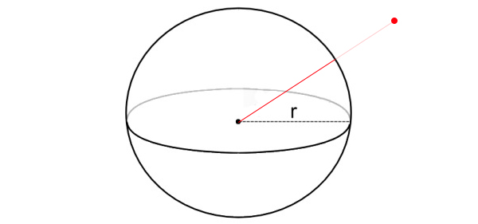

# WIP, This page is still being worked on!

# Closes Point On Sphere

Finding the closest point on a sphere can be just as useful as knowing if a point is inside a sphere or not. The closest point on sphere is often used for AI, Physics simuation and special effects.

The key to the closest point on sphere algorithm is to realize that no matter where that point may be, it will always be the same distance from the center of the sphere. That distance is equal to the radius.

Before reading the next paragraph (Because i will answer the question there), see if you can figure out given a point and a sphere how to get the closest point on the sphere to that point. I'll provide an image:



### The algorithm

The algorithm is not as straight forward as Point in Sphere, but it's pretty simple. First, you need to subtract the point from the center of the sphere. Subtraction order matters on this one. You are left with a vector that points from the center of the sphere, to the test point.

Normalize this vector, then multiply it by the radius of the sphere. You now have a vector that points from the center of the sphere, to the edge of the sphere, towards the point in question.

Finally, add the position of the sphere (as a vector) to the new vector you have. This gives you a vector that points from the origin of the world to the edge of the sphere (A Point)

### Prototype

The sample code below is probably not needed, it's a literal translation of the paragraph above. 

```cs
// THIS BLOCK IS JUST SAMPLE CODE, DON'T COPY IT!
Point ClosestPoint(Vector3 spherePos, float sphereRad, Vector3 point) {
    // First, get a vetor from the sphere to the point
    Vector3 sphereToPoint = point - spherePos;
    // Normalize that vector
    sphereToPoint = Vector3.Normalize(sphereToPoint);
    // Adjust it's length to point to edge of sphere
    sphereToPoint *= sphereRad;
    // Translate into world space
    Vector3 worldPoint = spherePos + sphereToPoint;
    // Return new point
    return new Point(worldPoint.x, worldPoint.y, worldPoint.z);
}
```

## On Your Own

Add the following function to the ```Collisions``` class:

```cs
public static Point ClosestPoint(Sphere sphere, Point point)
```

And provide an implementation for it!

### Unit Test

This unit test will test both the point in sphere, and closest point to sphere sections of code. If any kind of error occurs, red text should be printed to the console. The camera in this example orbits, but you can disable that by commenting out the update method.

If you don't see anything on screen, it's because the math library is probably wrong. This would happen if you forgot to copy the math implementation from OpenGL1X into Math-Implementation, and used the old Math-Implementation library.

Here is a screenshot of what the unit test will look like:


```cs
using OpenTK.Graphics.OpenGL;
using Math_Implementation;
// The namespace where your primitives live!

namespace CollisionDetectionSelector.Samples {
    class ClosestPointSample : Application {
        protected Vector3 cameraAngle = new Vector3(120.0f, -10f, 20.0f);
        protected float rads = (float)(System.Math.PI / 180.0f);

        Point[] testPoints = new Point[] {
            new Point(1, 0, 0),
            new Point(0, 1, 0),
            new Point(0, 0, 1),
            new Point(0.5f, 0.5f, 0.5f),
            new Point(2f, 2f, 2f),
            new Point(3f, 3f, 3f),
            new Point(4f, 4f, 4f),
        };

        Point farPoint = new Point(0f, 0f, 7f);
        Sphere testSphere = new Sphere(1f, 1f, 0f, 2f);

        public override void Intialize(int width, int height) {
            GL.Enable(EnableCap.CullFace);
            GL.PolygonMode(MaterialFace.FrontAndBack, PolygonMode.Line);
            GL.PointSize(2f);

            bool[] results = new bool[] { true, true, true, true, false, false, false };
            for (int i = 0; i < testPoints.Length; ++i) {
                bool collision = Collisions.PointInSphere(testSphere, testPoints[i]);
                if (collision != results[i]) {
                    System.Console.ForegroundColor = System.ConsoleColor.Red;
                }
                System.Console.Write("Point: " + testPoints[i]);
                if (collision) {
                    System.Console.WriteLine(" is in sphere");
                }
                else {
                    System.Console.WriteLine(" is not in sphere");
                }
                System.Console.ResetColor();
            }

            Vector3 expected = new Vector3(0.719944f, 0.719944f, 1.960392f);
            Point closest = Collisions.ClosestPoint(testSphere, farPoint);
            if (expected != closest.ToVector()) {
                System.Console.ForegroundColor = System.ConsoleColor.Red;
            }
            System.Console.WriteLine("Closest point: " + closest);
            if (expected != closest.ToVector()) {
                System.Console.WriteLine("Expected: " + expected.X + ", " + expected.Y + ", " + expected.Z);
            }
            System.Console.ResetColor();
        }

        public override void Render() {
            Vector3 eyePos = new Vector3();
            eyePos.X = cameraAngle.Z * -(float)System.Math.Sin(cameraAngle.X * rads * (float)System.Math.Cos(cameraAngle.Y * rads));
            eyePos.Y = cameraAngle.Z * -(float)System.Math.Sin(cameraAngle.Y * rads);
            eyePos.Z = -cameraAngle.Z * (float)System.Math.Cos(cameraAngle.X * rads * (float)System.Math.Cos(cameraAngle.Y * rads));
            
            Matrix4 lookAt = Matrix4.LookAt(eyePos, new Vector3(0.0f, 0.0f, 0.0f), new Vector3(0.0f, 1.0f, 0.0f));
            GL.LoadMatrix(Matrix4.Transpose(lookAt).Matrix);

            DrawOrigin();

            GL.Color3(1f, 1f, 1f);
            testSphere.Render();

            foreach(Point point in testPoints) {
                if (Collisions.PointInSphere(testSphere, point)) {
                    GL.Color3(1f, 0f, 0f);
                }
                else {
                    GL.Color3(0f, 1f, 0f);
                }
                point.Render();
            }

            GL.Color3(0f, 0f, 1f);
            farPoint.Render();

            Point closest = Collisions.ClosestPoint(testSphere, farPoint);
            GL.Color3(1f, 0f, 1f);
            GL.Begin(PrimitiveType.Lines);
            GL.Vertex3(testSphere.Position.X, testSphere.Position.Y, testSphere.Position.Z);
            GL.Vertex3(closest.X, closest.Y, closest.Z);
            GL.End();

            GL.Color3(1f, 1f, 0f);
            closest.Render();

            GL.Color3(0f, 1f, 1f);
            GL.Begin(PrimitiveType.Lines);
            GL.Vertex3(closest.X, closest.Y, closest.Z);
            GL.Vertex3(farPoint.X, farPoint.Y, farPoint.Z);
            GL.End();
        }

        public override void Update(float deltaTime) {
           cameraAngle.X += 45.0f * deltaTime;
        }

        protected void DrawOrigin() {
            GL.Begin(PrimitiveType.Lines);
            GL.Color3(1f, 0f, 0f);
            GL.Vertex3(0f, 0f, 0f);
            GL.Vertex3(1f, 0f, 0f);
            GL.Color3(0f, 1f, 0f);
            GL.Vertex3(0f, 0f, 0f);
            GL.Vertex3(0f, 1f, 0f);
            GL.Color3(0f, 0f, 1f);
            GL.Vertex3(0f, 0f, 0f);
            GL.Vertex3(0f, 0f, 1f);
            GL.End();
        }

        public override void Resize(int width, int height) {
            GL.Viewport(0, 0, width, height);
            GL.MatrixMode(MatrixMode.Projection);
            float aspect = (float)width / (float)height;
            Matrix4 perspective = Matrix4.Perspective(60, aspect, 0.01f, 1000.0f);
            GL.LoadMatrix(Matrix4.Transpose(perspective).Matrix);
            GL.MatrixMode(MatrixMode.Modelview);
            GL.LoadIdentity();
        }
    }
}
```