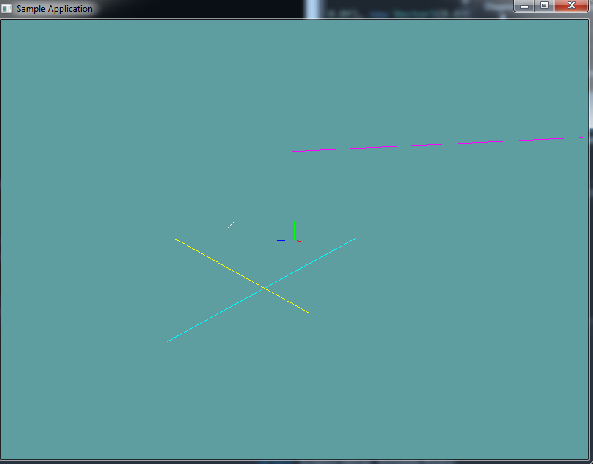

#Line

Technically a line is the intersection of 2 planes. It runs infinatley in all directions. What we're going to calla  line is actually a __Line Segment__. It's a line between two points. Unlike a line, a line segment does have a length.

Given the above definition, defining a line is pretty simple:

```cs
class Line {
    public Point start;
    public Point end;
}
```

There is really no magic to a line. For example if you want to get the length of a line, it's the same as getting the length of a vector! You get a vector by subtracting start from end, then find the length!

### Code Guide

The ```Line``` class is straight forward. You can follow this guide for implementation, or make your own.

```cs
TODO
```


## On Your Own

Implement the Line class. You can use the code guide above, or use your own implementation

### Sample / Unit Test

You can [Download](../Samples/CollisionLine.rar) the samples for this chapter to see if your result looks like the unit test.

This example is visual only, no errors will be printed to the console if the code is bad. This is what the final render should look like:



```cs
TODO
```