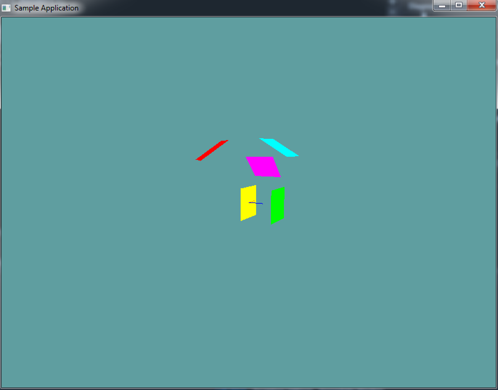

#Plane

A plane is a flat surface that extends infinateley in all directions. There are three common ways to represent a plane:

* [Three points (not on a straight line)](https://www.khanacademy.org/math/geometry/tools-of-geometry/points-lines-planes/v/specifying-planes-in-three-dimensions)
* [A normal and a point on the plane](https://www.khanacademy.org/math/linear-algebra/vectors_and_spaces/dot_cross_products/v/defining-a-plane-in-r3-with-a-point-and-normal-vector)
* __A normal and the distance from origin__

Your native plane implementation should represent the plane as the third, a normal and a distance from origin. This is the plane equasion. Given the normal and distance, any point ```X``` that satisfyes the equation

```
Dot(X, Normal) == Distance
```

Is on the plane. We can represent a plane as a normal and a distance from origin, but we can still [construct it from 3 points](http://www.maplesoft.com/support/help/maple/view.aspx?path=MathApps%2FEquationofaPlane3Points) using the following formula:

```cs
// THIS BLOCK IS JUST SAMPLE CODE, DON'T COPY IT!
Plane ComputePlane(Point a, Point b, Point c) {
    Plane result = new Plane();
    result.Normal = Normalize(Cross(b - a, c - a));
    result.Distance = Dot(result.Normal, a);
    return result;
}
```

### Code Guide

Because the plane's normal is finicky, i suggest not exposing it directly. Instead, have a private ```_normal``` variable, and a ```Normal``` getter / setter. Whenever ```Normal``` is set, it just sets ```_normal``` and calls ```Normalize``` on it.

```cs
using System;
using OpenTK.Graphics.OpenGL;
using Math_Implementation;

namespace CollisionDetectionSelector.Primitives {
    class Plane {
        protected Vector3 _normal = new Vector3();

        public Vector3 Normal {
            // TODO: Getter and setter
            // remember, this just accesses and sets _normal
            // Which must be normalized when set!
        }
        public float Distance = 0f;

        public Plane() {
            // TODO: Make a default plane
            // by default normal is (0, 0, 1) and distance is 0
        }

        public Plane(Vector3 norm, float dist) {
            // TODO
        }

        public Plane(Point a, Point b, Point c) {
            // TODO: Construct this plane from a point
        }

        // No need to edit anything below this
        public void Render(float scale = 1f) {
            //Debug Normal
            /* // GL.Color3(1f, 1f, 0f);
            GL.Begin(PrimitiveType.Lines);
            GL.Vertex3(0f, 0f, 0f);
            GL.Vertex3(Normal.X * 500, Normal.Y * 500, Normal.Z * 500);
            GL.End(); */

            // Construct plane orientation
            Vector3 forward = new Vector3(Normal.X, Normal.Y, Normal.Z);
            Vector3 up = new Vector3(0f, 1f, 0f);
            Vector3 right = Vector3.Cross(forward, up);
            up = Vector3.Cross(right, forward);
            
            // Because this is going to be a matrix, it needs to be normalized
            forward.Normalize();
            right.Normalize();
            up.Normalize();

            // Create plane model matrix
            Matrix4 rot = new Matrix4(right.X, up.X, -forward.X, 0.0f,
                right.Y, up.Y, -forward.Y, 0.0f,
                right.Z, up.Z, -forward.Z, 0.0f,
                0.0f, 0.0f, 0.0f, 1.0f);
            Matrix4 trans = Matrix4.Translate(Normal * Distance);
            Matrix4 model = trans * rot;

            // Load matrix and render plane
            GL.PushMatrix();
            GL.MultMatrix(model.OpenGL);
            GL.Scale(scale, scale, scale);
            //GL.Color3(1f, 1f, 1f);
            GL.Begin(PrimitiveType.Quads);
            GL.Vertex3(-1, -1, 0);
            GL.Vertex3(-1, 1, 0);
            GL.Vertex3(1, 1, 0);
            GL.Vertex3(1, -1, 0);
            GL.End();
            GL.PopMatrix();
         }

        public override string ToString() {
            return "N: (" + Normal.X + ", " + Normal.Y + ", " + Normal.Z + "), D: " + Distance;
        }
    }
}
```

Unlike the previous primitives the ```Render``` function for the plane takes a scale. By default, this function renders a plane that ranges from -1 to 1. But because a plane is infinate, you may need it to be larger. If that's the case, provide a large number as the scale argument when calling ```Render```

## On Your Own

Implement the Plane class. You can use the code guide above, or use your own implementation

### Sample / Unit Test

#TODO: Download

This example is visual only, no errors will be printed to the console if the code is bad. This is what the final render should look like:



```cs
using OpenTK.Graphics.OpenGL;
using Math_Implementation;
using CollisionDetectionSelector.Primitives;
using Gwen.Control;

namespace CollisionDetectionSelector.Samples {
    class PlaneSample : Application {
        protected Vector3 cameraAngle = new Vector3(120.0f, -10f, 20.0f);
        protected float rads = (float)(System.Math.PI / 180.0f);

        Plane[] plane = new Plane[] {
            new Plane(),
            new Plane(),
            new Plane(new Vector3(0f, 5f, 3f), 4f),
            new Plane(new Point(5, 6, 7), new Point(6, 5, 4), new Point(1, 2, 3)),
            new Plane(new Point(0, 0, 2), new Point(1, 1, 2), new Point(2, 0, 2))
        };

        public override void Intialize(int width, int height) {
            //GL.Enable(EnableCap.CullFace);
            GL.Enable(EnableCap.DepthTest);
            GL.PolygonMode(MaterialFace.FrontAndBack, PolygonMode.Fill);
            GL.PointSize(2f);

            plane[1].Normal = new Vector3(1f, 1f, 0f);
            plane[1].Distance = 3.0f;
            plane[3].Distance = 4f;

        }

        public override void Render() {
            Vector3 eyePos = new Vector3();
            eyePos.X = cameraAngle.Z * -(float)System.Math.Sin(cameraAngle.X * rads * (float)System.Math.Cos(cameraAngle.Y * rads));
            eyePos.Y = cameraAngle.Z * -(float)System.Math.Sin(cameraAngle.Y * rads);
            eyePos.Z = -cameraAngle.Z * (float)System.Math.Cos(cameraAngle.X * rads * (float)System.Math.Cos(cameraAngle.Y * rads));

            Matrix4 lookAt = Matrix4.LookAt(eyePos, new Vector3(0.0f, 0.0f, 0.0f), new Vector3(0.0f, 1.0f, 0.0f));
            GL.LoadMatrix(Matrix4.Transpose(lookAt).Matrix);

            DrawOrigin();

            float[][] renderColors = new float[][] {
                new float[] { 1f, 1f, 0f },
                new float[] { 1f, 0f, 1f },
                new float[] { 0f, 1f, 1f },
                new float[] { 1f, 0f, 0f },
                new float[] { 0f, 1f, 0f }
            };

            for (int i = 0; i < plane.Length; ++i) {
                GL.Color3(renderColors[i][0], renderColors[i][1], renderColors[i][2]);
                plane[i].Render();
            }
        }

        public override void Update(float deltaTime) {
            cameraAngle.X += 45.0f * deltaTime;
        }

        protected void DrawOrigin() {
            GL.Begin(PrimitiveType.Lines);
            GL.Color3(1f, 0f, 0f);
            GL.Vertex3(0f, 0f, 0f);
            GL.Vertex3(1f, 0f, 0f);
            GL.Color3(0f, 1f, 0f);
            GL.Vertex3(0f, 0f, 0f);
            GL.Vertex3(0f, 1f, 0f);
            GL.Color3(0f, 0f, 1f);
            GL.Vertex3(0f, 0f, 0f);
            GL.Vertex3(0f, 0f, 1f);
            GL.End();
        }

        public override void Resize(int width, int height) {
            GL.Viewport(0, 0, width, height);
            GL.MatrixMode(MatrixMode.Projection);
            float aspect = (float)width / (float)height;
            Matrix4 perspective = Matrix4.Perspective(60, aspect, 0.01f, 1000.0f);
            GL.LoadMatrix(Matrix4.Transpose(perspective).Matrix);
            GL.MatrixMode(MatrixMode.Modelview);
            GL.LoadIdentity();
        }
    }
}
```