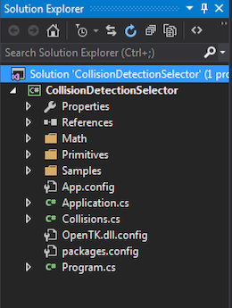
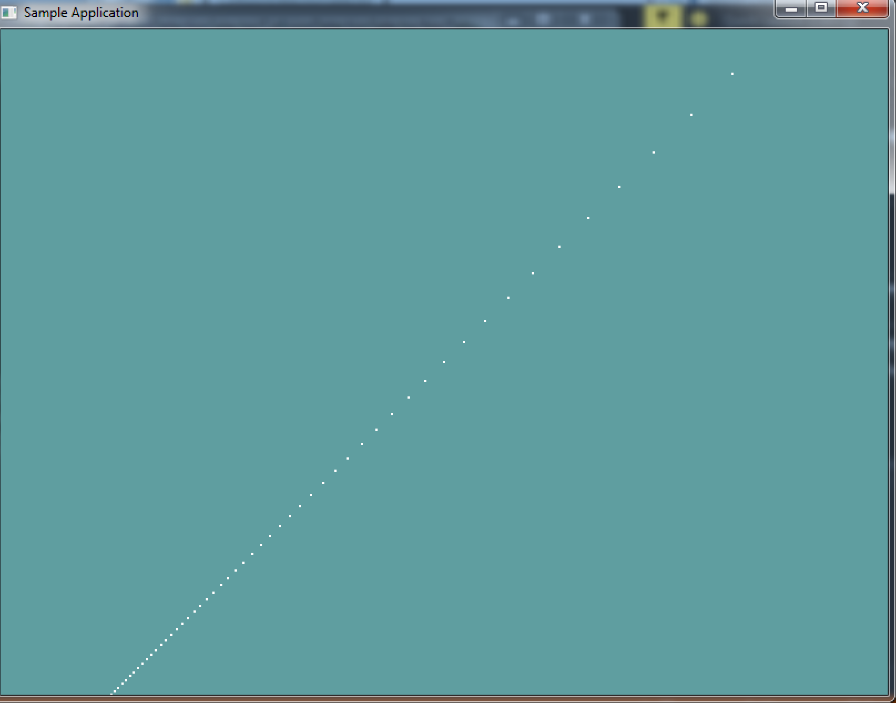

# Getting Started

Troughout this course, i'm going to be providing you with skeleton code for shape classes. __THIS CODE WILL NOT COMPILE__. You don't even have to use my code for implementation! The code is just there to give you an idea of what a class needs to have. It's pseudo-code.

__I will render it for you__. The difference being the ```Render``` function. Because this course is about collisions, not rendering, i will provide the rendering code for each primitive in full. 

I will also try to provide unit-tests or sample applications for everything __THIS CODE WILL COMPILE__, just copy / paste.

#### THERE IS NOTHING TO CODE UNTIL THE ON YOUR OWN SECTION

And that's going to stay that way troughout the rest of these chapters. Just read and digest the information until you get to the _On Your Own_ section. That's the only place where you need to implement stuff.

# Point

The point is the simplest 3D primitive we will use. That makes it a good primitive to start with. A point is just a 3D touple, a collection of 3 numbers. Therefore, it makes sense to use a Vector3 to represent a point.

Remember, this layout is to give you an idea of WHAT the class is and should do. You don't HAVE to implement the class like this, just be sure to understand what the clas does.

```cs
using OpenTK.Graphics.OpenGL;
using Math_Implementation;

class Point {
  protected Vector3 position = new Vector3();
  
  public Vector3 Position {
    get; // TODO (Make new vector)
    set; // TODO (Make new vector)
  }
  
  public float X { get; set; } // TODO: get, set
  public float Y { get; set; } // TODO: get, set
  public float Z { get; set; } // TODO: get, set
  
  public Point(); // TODO
  public Point(float x, float y, float z); // TODO
  public Point(Vector3 v); // TODO (Make new)
  
  public Vector3 ToVector(); // TODO (Return new)
  public void FromVector(Vector3 v); // TODO (Make new)
  
#region Rendering  
  public void Render() {
      GL.Begin(PrimitiveType.Points);
      GL.Vertex3(position.X, position.Y, position.Z);
      GL.End();
  }
  
  public override string ToString() {
    return "(" + X + ", " + Y + ", " + Z + ")";
  }
#endregion  
}
```

The actual Vector3 that is the position is protected. All getters and setters should more often than not need to make a new internal vector. I've noted in comments which ones i think need to do this? Why? Let's take a look at the constructor that takes a vector.

Let's say we implement this constructor wrong, without creating a new vecotr:

```cs
public Point(Vector3 v) {
    position = v;
}
```

Now if we run this code:

```cs
void DoPointUnitTest() {
    Vector3 v = new Vector3(2, 3, 4);
    Point unitPoint1 = v;
    Console.WriteLine("p1: " + unitPoint1.ToString());
    v.X = 7;
    Point unitPoint2 = v;
    Console.WriteLine("p1: " + unitPoint1.ToString());
    Console.WriteLine("p2: " + unitPoint2.ToString());
}
```

The output of the unit test will be:

```
p1: (2, 3, 4)
p1: (7, 3, 4)
p2: (7, 3, 4)
```

As you can see, the X value of p1 would get changed. This is wrong. It happens because by doing a simple assignment like that, we're setting the ```position``` vector as a reference to the ```v``` argument. Essentially both variables point to the same vector!

Instead the constructor needs to create a NEW vector, using the values of ```v```

```cs
public Point(Vector3 v) {
    position = new Vector3(v.X, v.Y, v.Z);
}
```

This works better. The vector that ```position``` is assigned to was made right there on the spot. If we run the same unit test as above, the new output will be:

```
p1: (2, 3, 4)
p1: (2, 3, 4)
p2: (7, 3, 4)
```

And that is what we'd expect. The takeaway here is to ALWAYS pay attention to what you're assigning, a reference, a new object or a struct. And know what ramifications that assignement might have! When can you get away with a reference assign, and when do you need to do a deep copy that duplicates data into a new object. It's a lot to think about!

### On Your own

Go ahead and implement the ```Point``` class on your own. There isn't much to do, just implement the stubs (Or figure out how you would implement it and do that, like i said you don't have to follow my pseudo-code i give, but you certainly can).

I made all my geometry classes under a geometry folder, to keep the project clean:



I'm going to be putting all geometry (Point, Sphere, AABB, Plane, etc...) under the Primitives folder. You can orgonize your project however you want, but i think this is the cleanest way of doing things.

## Sample / Unit Test

For every section i'll try to provide a sample application, or a unit test. For Points, make a new sample application (I called mine __PointSample.cs__ and add the following code to it:

```cs
using OpenTK.Graphics.OpenGL;
using Math_Implementation;
using CollisionDetectionSelector.Primitives;

namespace CollisionDetectionSelector.Samples {
    class PointSample : Application {
        Point[] points = null;

        public override void Intialize(int width, int height) {
            points = new Point[100];
            for (int i = 0; i < 100; ++i) {
                points[i] = new Point(i -50, i - 50, i - 50 );
            }
            GL.PointSize(2f);
        }

        public override void Render() {
            Matrix4 lookAt = Matrix4.LookAt(new Vector3(0.0f, 0.0f, 30.0f), new Vector3(0.0f, 0.0f, 0.0f), new Vector3(0.0f, 1.0f, 0.0f));
            GL.LoadMatrix(lookAt.OpenGL);

            for (int i = 0; i < points.Length; ++i) {
                points[i].Render();
            }
        }

        public override void Resize(int width, int height) {
            GL.Viewport(0, 0, width, height);
            GL.MatrixMode(MatrixMode.Projection);
            float aspect = (float)width / (float)height;
            Matrix4 perspective = Matrix4.Perspective(60, aspect, 0.01f, 1000.0f);
            GL.LoadMatrix(Matrix4.Transpose(perspective).Matrix);
            GL.MatrixMode(MatrixMode.Modelview);
            GL.LoadIdentity();
        }
    }
}
```

If you implemented your ```Point``` class well, the resulting sample window should look like this:

