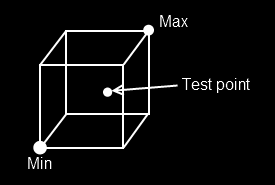

# Point in AABB

Figuring out if a point is inside of an AABB is pretty simple, especially if you think of an AABB as being represented by a min and a max point. Take a look at the image below and try to figure out the algorithm before i describe it in the next paragraph



### The algorithm

Looking at the above image, we can figure out that if a point is inside of a AABB:

* The relationship of point to min is such:
  * ```Point.X```, ```Point.Y``` and ```Point.Z``` are all __greater__ than ```Min.X```, ```Min.Y``` and ```Min.Z```.
* The relationship of point to max is such: 
  * ```Point.X```, ```Point.Y``` and ```Point.Z``` are all __less__ than ```Min.X```, ```Min.Y``` and ```Min.Z```.

That is to say, if ```Point > min && Point < max``` then the point is inside the AABB.

## On Your Own

Add the following function to the ```Collisions``` class:

```cs
public static bool PointInAABB(AABB aabb, Point point)
```

And provide an implementation for it!

### Unit Test

The sample / Unit test code for this section will be included with the next (Closest point on AABB) section.