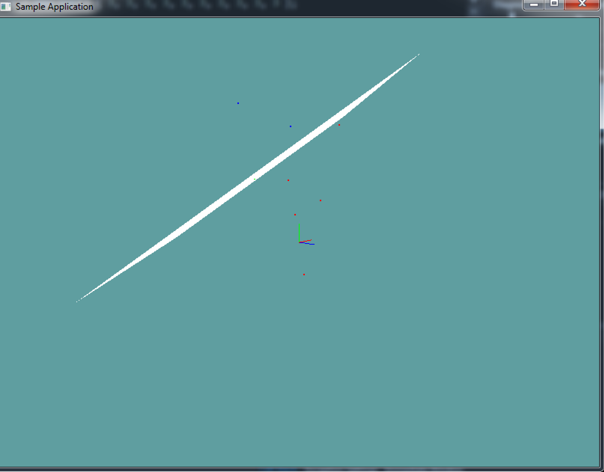

# Point on plane

Testing if a point is on a plane or not is fairly straight forward. In fact, we've done it multiple time. The key to this is the plane equasion!

```cs
// Plane representation
class Plane {
  float A, B, C; // Normal
  float D; // Dostance
}

// Plane equasion (XYZ is a point on the plane)
A*X + B*Y + C*Z + = Distance

// We can represent the above as:
Dot(Normal, UnknownPoint)  = Distance
```

Given this information we can figure out if a point is on a plane or not. Let's rearrange the distance equasion, so the distance is on the left side and the right side is 0:

```cs
Dot(UnknownPoint, Normal) - Distance == 0
```

If a point satisfies the above equasion it is on the plane!

```cs
A*X + B*Y + C*Z - D = Result
```

The resulting number is what we care about. 

* If it is 0, the point is on the plane
* If it is positive, the point is in front of the plane
* If it is negative, the point is behind the plane

## On Your Own

Add the following functions to the ```Collisions``` class:

```cs
public static bool PointOnPlane(Point point, Plane plane);
// Should return a positive number, a negative number or 0
public static float DistanceFromPlane(Point point, Plane plane);
```

And provide an implementation for them!

**HINT** ```PointOnPlane``` not behaving as expected? Remember, floating point numbers are finicky. You WILL need to do an epsilon comparison! 

```DistanceFromPlane``` does not need an epsilon, as it returns the result of an equation!

Try to implement the epsilon comparison on your own, if you can't figure it out, [here](https://gist.github.com/gszauer/8d424f0ec0eee18a382bfb676f0820d4) is how to do it.


### Unit Test

You can [Download](../Samples/CollisionPlane.rar) the samples for this chapter to see if your result looks like the unit test.

The unit test renders a large plane and colors the dots around it. Any point on the plane is green, points behind the plane are red, points in front of it are blue. The constructor will spit out errors if either of the above equasions is bad.



```cs
using OpenTK.Graphics.OpenGL;
using Math_Implementation;
using CollisionDetectionSelector.Primitives;

namespace CollisionDetectionSelector.Samples {
    class PointOnPlaneSample : Application {
        protected Vector3 cameraAngle = new Vector3(120.0f, -10f, 20.0f);
        protected float rads = (float)(System.Math.PI / 180.0f);

        Plane plane = new Plane(new Point(5, 6, 7), new Point(6, 5, 4), new Point(1, 2, 3));
        Point[] points = new Point[] {
            new Point(0f, 0f, 0f),
            new Point(2f, 6f, 1f),
            new Point(3f, 1f, -3f),
            new Point(-2f, -1f, 2f),
            new Point(7f, 7f, -7f),
            new Point(3f, 2f, -1f),
            new Point(10f, 3f, -10f),
            new Point(2f, 8f, -7f),
            new Point(-1.632993f, 3.265986f, -1.632993f),
            new Point(-1.020621f, 3.265986f, -2.245366f)
        };

        public override void Intialize(int width, int height) {
            GL.Enable(EnableCap.DepthTest);
            GL.PointSize(2f);
            plane.Distance = 4f;

            int[] expected = new int[] { -1, -1, -1, -1, 1, -1, -1, 1, 0, 0 };
            int[] result = new int[] { 3, 3, 3, 3, 3, 3, 3, 3, 3, 3 };

            if (expected.Length != result.Length) {
                System.Console.ForegroundColor = System.ConsoleColor.Red;
                System.Console.WriteLine("Gabor messed up!");
            }

            if (result.Length != points.Length) {
                System.Console.ForegroundColor = System.ConsoleColor.Red;
                System.Console.WriteLine("Gabor messed up!");
            }

            for (int i = 0; i < points.Length; ++i) {
                Point point = points[i];
                if (Collisions.PointOnPlane(point, plane)) {
                    result[i] = 0;
                }
                else {
                    if (Collisions.DistanceFromPlane(point, plane) < 0f) {
                        result[i] = -1;
                    }
                    else {
                        result[i] = 1;
                    }
                }
            }

            for (int i = 0; i < points.Length; ++i) {
                if (result[i] == 3) {
                    System.Console.ForegroundColor = System.ConsoleColor.Red;
                    System.Console.WriteLine("Gabor messed up!");
                }

                if (expected[i] != result[i]) {
                    System.Console.ForegroundColor = System.ConsoleColor.Red;
                    System.Console.Write("Point " + i + " was expected ");
                    if (expected[i] == 0) {
                        System.Console.Write("on ");
                    }
                    else if (expected[i] == 1) {
                        System.Console.Write("in front of ");
                    }
                    else if (expected[i] == -1) {
                        System.Console.Write("behind the ");
                    }
                    System.Console.Write("plane, but was found ");
                    if (result[i] == 0) {
                        System.Console.Write("on");
                    }
                    else if (result[i] == 1) {
                        System.Console.Write("in front");
                    }
                    else if (result[i] == -1) {
                        System.Console.Write("behind");
                    }
                    System.Console.WriteLine("\n\tPlane: " + plane.ToString());
                    System.Console.WriteLine("\tPoint: " + points[i].ToString() + "\n");
                }
            }
        }

        public override void Render() {
            Vector3 eyePos = new Vector3();
            eyePos.X = cameraAngle.Z * -(float)System.Math.Sin(cameraAngle.X * rads * (float)System.Math.Cos(cameraAngle.Y * rads));
            eyePos.Y = cameraAngle.Z * -(float)System.Math.Sin(cameraAngle.Y * rads);
            eyePos.Z = -cameraAngle.Z * (float)System.Math.Cos(cameraAngle.X * rads * (float)System.Math.Cos(cameraAngle.Y * rads));

            Matrix4 lookAt = Matrix4.LookAt(eyePos, new Vector3(0.0f, 0.0f, 0.0f), new Vector3(0.0f, 1.0f, 0.0f));
            GL.LoadMatrix(Matrix4.Transpose(lookAt).Matrix);

            DrawOrigin();

            GL.Color3(1f, 1f, 1f);
            plane.Render(7f);

            foreach(Point point in points) {
                if (Collisions.PointOnPlane(point, plane)) {
                    GL.Color3(0f, 1f, 0f);
                }
                else {
                    if (Collisions.DistanceFromPlane(point, plane) < 0f) {
                        GL.Color3(1f, 0f, 0f);
                    }
                    else {
                        GL.Color3(0f, 0f, 1f);
                    }
                }
                point.Render();
            }
        }

        public override void Update(float deltaTime) {
            cameraAngle.X += 45.0f * deltaTime;
        }

        protected void DrawOrigin() {
            GL.Begin(PrimitiveType.Lines);
            GL.Color3(1f, 0f, 0f);
            GL.Vertex3(0f, 0f, 0f);
            GL.Vertex3(1f, 0f, 0f);
            GL.Color3(0f, 1f, 0f);
            GL.Vertex3(0f, 0f, 0f);
            GL.Vertex3(0f, 1f, 0f);
            GL.Color3(0f, 0f, 1f);
            GL.Vertex3(0f, 0f, 0f);
            GL.Vertex3(0f, 0f, 1f);
            GL.End();
        }

        public override void Resize(int width, int height) {
            GL.Viewport(0, 0, width, height);
            GL.MatrixMode(MatrixMode.Projection);
            float aspect = (float)width / (float)height;
            Matrix4 perspective = Matrix4.Perspective(60, aspect, 0.01f, 1000.0f);
            GL.LoadMatrix(Matrix4.Transpose(perspective).Matrix);
            GL.MatrixMode(MatrixMode.Modelview);
            GL.LoadIdentity();
        }
    }
}
```