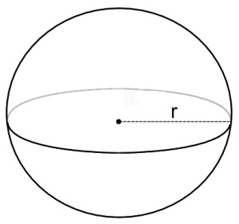
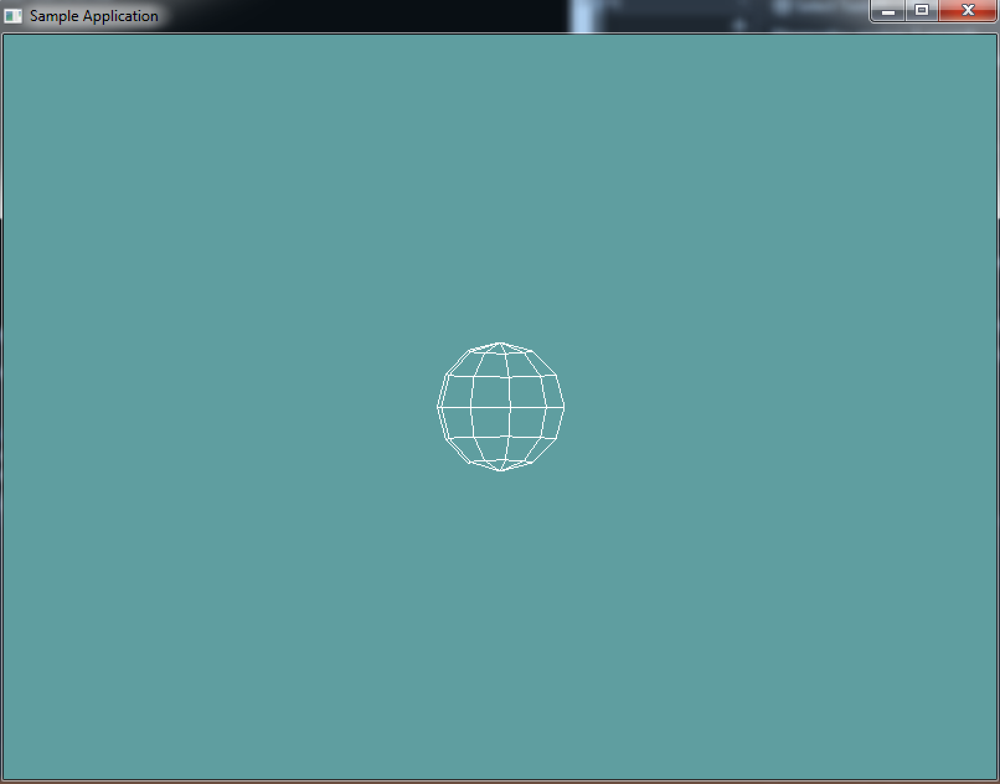

# Sphere

Other than a point, the next most basic 3D  shape. A sphere consists of a point and a radius. The radius of a sphere goes half-way accross it. So, a sphere with a radius of 1, will have a diameter of 2. This can be counter-intuitive when modelling a world, but keep it in mind!



Because we're not going to actually expose a lot of the data underneath the sphere, i'm going to store the point as a ```Vector3```, and the radius as a ```float```, but you could store the point as a ```Point```

Based on the above information, and the image, the simplest implementation of a sphere would be:

```cs
// THIS BLOCK IS JUST SAMPLE CODE, DON'T COPY IT!
class Sphere { // Could be a struct?
  public Vector3 position; // Could be 3 floats?
  public float radius = 1f;
}
```

### Code Guide

Everything in and after the __Rendering__ region will compile. The code above it is more of a suggestion than a hard guide, tough i do think this is good design. The ```CreateRenderArrays``` function __MUST__ be called in __EVERY__ constructor.

```cs
using System;
using OpenTK.Graphics.OpenGL;
using Math_Implementation;

class Sphere {
    Vector3 point = new Vector3();
    float radius = 1f;

    public Point Position { /* TODO */ } // Gets / Sets point vector
    public float Radius { /* TODO */} // Self explanatory

    public Sphere() {
        CreateRenderArrays(); // Mush call this to create Arrays
    }

    public Sphere(Point p, float r) {
        // TODO: Set member variables
        CreateRenderArrays(); // Mush call this to create Arrays
    }

    public Sphere(Vector3 p, float r) {
        // TODO: Set member variables
        CreateRenderArrays(); // Mush call this to create Arrays
    }
    
    public Sphere(float x, float y, float z, float r) {
        // TODO: Set member variables
        CreateRenderArrays(); // Mush call this to create Arrays
    }

#region Rendering
    private float[] verts = null;
    private float[] norms = null;
    private uint[] indices = null;

    private void CreateVBO(uint rings = 10, uint sectors = 15) {
        // From:
        // http://stackoverflow.com/questions/5988686/creating-a-3d-sphere-in-opengl-using-visual-c/5989676#5989676
        // http://stackoverflow.com/questions/7957254/connecting-sphere-vertices-opengl
        float R = 1f/ (float)(rings - 1);
        float S = 1f/ (float)(sectors - 1);
        float M_PI = 3.14159265358979323846f;
        float M_PI_2 = 1.57079632679489661923f;

        verts = new float[rings * sectors * 3];
        norms= new float[rings * sectors * 3];
        indices = new uint[rings * sectors * 4];

        int v = 0;
        int n = 0;
        int i = 0;

        for (int r = 0; r < rings; r++) {
            for (int s = 0; s < sectors; s++) {
                float y = (float)Math.Sin(-M_PI_2 + M_PI * r * R);
                float x = (float)Math.Cos(2f * M_PI * s * S) * (float)Math.Sin(M_PI * r * R);
                float z = (float)Math.Sin(2f * M_PI * s * S) * (float)Math.Sin(M_PI * r * R);

                verts[v++] = (x /* * radius*/);
                verts[v++] = (y /* * radius*/);
                verts[v++] = (z /* * radius*/);

                norms[n++] = (x);
                norms[n++] = (y);
                norms[n++] = (z);
            }
        }

        if (v != verts.Length) {
            Console.WriteLine("ERROR, Wrong number of verts!");
        }
        if (n != norms.Length) {
            Console.WriteLine("ERROR, Wrong number of norms!");
        }

        for (int r = 0; r < rings - 1; r++) {
            for (int s = 0; s < sectors - 1; s++) {
                indices[i++] = ((uint)(r * sectors + s));
                indices[i++] = ((uint)(r * sectors + (s + 1)));
                indices[i++] = ((uint)((r + 1) * sectors + (s + 1)));
                indices[i++] = ((uint)((r + 1) * sectors + s));
            }
        }

        if (i != indices.Length) {
            Console.WriteLine("ERROR, Wrong number of indices!");
        }
    }

    public void Render() {
        GL.PushMatrix();
        GL.Translate(point.X, point.Y, point.Z);
        GL.Scale(radius, radius, radius);

        GL.EnableClientState(ArrayCap.VertexArray);
        GL.EnableClientState(ArrayCap.NormalArray);

        GL.VertexPointer(3, VertexPointerType.Float, 0, verts);
        GL.NormalPointer(NormalPointerType.Float, 0, norms);
        GL.DrawElements(PrimitiveType.Quads, indices.Length, DrawElementsType.UnsignedInt, indices);

        GL.DisableClientState(ArrayCap.VertexArray);
        GL.DisableClientState(ArrayCap.NormalArray);

        GL.PopMatrix();
    }
#endregion

    public override string ToString() {
        return "Position: (" + point.X + ", " + point.Y + ", " + point.Z + "), Radius: " + radius;
    }
}
```

## On Your Own

Implement a sphere class. Feel free to use the above code as a guide, or come up with your own implementeation.

### Sample / Unit Test

This sample is short and simple, it makes a new sphere at origin, configures some render settings and draws the sphere. There is an image of what it's supposed to look like after the code.

```cs
using OpenTK.Graphics.OpenGL;
using Math_Implementation;
using CollisionDetectionSelector.Primitives;

namespace CollisionDetectionSelector.Samples {
    class SphereSample : Application{
        Sphere sphere = new Sphere();

        public override void Intialize(int width, int height) {
            GL.Enable(EnableCap.CullFace);
            GL.PolygonMode(MaterialFace.FrontAndBack, PolygonMode.Line);
        }

        public override void Render() {
            Matrix4 lookAt = Matrix4.LookAt(new Vector3(0.0f, 0.0f, 10), new Vector3(0.0f, 0.0f, 0.0f), new Vector3(0.0f, 1.0f, 0.0f));
            GL.LoadMatrix(lookAt.OpenGL);

            sphere.Render();
        }

        public override void Resize(int width, int height) {
            GL.Viewport(0, 0, width, height);
            GL.MatrixMode(MatrixMode.Projection);
            float aspect = (float)width / (float)height;
            Matrix4 perspective = Matrix4.Perspective(60, aspect, 0.01f, 1000.0f);
            GL.LoadMatrix(Matrix4.Transpose(perspective).Matrix);
            GL.MatrixMode(MatrixMode.Modelview);
            GL.LoadIdentity();
        }
    }
}
```

