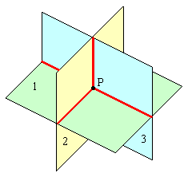
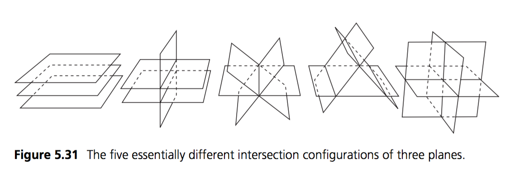

# 3 Plane Intersection

Planes have a pretty special property. Given 3 unique planes, they intersect at exactly one point!



Any 3 dimensional cordinate system has 3 axis (x, y, z) which can be represented by 3 planes. Where those axis meet is considered (0, 0, 0) or the origin of the coordinate space.

Other than debug visualization, i've never used this intersection test in production. But it's useful to know in order to visualize some debug properties.

### The algorithm

I don't fully understand this algorithm, usually i copy it out of a book. In that spirit, i'm just going to go ahead and provide it:

```cs
Point IntersectPlanes(Plane p1, Plane p2, Plane p3) {
    Vector m1 = new Vector(p1.Normal.X, p2.Normal.X, p3.Normal.X);
    Vector m2 = new Vector(p1.Normal.Y, p2.Normal.Y, p3.Normal.Y);
    Vector m3 = new Vector(p1.Normal.Z, p2.Normal.Z, p3.Normal.Z);
    Vector d = new Vector(p1.Distance, p2.Distance, p3.Distance);
    
    Vector u = Cross(m2, m3);
    Vector v =Cross (m1, d);
    
    float denom = Dot(m1, u);
    
    if (Abs(denom) < EPSILON) {
        // Planes don't actually intersect in a point
        // Throw exception maybe?
        return new Point(0, 0, 0);
    }
       
    return new Point(
        Dot(d, u) / denom,
        Dot(m3, v) / denom,
        -Dot(m2, v) / denom
    );
}
```

Of course, there are ways for 3 planes to intersect that do not end in a point:



In that case we just return 0, but it might be appropriate to throw an exception. Or it might not, depends on what you use this function for!

## On Your Own

Add the following function to the ```Collisions``` class:

```cs
public static Point Intersection(Plane p1, Plane p2, Plane p3);
```

And provide an implementation for it!

### Unit Test

#TODO: Download

The following code is visual only, if you make any mistakes no error is printed!

The image is straight forward, there is a plane, the test point is red, the closest point is green. There is a blue line going from the test point to the closest point. The magenta line is the normal of the plane (rendered on top of the blue line) 