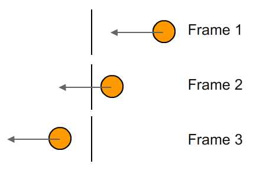

# Dynamic Intersections

Finding the collision between dynamic moving objects is a bit tougher than finding the collision between static objects. This is because of tunneling. Read [this article](https://www.aorensoftware.com/blog/2011/06/01/when-bullets-move-too-fast/) for a bit more in depth information on the problem.

Let's take a look at the problem using this image:



The object is moving a consistent amount of space each frame. The problem is, it moves right past the plane! So a Sphere to Plane intersection (the way we know it) will not catch this collision! 

Now, imagine turning that image 90 degrees to the left, the plane is the ground plane and the sphere is falling. It never hits the ground!

### Special Case

The sphere tunneling test has a simple solution, but the more complex the shape, the harder the solution. __In this chapter__ we are going to cover dynamic collisions of specific shapes that have trivial solutions. 

This __will not__ be as comprehensive a list of collisions as the dynamic ones. Because at some point you have to start getting crazy! But sometimes that is the solution. Detecting tunneling is a problem of logic, there is no standard algorithm.

Think about a moving AABB and a plane. You'd have to make a line from every vertex of the AABB in it's starting position to every vertex in it's end position, then you'd have to compare those 4 lines against the plane. If any of those 4 lines are intersecting the plane, but the aabb in it's final position is not, you have tunneling!

Knowing that you've tunneled will let you correct it. However, we are __not__ going to cover the logic for tunel detection and correction of complex shapes. That's the kind of stuff you have to learn to figure out in the moment.

### Time Slicing

Tunneling is inherantly a problem of time. If your delta time is lower, the less chance you have of tunneling! Becuase of this, some games solve the tunneling issue by breaking up their update loop by seperating collision detection / resolution from update steps:

```cs
void Update(float deltaTime) {
    foreach(GameObject go in world) {
      go.Update(deltaTime);
    }
    
    foreach(GameObject go in world) {
      go.ResolveCollisions(deltaTime);
    }
    
    foreach(GameObject go in world) {
      go.Render();
    }
}
```

Now you are probably thinking this doesn't solve the problem, and as presented above, it does not. The key is, by breaking the collision code out of update, you can slice in more collision frames.

Think of it like this, if your delta time is 0.66, you can update collisions once with a slice of 0.66, __twice__ with a slice of 0.33, or __6 times every frame__ with a slice of 0.11!

```cs
float sliceMax = 0.033f;
void Update(float deltaTime) {
    foreach(GameObject go in world) {
      go.Update(deltaTime);
    }
    
    float thisSlice = deltaTime;
    foreach(GameObject go in world) {
      while (thisSlice > 0) {
        go.ResolveCollisions(thisSlice);
        thisSlice -= sliceMax;
      }
    }
    
    foreach(GameObject go in world) {
      go.Render();
    }
}
```

Notice how the collision resolution will be called multiple times per frame now! Of course this is not an end-all solution, sometimes you still need to querry collisions during the update phase, which will throw this whole system out of whack.

Fun fact, this is how Bethesda games do physics, and the problem of querrying collisions outside the collision resolution method is why they have some famous physics bugs!

### Generic Case

There are a few physics engines that seemingly never miss a collision. This is possible trough a method known as __Swept Volume__ intersection. The upside of this method is that it will always work. The downside is that it's prohibitavley expensive!

(Generic) Swept volumes 