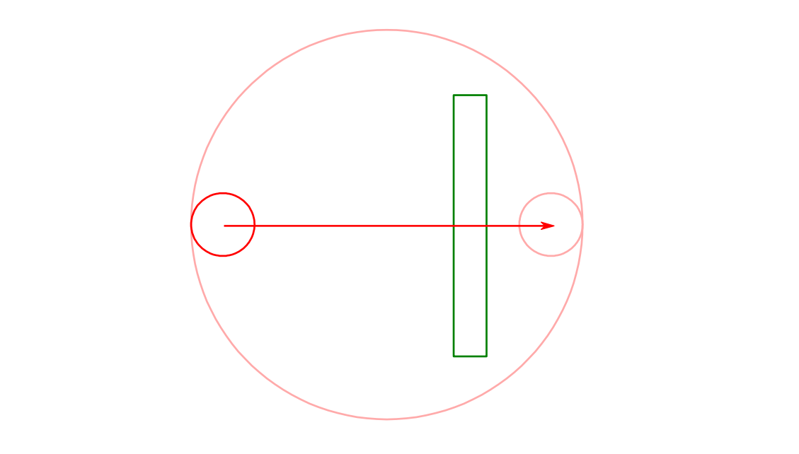
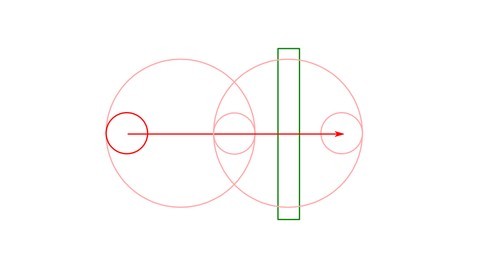
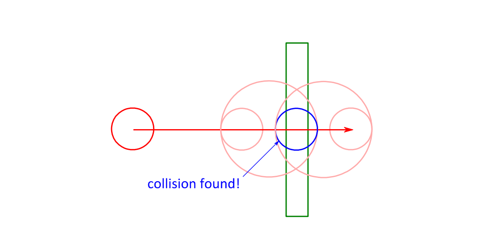

# Binary Impact Search

To get a better scaling algorithm we can use binary search. It starts this way:

We enclose the moving object's current position and moved position in a bounding circle. If the
obstacle does not collide with this bounding circle we know there can't be a collision. Otherwise we
subdivide the problem into two halves:

The first half represents the object covering the first half of the distance. As done before we encircle
the start and end position with a bounding circle. If this bounding circle were to collide with the
obstacle we would continue subdividing this movement segment. But it doesn't, so we test the second
bounding circle, wrapping the halfway-through object and its destination position. This bounding
circle collides with the obstacle so we subdivide the second half as done before:

