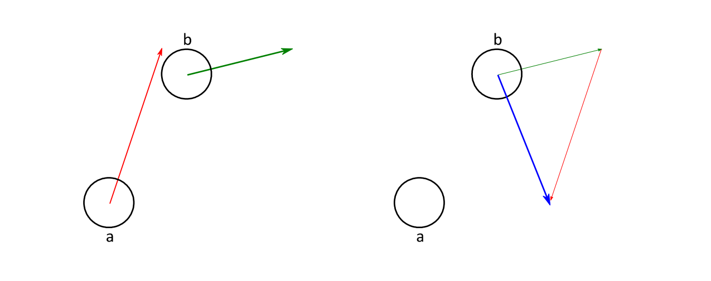

# When Both Objects Move
... we can use a simple trick: we subtract the movement of object a from both objects' movements.



This way, object a remains stationary while object b does all the moving. Their motion relative to
each other stays the same. Now we can apply the algorithms we have learned so far.

As yet we don't have a function moving_rectangle_circle_collide(). Instead of writing a full-blown
binary search function we use the make-one-object-stationary trick from above:

```
Bool moving_rectangle_circle_collide(Rectangle a, Vector2D moveA, Circle b) {
    Vector2D moveB = negate_vector(moveA);
    return moving_circle_rectangle_collide(b, moveB, a);
}
```

We just invert the movement of a and take it as movement for b. This way a becomes stationary and
b moves. Now we can just use the standard test for one moving and one static colliding sphapes.