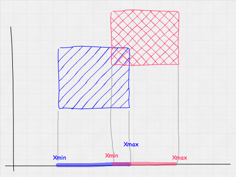

# AABB v AABB intersection

One to the most useful intersection tests is testing an AABB against another AABB. In fact, this is probably the intersection test you will use the most!

Surprisingly, this is also one of the simplest collision tests to write, it's a basic overlap test. Becuase the AABB has 3 axis, we just have to check each axis for an overlap. Consider the following image:



It shows an overlap test on only the X axis. If either the X, Y or Z have any overlap we know we have an intersection. Representing the above test in code is as follows:

```cs
a.minX <= b.maxX && a.maxX >= b.minX
```

## The Algorithm

Actually implementing the above test is just a matter of extrapolating the single axis test onto multiple axis. Very similar to the Point in AABB test.

```cs
bool Intersect(AABB a, AABB b) {
  return (a.minX <= b.maxX && a.maxX >= b.minX) &&
         (a.minY <= b.maxY && a.maxY >= b.minY) &&
         (a.minZ <= b.maxZ && a.maxZ >= b.minZ);
}
```

## On Your Own

Add the following function to the ```Collisions``` class:

```cs
public static bool Intersects(AABB a, AABB b) {
```

And provide an implementation for it!

### Unit Test

You can [Download](../Samples/StaticIntersections.rar) the samples for this chapter to see if your result looks like the unit test.

description of unit test


```cs
using OpenTK.Graphics.OpenGL;
using Math_Implementation;
using CollisionDetectionSelector.Primitives;

namespace CollisionDetectionSelector.Samples {
    class AABBtoAABBIntersection : Application {
        AABB[] aabbs = new AABB[] {
            null, null, null, null // Size = 4
        };

        public override void Intialize(int width, int height) {
            GL.Enable(EnableCap.DepthTest);
            GL.Enable(EnableCap.CullFace);
            GL.PolygonMode(MaterialFace.FrontAndBack, PolygonMode.Line);

            aabbs[0] = new AABB(new Point(-0.5f, -2f, -0.5f), new Point(0.5f, 2f, 0.5f));
            aabbs[1] = new AABB();
            aabbs[2] = new AABB(new Point(1f, 1f, 1f), new Point(3f, 3f, 3f));
            aabbs[3] = new AABB(new Point(-3f, -3f, -3f), new Point(-4f, -4f, -4f));

            bool[] results = new bool[] {
                true, false, true, true, false, true, false, false, true,
                false, true, false, true, false, false, true
            };
            int t = 0;

            for (int i = 0; i < aabbs.Length; ++i) {
                for (int j = 0; j < aabbs.Length; ++j) {
                    if (Collisions.Intersects(aabbs[i], aabbs[j]) != results[t++]) {
                        LogError("aabb " + i + " and " + j + " should " +
                            (results[t - 1] ? "" : "not ") + "intersect"
                        );
                    }
                }
            }
        }

        public override void Render() {
            base.Render();
            DrawOrigin();

            for (int i = 0; i < aabbs.Length; ++i) {
                GL.Color3(0f, 0f, 1f);
                for (int j = 0; j < aabbs.Length; ++j) {
                    if (i != j && Collisions.Intersects(aabbs[i], aabbs[j])) {
                        GL.Color3(1f, 0f, 0f);
                        break;
                    }
                }
                aabbs[i].Render();
            }
        }
    }
}
```