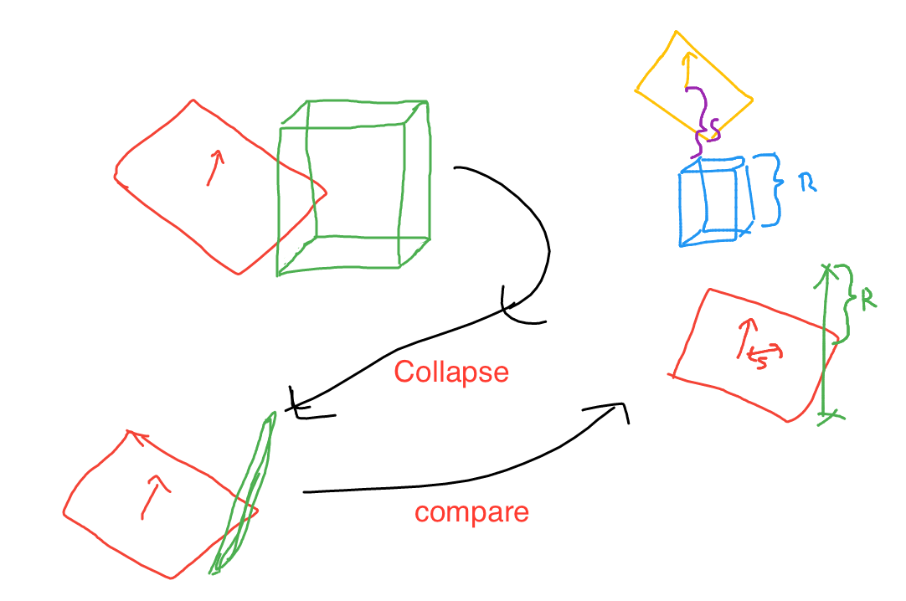
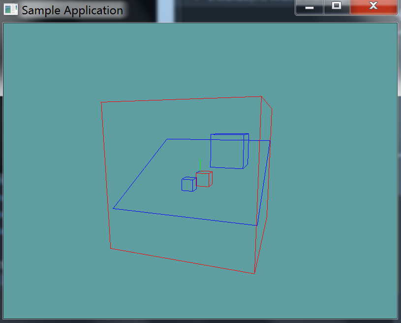

# AABB Plane intersection

To test if an AABB and plane intersect, we first have to project each vertex of the AABB onto the plane's normal. This leaves us with all the vertices of the AABB on a line.

We then check the vertex that is furthest from the plane. If the vertex diagonally opposite that one is on the other side of the plane, we have an intersection. 

## The Algorithm

This test is equivalent to finding an AABB vertex most distant along the plane
normal and making sure that vertex and the vertex diagonally opposite lie on opposite
sides of the plane.

```cs
// Test if AABB b intersects plane p
int TestAABBPlane(AABB b, Plane p) {
    // Convert AABB to center-extents representation
    Point c = (b.max + b.min) * 0.5f; // Compute AABB center
    Point e = b.max - c; // Compute positive extents
    
    // Compute the projection interval radius of b onto L(t) = b.c + t * p.n
    float r = e[0]*Abs(p.n[0]) + e[1]*Abs(p.n[1]) + e[2]*Abs(p.n[2]);
    
    // Compute distance of box center from plane
    float s = Dot(p.n, c) - p.d;
    
    // Intersection occurs when distance s falls within [-r,+r] interval
    return Abs(s) <= r;
}
```

So, what happens here, is we compute the center of the aabb (```c```) and it's extents (```e```). We then collapse extents ```e``` onto the plane normal (```p.n```). 

At this point we have a line with center point ```c``` and size ```r``` in both directions.

We then compute ```s```, which is the distance of the line from the plane. If the line is further away than half it's length, it does not intersect. If it's closer, it does.



## Another method

Of course, this is not the only way to do the intersection test. You could always take the more logical brute force approach.

The brute force approach would be to loop trough all 8 points of the box and check them against the plane. There are 3 possible outcomes:

1) All points are in front of the plane, no collision
2) All points are behind the plane, no collision
3) Some points are in front of the plane, some are behind. COLLISION

That is to say, if you encounter any points that are not on the same side of the plane, a collision has occured. The hardest thing about the brute force approach is figuring out how to get all 4 sides of the AABB as vertices.

```cs
Vector3[] points = new Vector3[] {
    // Min side
    new Vector3(min.X, min.Y, min.Z),
    new Vector3(max.X, min.Y, min.Z),
    new Vector3(min.X, max.Y, min.Z),
    new Vector3(min.X, min.Y, max.Z),
    // Max side
    new Vector3(max.X, max.Y, max.Z),
    new Vector3(min.X, max.Y, max.Z),
    new Vector3(max.X, min.Y, max.Z),
    new Vector3(max.X, max.Y, min.Z)
};
```

## On Your Own

Add the following function to the ```Collisions``` class, how you implement this function (brute force or fancy) is up to you:

```cs
// TODO: Provide implementation for this
public static bool Intersects(AABB aabb, Plane plane) 

// Conveniance function
public static bool Intersects(Plane plane, AABB aabb) {
    return Intersects(aabb, plane);
}

```

And provide an implementation for it!

### Unit Test

You can [Download](../Samples/StaticIntersections.rar) the samples for this chapter to see if your result looks like the unit test.

The constructor of the unit test will spit out errors. There are 4 cubes, 1 in front of the plane, 1 behind the plane, 1 intersecting the plane and one that encompases (Again, just intersects becuse the plane is of infinate size) the plane. The two boxes that intersect the plane are renderd in red.



```cs
using OpenTK.Graphics.OpenGL;
using Math_Implementation;
using CollisionDetectionSelector.Primitives;

namespace CollisionDetectionSelector.Samples {
    class AABBPlaneIntersection : Application {
        Plane test = new Plane();

        AABB[] aabbs = new AABB[] {
            null, null, null, null // Size = 4
        };

        public override void Intialize(int width, int height) {
            GL.Enable(EnableCap.DepthTest);
            GL.Enable(EnableCap.CullFace);
            GL.PolygonMode(MaterialFace.FrontAndBack, PolygonMode.Line);
            GL.PointSize(5f);

            test.Normal = new Vector3(0f, 1f, 0.5f);
            aabbs[0] = new AABB(new Point(-2f, -2f, -2f), new Point(-1f, -1f, -1f));
            aabbs[1] = new AABB(new Point(2f, 1f, 2f), new Point(4f, 3f, 4f));
            aabbs[2] = new AABB(new Point(1f, 0f, 1f), new Point(0f, -1f, 0f));
            aabbs[3] = new AABB(new Point(5f, 5f, 5f), new Point(-5f, -5f, -5f));

            bool[] results = new bool[] {
                false, false, true, true
            };
            int t = 0;

            for (int i = 0; i < aabbs.Length; ++i) {
                if (Collisions.Intersects(aabbs[i], test) != results[t++]) {
                    LogError("Expected aabb " + i + " to " +
                        (results[t - 1] ? "intersect" : "not intersect") +
                    " the plane");
                }
            }
        }

        public override void Render() {
            base.Render();
            DrawOrigin();

            for (int i = 0; i < aabbs.Length; ++i) {
                GL.Color3(0f, 0f, 1f);
                if (Collisions.Intersects(test, aabbs[i])) {
                    GL.Color3(1f, 0f, 0f);
                }
                aabbs[i].Render();
            }

            GL.Color3(0f, 0f, 1f);
            test.Render(5f);
        }
    }
}
```