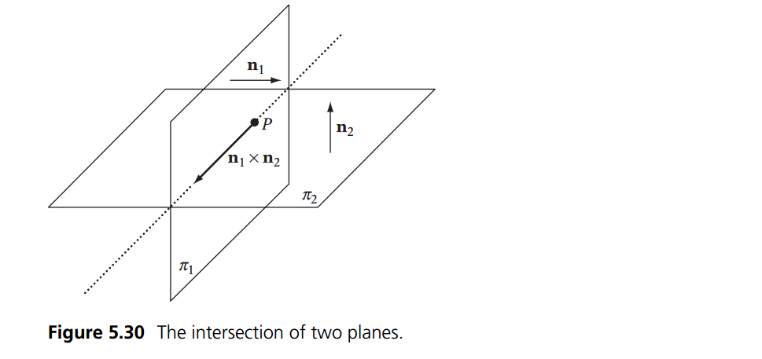

# Plane Plane intersection

We've already done some work with plane intersection, when we did the intersection for 3 planes onto a point. Luckly the intersection of 2 planes is a lot simpler.

The only time two planes don't intersect is if they are parallel. If the planes are not parallel they will intersect in a line (of infinate length)



The line of intersection is fairly useless in game development, so we will not be covering it here. If you are interested, youtube is full of videos on how to find this line, and the book [Real Time Collision Detection](https://www.amazon.com/Real-Time-Collision-Detection-Interactive-Technology/dp/1558607323/182-5816879-0409622?ie=UTF8&redirect=true) covers how to do it in the context of games. I have a PDF if you need it.

## The Algorithm

The key piece of information above is that two planes never intersect if they are parallel. Only if they are parallel. Knowing this case, the problem becomes, how can we tell if two planes are parallel?

Dot Product to the rescue! We have the normal of each plane! If the normals point in the same direction, we have parallel planes!

```cs
bool PlanesIntersect(Plane p1, Plane p2) {
    // Compute direction of intersection line
    Vector d = Cross(p1.n, p2.n);
    
    // If the length(Squared) of d is zero, the planes are 
    // parallel (and separated) or coincident, 
    // so they’re not considered intersecting
    return (Dot(d, d) > EPSILON); // EPSILON = 0.0001f
}
```

## On Your Own

Add the following function to the ```Collisions``` class:

```cs
public static bool Intersects(Plane p1, Plane p2)
```

And provide an implementation for it!

### Unit Test

You can [Download](../Samples/StaticIntersections.rar) the samples for this chapter to see if your result looks like the unit test.

description of unit test


```cs
using OpenTK.Graphics.OpenGL;
using Math_Implementation;
using CollisionDetectionSelector.Primitives;

namespace CollisionDetectionSelector.Samples {
    class PlanePlaneIntersection : Application {
        Plane[] planes = new Plane[] {
            null, null, null, null, null // Size = 5
        };

        public override void Intialize(int width, int height) {
            GL.Enable(EnableCap.DepthTest);
            //GL.Enable(EnableCap.CullFace);
            GL.PolygonMode(MaterialFace.FrontAndBack, PolygonMode.Line);
            GL.PointSize(5f);

            planes[0] = new Plane();
            planes[1] = new Plane(new Vector3(2f, 0f, 1f), 0f);
            planes[2] = new Plane(new Vector3(0f, 1f, 0f), -2f);
            planes[3] = new Plane(new Vector3(-1f, 1f, 2f), 3f);
            planes[4] = new Plane(new Vector3(1f, 0f, 0.5f), 3f);

            bool[] results = new bool[] {
                false, true,  true, true,  true, true, false, true,  true, false, true,
                true,  false, true, true,  true, true, true,  false, true, true,  false,
                true, true,  false,
            };
            int t = 0;

            for (int i = 0; i < planes.Length; ++i) {
                for (int j = 0; j < planes.Length; ++j) {
                    if (Collisions.Intersects(planes[i], planes[j]) != results[t++]) {
                        LogError("[" + (t - 1) + "] Expected plane " + i + " to " +
                            (results[t - 1] ? "intersect" : "not intersect") +
                        " plane " + j);
                    }
                }
            }
        }

        public override void Render() {
            base.Render();
            DrawOrigin();

            for (int i = 0; i < planes.Length; ++i) {
                planes[i].Render();
            }
        }
    }
}
```