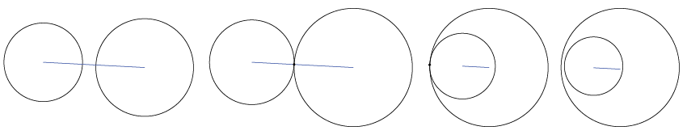
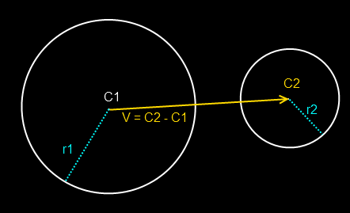

# Sphere Sphere Intersection

The overlap test between two spheres is very simple. The distance between the sphere centers is computed and compared against the sum of the sphere radii. To avoid an often expensive square root operation, the squared distances are compared.

The test looks like this:



The blue line is the distance between the center of the spheres. In the first example this line is greater than the sum radii of the spheres, they do not intersect. The second example, it's equal, they intersect. The third and fourth examples see the distance be less than the sum of the radii as well, they also intersect.

The above example fails to show the radii of the spheres, in the below image, the yellow line does that.



## The Algorithm

The code to test intersecting spheres is super straight forward.

```cs
bool TestSphereSphere(Sphere a, Sphere b) {
    // Calculate squared distance between centers
    Vector d = a.position - b.position;
    float squaredDistance = Dot(d, d); // Same as d.LengthSquared()
    
    // Spheres intersect if squared distance is less than squared sum of radii
    float radiusSum = a.radius + b.radius;
    float squaredRadii = radiusSum * radiusSum;
    
    return squaredDistance <= squaredRadii;
}
```

## On Your Own

Add the following function to the ```Collisions``` class:

```cs
public static bool Intersects(Sphere s1, Sphere s2)
```

And provide an implementation for it!

### Unit Test

You can [Download](../Samples/StaticIntersections.rar) the samples for this chapter to see if your result looks like the unit test.

This unit test will render 4 spheres, in verious test cases. Any sphere that intersects another sphere is rendered as red. If a sphere does not intersect any other spheres, it will render blue. The constructor will log error messages.


```cs
using OpenTK.Graphics.OpenGL;
using Math_Implementation;
using CollisionDetectionSelector.Primitives;

namespace CollisionDetectionSelector.Samples {
    class SphereSphereIntersection : Application{
        Sphere[] spheres = new Sphere[] {
            null, null, null, null // Size = 4
        };

        public override void Intialize(int width, int height) {
            GL.Enable(EnableCap.DepthTest);
            GL.Enable(EnableCap.CullFace);
            GL.PolygonMode(MaterialFace.FrontAndBack, PolygonMode.Line);

            spheres[0] = new Sphere(new Point(0f, 0f, 0f), 2f);
            spheres[1] = new Sphere(new Point(0f, 3.5f, 0f), 1f);
            spheres[2] = new Sphere(new Point(0f, -3f, 0f), 1f);
            spheres[3] = new Sphere(new Point(1f, 0f, 0f), 1f);

            bool[] results = new bool[] {
                true, false, true, true, false, true, false, false, true,
                false, true, false, true, false, false, true
            };
            int t = 0;

            for (int i = 0; i < spheres.Length; ++i) {
                for (int j = 0; j < spheres.Length; ++j) {
                    if (Collisions.Intersects(spheres[i], spheres[j]) != results[t++]) {
                        LogError("sphere " + i + " and " + j + " should " +
                            (results[t - 1] ? "" : "not ") + "intersect"
                        );
                    }
                }
            }
        }

        public override void Render() {
            base.Render();
            DrawOrigin();

            for (int i = 0; i < spheres.Length; ++i) {
                GL.Color3(0f, 0f, 1f);
                for (int j = 0; j < spheres.Length; ++j) {
                    if (i != j && Collisions.Intersects(spheres[i], spheres[j])) {
                        GL.Color3(1f, 0f, 0f);
                        break;
                    }
                }
                spheres[i].Render();
            }
        }
    }
}
```