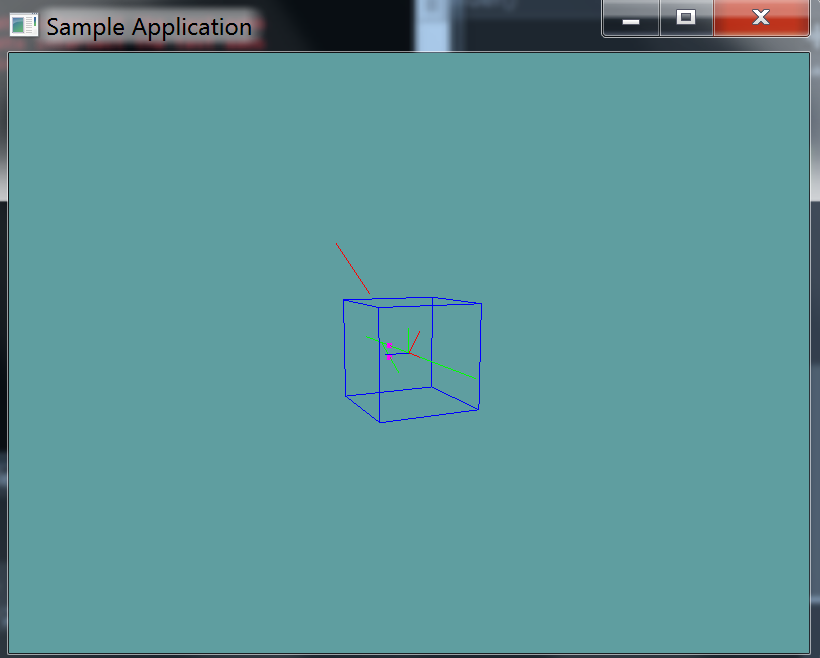

#Line Against Plane

Again, this test is almost the same as the previous two. The code here should be really straight forward.

### Implementation

Provide an implementation for the following function

```cs
public static bool LineTest(Line line, Plane plane, out Point result) {
```

### Unit Test

You can [Download](../Samples/Raycast.rar) the samples for this chapter to see if your result looks like the unit test.

This unit test will print out errors if any are present in your code.



```cs
using OpenTK.Graphics.OpenGL;
using Math_Implementation;
using CollisionDetectionSelector.Primitives;

namespace CollisionDetectionSelector.Samples {
    class LinetestPlane : Application {
        public Line[] lines = new Line[] {
            new Line(new Point(2.5f, 2.5f, 2.5f), new Point(4, 4, 4)), // false
            new Line(new Point(1f, 1f, 0f), new Point(0f, 0f, 0f)), // false
            new Line(new Point(-1f, -1f, 0f), new Point(-3f, 0f, 0f)), // false
            new Line(new Point(-5f, 0f, 0f), new Point(5f, 0f, 0f)), // true
            new Line(new Point(7f, 0f, 1f), new Point(-7f, 0f, 1f)), // true
            new Line(new Point(0.5f, 0.5f, 0.5f), new Point(0.5f, 0.5f, 2f)) // false
        };
        public Plane plane = new Plane();

        public override void Intialize(int width, int height) {
            GL.Enable(EnableCap.DepthTest);
            GL.PointSize(5f);
            GL.PolygonMode(MaterialFace.FrontAndBack, PolygonMode.Line);

            plane.Normal = new Vector3(1, 1, 0);
            plane.Distance = 1;

            bool[] results = new bool[] { false, false, false, true, true, false };
            Point result = new Point();
            for (int i = 0; i < results.Length; ++i) {
                if (Collisions.LineTest(lines[i], plane, out result) != results[i]) {
                    LogError("Line at index " + i + " was " +
                        (results[i] ? "expected" : "not expected") +
                        "to intersect the test plane");
                }
            }
        }

        public override void Render() {
            base.Render();
            DrawOrigin();

            Point result = new Point();
            foreach (Line line in lines) {
                if (Collisions.LineTest(line, plane, out result)) {
                    GL.Color3(1f, 0f, 1f);
                    result.Render();
                    GL.Color3(0f, 2f, 0f);
                }
                else {
                    GL.Color3(1f, 0f, 0f);
                }
                line.Render();
            }

            GL.Color3(0f, 0f, 1f);
            plane.Render(5f);
        }

        private void Log(string s) {
            System.Console.WriteLine(s);
        }
    }
}
```