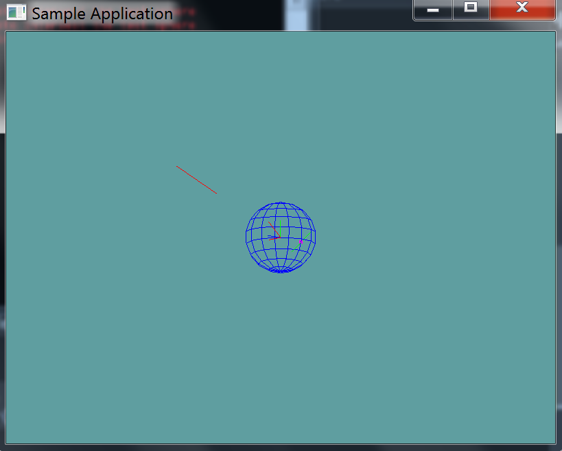

#Line Against Sphere

In this chapter i will provide code for the wrapper functions of line against sphere. I'll provide all implementation as an example, the next few chapters i'll only provide the API and leave the implementation up to you.

This test will __test intersection__, it will __not test containment__. That is, if you have a line, and both start and end points are INSIDE the sphere, the result of this test will be false!

### Implementation

```cs
public static bool LineTest(Line line, Sphere sphere, out Point result) {
    // First, create a ray from p0 to p1
    Ray ray = new Ray();
    ray.Position = line.start; // by reference, that's ok
    // Normal points from start to end, by value.
    // The Normal setter will automatically normalize this
    ray.Normal = (line.end.ToVector() - line.start.ToVector());

    // Not do the actual ray cast
    float t = -1;
    if (!Raycast(ray, sphere, out t)) {
        // If the raycast returns false, the point was never on the line!
        result = new Point(0f, 0f, 0f);
        return false;
    }

    // If t is less than 0, the point is behind the start point
    if (t < 0) {
        // By value! Call new to make a new point, don't want to assigne a reference
        result = new Point(line.start.ToVector());
        return false;
    }
    // Optimize by checking length squared instead of length!
    // if t is greater than the length of the line, intersection is after start point
    else if (t * t > line.LengthSquared) {
        result = new Point(line.end.ToVector()); // Again, by value!
        return false;
    }

    // If we made it here, the line intersected the sphere
    result = new Point(ray.Position.ToVector() + ray.Normal * t);
    return true;
}
```

### Unit Test

You can [Download](../Samples/Raycast.rar) the samples for this chapter to see if your result looks like the unit test.

This unit test will print out errors if any are present in your code.



```cs
using OpenTK.Graphics.OpenGL;
using Math_Implementation;
using CollisionDetectionSelector.Primitives;

namespace CollisionDetectionSelector.Samples {
    class LinetestSphere : Application {
        public Line[] lines = new Line[] {
            new Line(new Point(2.5f, 2.5f, 2.5f), new Point(4, 4, 4)), // false
            new Line(new Point(1f, 1f, 0f), new Point(0f, 0f, 0f)), // false
            new Line(new Point(-1f, -1f, 0f), new Point(-3f, 0f, 0f)), // true
        };
        public Sphere sphere = new Sphere();

        public override void Intialize(int width, int height) {
            GL.Enable(EnableCap.DepthTest);
            GL.PointSize(5f);
            GL.Enable(EnableCap.CullFace);
            GL.PolygonMode(MaterialFace.FrontAndBack, PolygonMode.Line);

            sphere.Position = new Point(0f, 0f, 0f);
            sphere.Radius = 2;

            bool[] results = new bool[] { false, false, true };
            Point result = new Point();
            for (int i = 0; i < results.Length; ++i) {
                if (Collisions.LineTest(lines[i], sphere, out result) != results[i]) {
                    LogError("Line at index " + i + " was " +
                        (results[i] ? "expected" : "not expected") +
                        "to intersect the test SPHERE");
                }
            }
        }

        public override void Render() {
            base.Render();
            DrawOrigin();

            Point result = new Point();
            foreach (Line line in lines) {
                if (Collisions.LineTest(line, sphere, out result)) {
                    GL.Color3(1f, 0f, 1f);
                    result.Render();
                    GL.Color3(0f, 2f, 0f);
                }
                else {
                    GL.Color3(1f, 0f, 0f);
                }
                line.Render();
            }

            GL.Color3(0f, 0f, 1f);
            sphere.Render();
        }

        private void Log(string s) {
            System.Console.WriteLine(s);
        }
    }
}
```