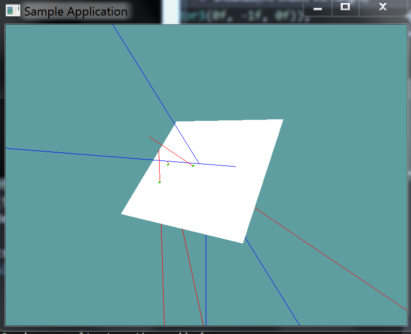

# Ray Against Plane

Testing a ray against a plane is surprisingly easy. Remember, any point on the ray can be represented by a time t, such that:

```
point(t) = plane.position + plane.normal * t
^ the (t) above means point at time t
```

Also, recall we can test if a point is on a plane if it fits this equation:

```
DOT(point, plane.normal) = plane.distance
```

A ray and a plane collide if a point exists that satisfies both of these equations! Let's start out with the formula for point on plane:

```
DOT(point, plane.normal) = plane.distance
```

In this formula the point is unknown. But we know that the point must also be on the ray at some time t. So, let's substitute the unknown point for the point on ray formula.

```
DOT(ray.position + ray.normal * t, plane.normal) = plane.distance
```

At this point, the only unknown in the above equation is t. Let's start re-arranging the equation so t is on the left side by its-self. We can distribute the dot product operation:

```
DOT(ray.position, plane.normal) + DOT(ray.normal * t, plane.normal) = plane.distance
```

Now, we can subtract the first dot product from each side.

```
DOT(ray.normal * t, plane.normal) = plane.distance - DOT(ray.position, plane.normal);
```

Finally, we can divide each side by ray.normal DOT plane.normal.

```
t = (plane.distance - DOT(ray.position, plane.normal) / DOT(ray.normal, plane.normal)
```

That's it! We now have T! The above might be a bit confusing, let's take a look at it as just math. In the below formula __pos__ is the position of the ray, __dir__ is the normal of the ray. __norm__ is the normal of the plane and __dist__ is the distance of the plane. __t__ is of course t. t__dir__ means t * dir.

* First we have the formula for a plane
* $$unknownPoint \cdot norm = dist$$
*   
* Next, we substitute the point on ray formula for the unknown point
* $$(pos + t\mathbf d\mathbf i \mathbf r) \cdot norm = dist$$
*   
* Distribute the dot product
* $$pos \cdot norm + t\mathbf d\mathbf i\mathbf r \cdot norm = dist$$
*  
* Subtract pos dot norm from both sides
* $$t\mathbf d\mathbf i\mathbf r \cdot norm = dist - pos \cdot nrom$$
* 
* Divide both sides by dir dot norm
* $$t = \frac{dist - pos \cdot nrom}{dir \cdot norm}$$

A few things to keep in mind.

If the ray is parallel to the plane $$dir \cdot norm$$ will be 0 and there is no intersection.

An intersection is only valid if the ray is in front of the plane.That is, if the direction of the ray is opposite of the planes normal. This is true if $$dir \cdot norm < 0$$.

If the value of t is out of range (that is, if t is negative), then there is no intersection.

## The Algorithm

```cs
// Returns t if collision happened, -1 if it didnt
float Raycast(Ray ray, Plane plane) {
    float nd = Vector3.Dot(ray.Normal, plane.Normal);
    float pn = Vector3.Dot(ray.Position, plane.Normal);

    if (nd >= 0f) {
        return -1;
    }

    t = (plane.Distance - pn) / nd;

    if (t >= 0f) {
      return t;
    }
    return -1;
}
```

## On Your Own

Add the following function to the ```Collisions``` class:

```cs
// TODO: Implement ONLY THIS ONE method:
public static bool Raycast(Ray ray, Plane plane, out float t) 


// I've implemented the blow methods for you.
// Nothing to do past this point

// Conveniance method, returns t without an out param
// If no collision happened, will return -1
public static float Raycast(Ray ray, Plane plane) {
    float t = -1;
    if (!Raycast(ray, plane, out t)) {
        return -1;
    }
    return t;
}

// Conveniance method, returns the point of intersection
public static bool Raycast(Ray ray, Plane plane, out Point p) {
    float t = -1;
    bool result = Raycast(ray, plane, out t);
    p = new Point(ray.Position.ToVector() + ray.Normal * t);
    return result;
}
```

And provide an implementation for it!

### Unit Test

You can [Download](../Samples/Raycast.rar) the samples for this chapter to see if your result looks like the unit test.

This unit test will render a plane on screen, and several rays. If any rays intersect the Plane they will render red, otherwise blue. The point of intersection is renderd as a green dot

The constructor of the unit test will spit out errors if the test results are not what are expected.



```cs
using OpenTK.Graphics.OpenGL;
using Math_Implementation;
using CollisionDetectionSelector.Primitives;

namespace CollisionDetectionSelector.Samples {
    class RaycastPlane : Application {
        public Plane test = new Plane(new Vector3(1f, 1f, 0f), 1f);

        public Ray[] rays = new Ray[] {
            new Ray(new Point(0f, 0f, 0f), new Vector3(0f, -1f, 0f)),
            new Ray(new Point(0.5f, 0.5f, 0f), new Vector3(-1f, -1f, 0f)),
            new Ray(new Point(1f, 1f, 0f), new Vector3(1f, 1f, 0f)),
            new Ray(new Point(1f, 1f, -3f), new Vector3(0f, 0f, 1f)),
            new Ray(new Point(2f, 2f, 3f), new Vector3(0f, -1f, 0f)),
            new Ray(new Point(3f, 3f, 3f), new Vector3(-3f, -3f, -3f)),
            new Ray(new Point(1f, 1f, 3f), new Vector3(-2f, -3f, 1f)),
        };

        public override void Intialize(int width, int height) {
            GL.Enable(EnableCap.DepthTest);
            GL.PointSize(5f);
            GL.PolygonMode(MaterialFace.FrontAndBack, PolygonMode.Fill);

            bool[] results = new bool[] {
                false, false, false, false, true, true, true
            };

            float t;
            for (int i = 0; i < results.Length; ++i) {
                if (Collisions.Raycast(rays[i], test, out t) != results[i]) {
                    LogError("Expected ray at index: " + i + " to " +
                        (results[i] ? "intersect" : "not intersect") +
                        " the plane");
                }
            }
        }

        public override void Render() {
            base.Render();
            DrawOrigin();

            GL.Color3(1f, 1f, 1f);
            test.Render(5f);


            float t;
            foreach (Ray ray in rays) {
                if (Collisions.Raycast(ray, test, out t)) {
                    Point colPoint = new Point();
                    Collisions.Raycast(ray, test, out colPoint);
                    GL.Color3(0f, 1f, 0f);
                    colPoint.Render();
                    GL.Color3(1f, 0f, 0f);
                }
                else {
                    GL.Color3(0f, 0f, 1f);
                }
                ray.Render();
            }
        }

        private void Log(string s) {
            System.Console.WriteLine(s);
        }
    }
}
```