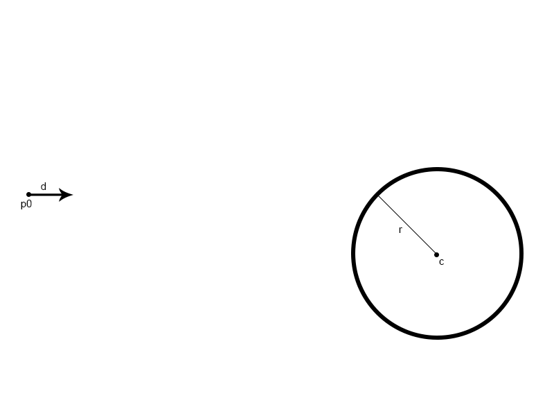
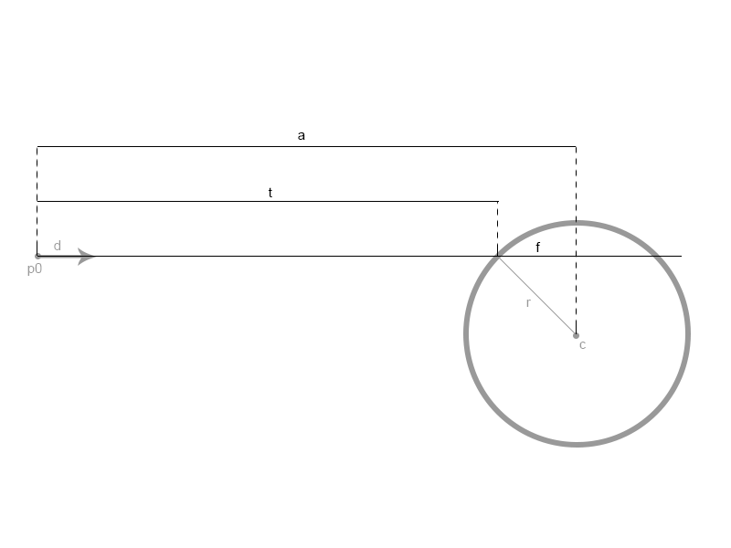
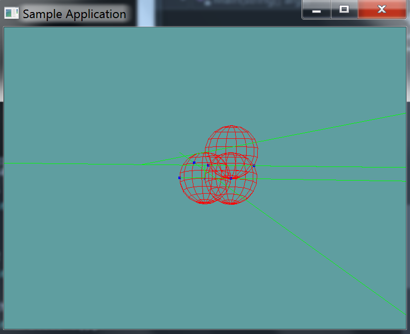

# Ray Against Sphere

Given the following image, we have :



* Ray __R__, defined by:
  * point __p0__
  * normal __d__
* Sphere __S__, defined by:
  * center point __c__ 
  * radius __r__

Given this information, we want to find out if ray __R__ intersects sphere __S__. If the ray intersects the sphere, it's going to be along the normal. In the image below, __t__ is the length at which the normal intersects the sphere:



An intersection happens at time __t__, along ray __R__. Another way to express this would be that the intersection happens at __R(t)__. To find __t__, we need to first find  __a__ and __f__. The formula for __t__ is:

```
t = a - f
```

In order to find __a__ and __f__, we need two more vectors, vector __e__ and vector __b__. Vector __e__ is the vector from __p0__ to __c__. Vector __b__ is one side of the right triangle formed by vectors __r__, __f__ and __b__. The image below demonstrates this. You know r and f, you have to solve the right triangle for b.


In this image, we have two triangles we care about. 
* Triangle __f__, __b__, __r__
* Triangle __a__, __e__, __b__

Given these two triangles, we can figure out the following

* Vector __e__ is a vector going to __p0__ to __c__
* Vector __a__ is vector __e__ projected onto vector __d__
* Vector __b__ is given by the pathegroen therom
  *  A^2+B^2=C^2  : Therom
  * $$ a^2+b^2=e^2 $$ : Triangle __a__, __e__, __b__
  * $$b^2=e^2-a^2$$ : Re-arranged
  * $$b = sqrt(e*e - a*a)$$ :final
* Vector __f__ is given by the pathegroen therom
  * $$f^2+b^2=r^2$$ : Triangle __f__, __b__, __r__
  *  $$f^2=r^2-b^2$$ : Re-arranged
* Now we can solve for __t__
  * $$t=a-f$$ : algorithm for __t__
  * $$t=a - sqrt(r^2- b^2)$$ : Expanded __f__  
  * $$t=a - sqrt(r^2- e^2 + a^2)$$ : Expanded __b__, final

With that, we have the value of t! 

What happens when the ray doesn't hit the sphere? The expression inside the square root $$sqrt(r^2- e^2 + a^2)$$ will be negative. Therefore, we have to make an early out test for that!

There is one more edge case, if $$e^2$$ is less than the squared radius of the sphere, the ray starts INSIDE the sphere! This is again a special case that we need to handle delicatley.

## The Algorithm

In the above diagrams, it's not always clear what is a vector value and what is a scalar value! When a vector is used in a square root, we are talking about the length of the vector. The code below should give more context.

```cs
// This function will return the value of t
// if it returns negative, no collision!
float Raycast01(Ray ray, Sphere sphere) {
    Vector3 p0 = ray.Position;
    Vector3 d = ray.Normal;
    Vector3 c = sphere.Position;
    float r = sphere.Radius;

    Vector3 e = c - p0;
    // Using Length here would cause floating point error to creep in
    float Esq = Vector3.LengthSquared(e);
    float a = Vector3.Dot(e, d);
    float b = Sqrt(Esq - (a * a));
    float f = Sqrt((r * r) - (b * b));

    // No collision
    if (r * r - Esq + a * a < 0f) {
       return -1; // -1 is invalid.
    }
    // Ray is inside
    else if (Esq < r * r) {
        return a + f; // Just reverse direction
    }
    // else Normal intersection
    return = a - f;
}
```

## On Your Own

Add the following function to the ```Collisions``` class:

```cs
// TODO: Implement this function
static bool Raycast(Ray ray, Sphere sphere, out float t)

// I've implemented these for you!

// Conveniance method, returns t without an out param
// If no collision happened, will return -1
static float Raycast(Ray ray, Sphere sphere) {
    float t = -1;
    if (!Raycast(ray, sphere, out t)) {
        return -1;
    }
    return t;
}

// Conveniance method, returns the point of intersection
// instead of p
static bool Raycast(Ray ray, Sphere sphere, out Point p) {
    float t = -1;
    bool result = Raycast(ray, sphere, out t);
    p = new Point(ray.Position.ToVector() + ray.Normal * t);
    return result;
}
```

And provide an implementation for it!

### Unit Test

You can [Download](../Samples/Raycast.rar) the samples for this chapter to see if your result looks like the unit test.

The unit test looks visually messy. 3 red spheres are rendered, and a bunch of green lines. Any collision point between a ray and a sphere is marked as blue.

Not every ray is tested against every line, that's why visually this one is impossible to call. The constructor however, will throw errors where needed.



```cs
using OpenTK.Graphics.OpenGL;
using Math_Implementation;
using CollisionDetectionSelector.Primitives;

namespace CollisionDetectionSelector.Samples {
    class RaycastSphere : Application {
        public class Touple {
            public Ray ray;
            public Sphere sphere;
            public bool result;

            public Touple(float rayX, float rayY, float rayZ, float normX, float normY, float normZ, 
                float sphereX, float sphereY, float sphereZ, float rad, bool res) {
                ray = new Ray(new Point(rayX, rayY, rayZ), new Vector3(normX, normY, normZ));
                sphere = new Sphere(new Point(sphereX, sphereY, sphereZ), rad);
                result = res;
            }
        }

        Touple[] touples = new Touple[] {
            new Touple(-2, 1, 0, 2, 0, 0, 2, 0, 0, 2, true),
            new Touple(-2, 0, 0, 2, 0, 0, 2, 2, 0, 2, true),
            new Touple(-2, 0, 0, 2, 0, 0, 0, 0, 0, 2, true),
            new Touple(-2, 2, 0, 2, -1, 2, 0, 0, 0, 2, true),
            new Touple(2, 1, 0, 2, 0, 0, 2, 0, 0, 2, true),
            new Touple(-2, 1, 0, -1, 0, 0, 2, 0, 0, 2, false),
            new Touple(-5, 1, 0, 2, 0.4f, 0, 2, 0, 0, 2, false)
        };

        public override void Intialize(int width, int height) {
            GL.Enable(EnableCap.DepthTest);
            GL.PointSize(5f);
            GL.Enable(EnableCap.CullFace);
            GL.PolygonMode(MaterialFace.FrontAndBack, PolygonMode.Line);

            foreach(Touple touple in touples) {
                float t = 0f;
                if (Collisions.Raycast(touple.ray, touple.sphere, out t) != touple.result) {
                    LogError("Expected ray: " + touple.ray + "\nTo " +
                        (touple.result ? "intersect" : "not intersect")
                    + " sphere: " + touple.sphere);
                }
            }
        }

        public override void Render() {
            //GL.Enable(EnableCap.CullFace);
            GL.PolygonMode(MaterialFace.FrontAndBack, PolygonMode.Line);

            base.Render();
            DrawOrigin();

            GL.Color3(1f, 0f, 0f);
            for (int i = 0; i < 3; ++i) {
                touples[i].sphere.Render();
            }

            GL.Color3(0f, 1f, 0f);
            foreach (Touple touple in touples) {
                touple.ray.Render();
                if (touple.result) {
                    Point p = new Point();
                    Collisions.Raycast(touple.ray, touple.sphere, out p);
                    GL.Color3(0f, 0f, 1f);
                    p.Render();
                    GL.Color3(0f, 1f, 0f);
                }
            }
        }

        private void Log(string s) {
            System.Console.WriteLine(s);
        }
    }
}
```