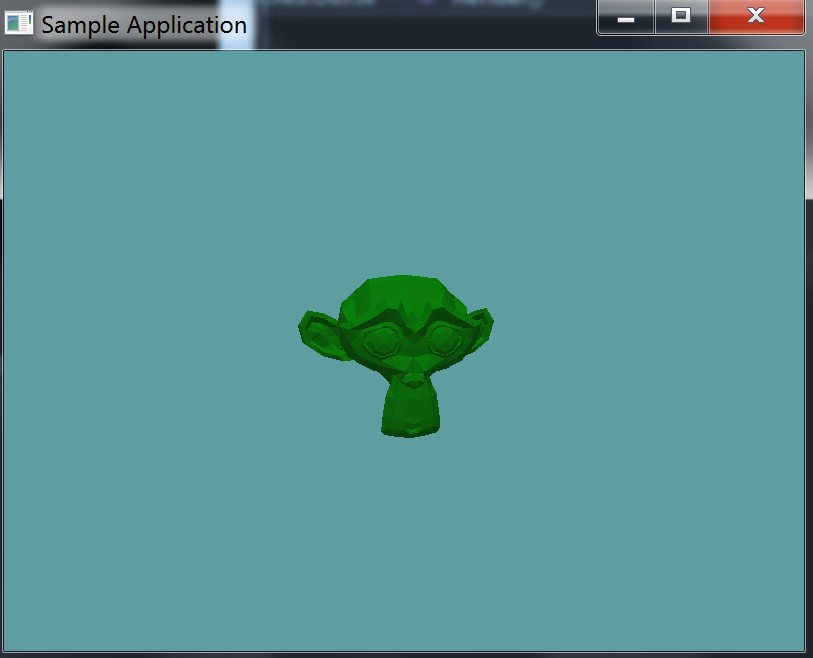

#3D Models

The basic primitive shapes will only get you so far in games. At some point you might need to figure out collisions against 3D models. Tough, it's considered best practice to avoid using mesh colliders, sometimes (Like environment collision) you absoluteley need them.

#Import Some Code

Before we begin implementing a 3D model, let's go ahead and add a way to load 3D models to the project. Pull in the [OBJLoader](https://github.com/Mszauer/OpenGL1X/blob/master/GameApplication/OBJLoader.cs) from the [OpenGL1X](https://github.com/Mszauer/OpenGL1X) project. Make sure to place the class in the correct name space. 

Once you have the class pulled in, go ahead and [Download suzanne.obj](../Samples/suzanne.obj). Here is some code to load up and display the model. Remember to set your working directory accordingly.

```cs
using OpenTK.Graphics.OpenGL;
using Math_Implementation;
using CollisionDetectionSelector.Primitives;
using CollisionDetectionSelector;

namespace CollisionDetectionSelector.Samples {
    class OBJSample : Application {
        OBJLoader obj = null;

        public override void Intialize(int width, int height) {
            GL.Enable(EnableCap.DepthTest);
            GL.Enable(EnableCap.CullFace);
            GL.Enable(EnableCap.Lighting);
            GL.Enable(EnableCap.Light0);

            GL.Light(LightName.Light0, LightParameter.Position, new float[] { 0.0f, 0.5f, 0.5f, 0.0f });
            GL.Light(LightName.Light0, LightParameter.Ambient, new float[] { 0f, 1f, 0f, 1f });
            GL.Light(LightName.Light0, LightParameter.Diffuse, new float[] { 0f, 1f, 0f, 1f });
            GL.Light(LightName.Light0, LightParameter.Specular, new float[] { 1f, 1f, 1f, 1f });

            obj = new OBJLoader("Assets/suzanne.obj");
        }

        public override void Render() {
            base.Render();
            DrawOrigin();

            GL.PushMatrix();
            GL.Scale(3.0f, 3.0f, 3.0f);
            obj.Render();
            GL.PopMatrix();
        }
    }
}
```

The resulting window should look like this:

