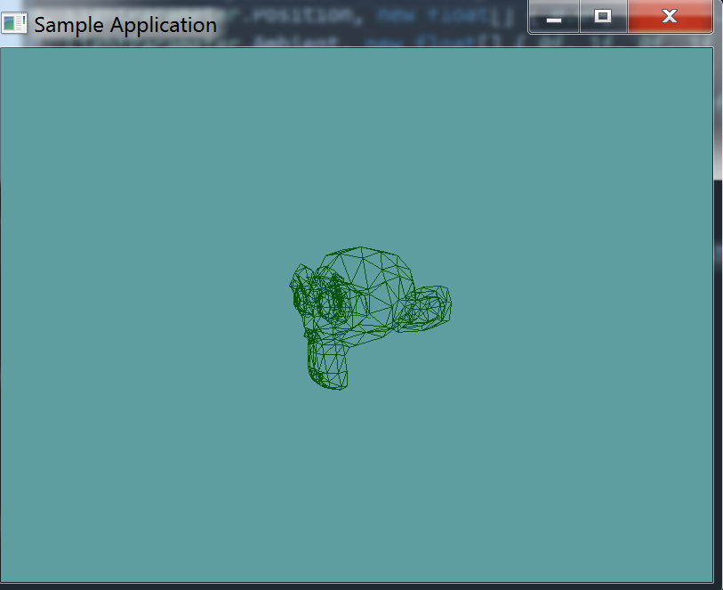

# AABB

Our model now has a triangle soup. We can raycast against this, or do collision test, whatever works. But, like we discussed that's really not optimal! so, instead let's make a function that creates an Axis Aligned Bounding Box around the model.

## Creating the AABB

We already have an array of triangles added to ```OBJLoader.cs```, now lets add a new member variable to it for the AABB of the mesh.

```cs
protected AABB containerAABB = null;
```

We're going to have to populate this AABB in the constructor of the mesh. Again, the ```vertexData``` array is our friend. 

First, assign ```containerAABB``` to be a new AABB object. Both the min and max point of this object should be the first vertex of ```vertexData```. Remember, the first vertex is elements 0, 1 and 2.

```cs
containerAABB = new AABB(new Point(vertices[0], vertices[1], vertices[2]),
                new Point(vertices[0], vertices[1], vertices[2]));
```

Now loop trough vertexData one vertex at a time. You will have to adjust containerAABB one component at a time. If a vertex has a smaller y than min-y assign a new y. For eaxample:

```cs
// ...
if (vertexData[i + 0] < containerAABB.minX) {
    containerAABB.minX = vertexData[i + 0];
}
if (vertexData[i + 0] > containerAABB.maxX) {
    containerAABB.maxX = vertexData[i + 0];
}
if (vertexData[i + 1] < containerAABB.minY) {
    containerAABB.minY = vertexData[i + 0];
}
if (vertexData[i + 1] > containerAABB.maxY) {
    containerAABB.maxY = vertexData[i + 1];
}
if (vertexData[i + 2] < containerAABB.minZ) {
    containerAABB.minZ = vertexData[i + 0];
}
if (vertexData[i + 2] > containerAABB.maxZ) {
    containerAABB.maxZ = vertexData[i + 2];
}
// ...
```

## Debug Render

Now, let's add a public getter for the aabb:

```cs
public AABB BoundingBox {
    get {
        return containerAABB;
    }
}
```

And modify the debug-render method to draw this box:

```cs
public void DebugRender() {
    containerAABB.Render();
    foreach (Triangle trianlge in collisionMesh) {
        trianlge.Render();
    }
}
```

You can [Download](../Samples/3DModels.rar) the samples for this chapter to see if your result looks like the unit test.

You should already have suzanne in your project from earlyer in this chapter. This section just added triangles to the OBJLoader code. The constructor only errors out if the triangle count is off. Otherwise the rest of the test is visual only. You should see susane in the test



```cs
using OpenTK.Graphics.OpenGL;
using Math_Implementation;
using CollisionDetectionSelector.Primitives;
using CollisionDetectionSelector;

namespace CollisionDetectionSelector.Samples {
    class OBJDebugTrianglesAABB : Application {
        OBJLoader obj = null;

        public override void Intialize(int width, int height) {
            GL.Enable(EnableCap.DepthTest);
            GL.Enable(EnableCap.CullFace);
            GL.Enable(EnableCap.Lighting);
            GL.Enable(EnableCap.Light0);

            GL.PolygonMode(MaterialFace.FrontAndBack, PolygonMode.Line);

            GL.Light(LightName.Light0, LightParameter.Position, new float[] { 0.0f, 0.5f, 0.5f, 0.0f });
            GL.Light(LightName.Light0, LightParameter.Ambient, new float[] { 0f, 1f, 0f, 1f });
            GL.Light(LightName.Light0, LightParameter.Diffuse, new float[] { 0f, 1f, 0f, 1f });
            GL.Light(LightName.Light0, LightParameter.Specular, new float[] { 1f, 1f, 1f, 1f });

            obj = new OBJLoader("Assets/suzanne.obj");

            if (obj.NumCollisionTriangles != 968) {
                LogError("Suzanne triangle count expected at 968, got: " + obj.NumCollisionTriangles);
            }
            AABB test = new AABB(new Point(-1.367188f, -0.984375f, -0.851562f), new Point(1.367188f, 0.984375f, 0.851562f));
            if (!AlmostEqual(test, obj.BoundingBox)) {
                LogError("Expected bounting box:\n" + test.ToString() + "\n Got bounding box: \n" + obj.BoundingBox.ToString());
            }
        }

        private bool AlmostEqual(float f1, float f2) {
            return (System.Math.Abs(f1 - f2) <= float.Epsilon *
                System.Math.Max(1.0f, System.Math.Max(
                    System.Math.Abs(f1), System.Math.Abs(f2))));
        }

        private bool AlmostEqual(Point p1, Point p2) {
            return AlmostEqual(p1.X, p2.X) && AlmostEqual(p1.Y, p2.Y) && AlmostEqual(p1.Z, p2.Z);
        }

        private bool AlmostEqual(AABB aabb1, AABB aabb2) {
            return AlmostEqual(aabb1.Min, aabb2.Min) && AlmostEqual(aabb1.Max, aabb2.Max);
        }

        public override void Render() {
            base.Render();
            DrawOrigin();

            GL.PushMatrix();
            GL.Scale(3.0f, 3.0f, 3.0f);
            obj.DebugRender();
            GL.PopMatrix();
        }
    }
}

```