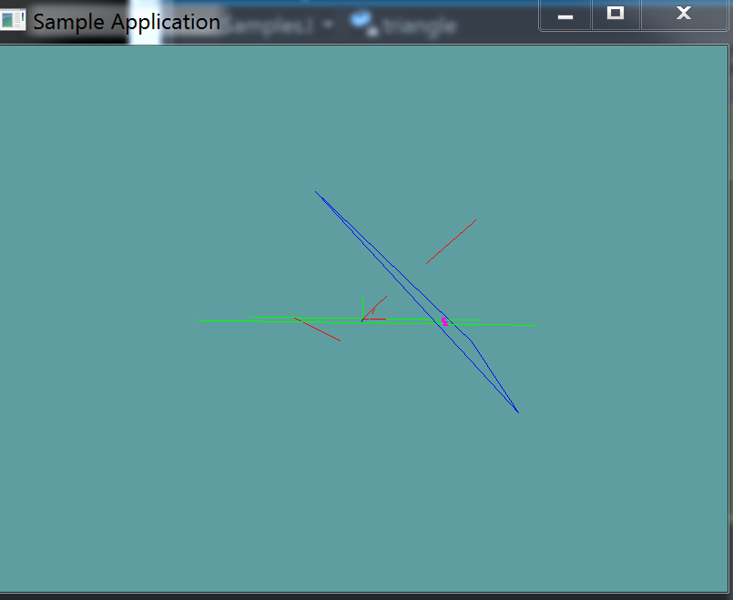

# Adding Triangles

It's time to start implementing some broad phase collision. The first thing we're going to do is add a list of triangles to our 3D model. This is going to be done at load time, as the models vertex array is filled in, we will also fill in a list of triangles.

We're also going to add a "DebugRender" function, that will loop trough all the triangles and render them. Because this is going to render each triangle indevidually, it's going to be much, much slower than the regular render function.

## Constructing Triangles

First thing is first, add a triangle array as a member variable to the ```ObjLoader``` class. I called mine ```collisionMesh```

```cs
protected Triangle[] collisionMesh = null;
```

Now, in the constructor, find where the actual vertex data is being filled in. I'll give you a hint, it's a for loop that happens AFTER everything has been read in from the file.

Before that loop, still in the constructor, allocate enough Triangles for the array

```cs
collisionMesh = new Triangle[vertexData.Count / 9];
```

Once the vertex data array has been filled with data, every 9 elements inside of it make one triangle. That is __collisionMesh[0]__ =

* new Triangle(
  * new Point(```vertexData[0]```, ```vertexData[1]```, ```vertexData[2]```),
  * new Point(```vertexData[3]```, ```vertexData[4]```, ```vertexData[5]```),
  * new Point(```vertexData[6]```, ```vertexData[7]```, ```vertexData[8]```),
* )

Figure out a way to loop trough vertex data in a way that fills the ```collisionMesh``` array out! For suzane, that means 968 triangles!


## Debug Render

First, let's add a debug getter to check how many debug triangles we have

```cs
public int NumCollisionTriangles {
    get {
        return collisionMesh.Length;
    }
}
```

Next, a "debug render" method, this method will simply draw out all triangles:

```cs
 public void DebugRender() {
    foreach(Triangle trianlge in collisionMesh) {
        trianlge.Render();
    }
}
```

## Unit Test

### Unit Test

You can [Download](../Samples/3DModels.rar) the samples for this chapter to see if your result looks like the unit test.

A trianlge and a few lines are rendered. Any line intersecting the triangle is green. All lines not intersecting the triangle are red. Magenta dots are rendered at the points of intersection. The constructor of this unit test will spit out errors if it finds any 



```cs

```