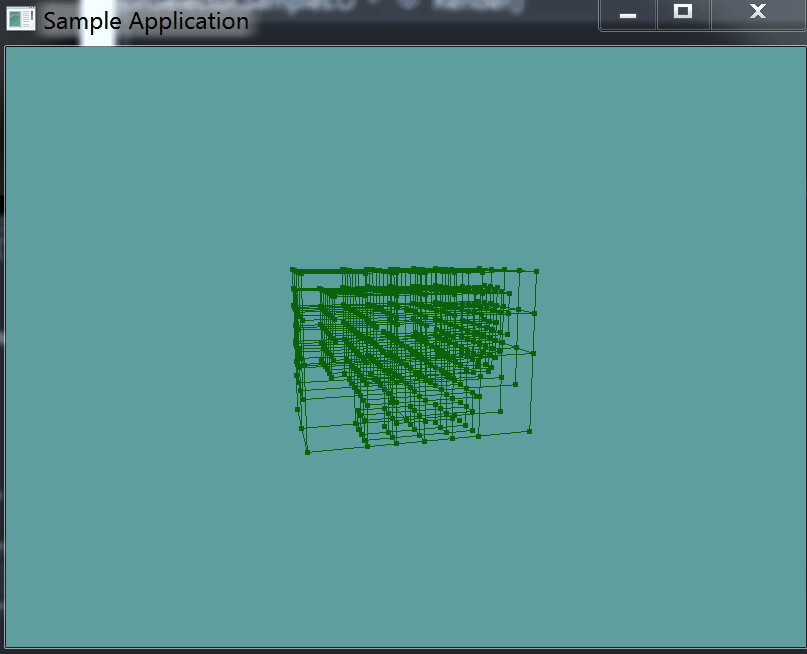
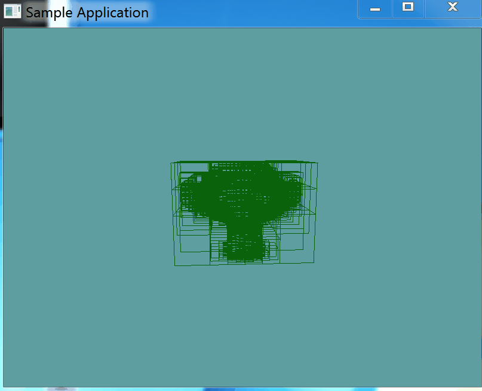

#Shake

Right now, every node in our BVH has exactly 8 or 0 children. This structure is called an __Octree__. This octree structure is not optimal, 7 of those 8 children might not actually contain any triangles.

We can eliminate any empty leaf nodes, meaning a BVH node will have 0, 1, 2, 3, 4, 5, 6, 7 or 8 children. This modified structure is called a __sparse octree__. The process of removing empty leaf nodes from the tree is called shaking. You have to shake the tree, because programmers have a real sense of humor.

### Count the triangles

The first piece of information we need to know about a BVH node in order to shake the tree is how many triangles the node contains. This isn't as simple as returning the count of the triangle list. 

We need to know how many children the node, and all of it's children and all of their children contain. This means that getting the child count is going to be a recursive function.

```cs
 public int TriangleCount {
    get {
        int totalCount = 0;
        if (Children != null) {
            foreach (BVHNode child in Children) {
                totalCount += child.TriangleCount;
            }
        }
        else if (Triangles != null) {
            totalCount += Triangles.Count;
        }

        return totalCount;
    }
}
```

### Shake it!

Implementing the actual shake function is simple. First, we check if the node has any children. If it does not, we don't do anything. 

If the node has children, we loop trough them BACKWARDS. Any child that has 0 triangles is removed.

After we've removed the 0 triangle children, we loop trough the remaining children and call shake on them. In this way, the shake function is recursive.

```cs
public void Shake() {
    if (Children != null) {
        for (int i = Children.Count - 1; i >= 0; --i) {
            if (Children[i].TriangleCount == 0) {
                Children.RemoveAt(i);
            }
        }
        foreach(BVHNode child in Children) {
            child.Shake();
        }
    }
}
```

Now, go ahead and call the Shake function in ```ObjLoader```, right after the split function was called! After all the BVH functions have been added to the ```OBJLoader``` constructor, this is what the relevant section looks like for me:

```cs
bvhRoot = new BVHNode(containerAABB);

for (int i = 0; i < vertexData.Count; i += 9) {
    collisionMesh[meshCounter++] = new Triangle(
        new Point(vertexData[i + 0], vertexData[i + 1], vertexData[i + 2]),
        new Point(vertexData[i + 3], vertexData[i + 4], vertexData[i + 5]),
        new Point(vertexData[i + 6], vertexData[i + 7], vertexData[i + 8])
    );

    bvhRoot.Triangles.Add(collisionMesh[meshCounter - 1]);
}

bvhRoot.Split();
bvhRoot.Shake();
```

### Test it

Running the game, the window should now display this:



You can clearly see how the tree got sparsed out. The shape of the mesh is even more visible now.

### More detail

For our monkey model, a subdivision depth of 3 will suffice. The bigger a model, the deeper the subivision needs to be. The deeper the subdivision, the more expensive the BVH becomes. Just for fun, let's see what would happen if we turned the subdiv depth up from 3 to 5:



Now you can REALLY tell the shape of the model. Let's keep the max depth at 3 for now, 5 is more appropriate for things like terrain. I've NEVER seen a max depth greater than 8.