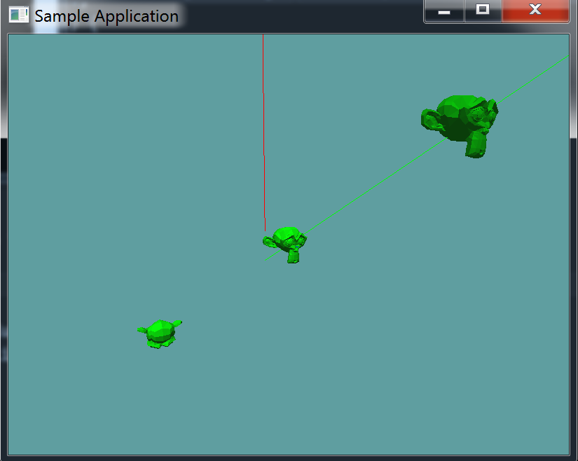

#Raycast

Now, for the moment of truth, let's implement a raycast function! Well, we're not really going to implement a new one, as much as we're going to modify the existing ```Raycast(Ray ray, OBJ model, out float t)``` function. 

## Expose the BVH Tree

Go into the ```OBJ``` class, and expose the ```BVHRoot``` of the ```OBJLoader``` that's contained inside the ```OBJ``` class.

```cs
public BVHNode BVHRoot {
    get {
        return model.BvhRoot;
    }
}
```

## Collisions

Just so we're on the same page, this is what my raycast function currently looks like:

```cs
public static bool Raycast(Ray ray, OBJ model, out float t) {
    Matrix4 inverseWorldMatrix = Matrix4.Inverse(model.WorldMatrix);
    Ray newRay = new Ray(ray.Position, ray.Normal);
    newRay.Position = new Point(Matrix4.MultiplyPoint(inverseWorldMatrix, ray.Position.ToVector()));
    newRay.Normal = Matrix4.MultiplyVector(inverseWorldMatrix, ray.Normal);

    if (!Raycast(newRay, model.BoundingSphere, out t)) {
        return false;
    }
    if (!Raycast(newRay, model.BoundingBox, out t)) {
        return false;
    }

    foreach(Triangle triangle in model.Mesh) {
        if (Raycast(newRay, triangle, out t)) {
            return true;
        }
    }

    return false;
}
```

Now, what we want to do is replace that triangle raycast loop with a raycast against a BVH node. That's going to be a new function. 

### Raycast BVHNode

Raycasting against a BVH node is a recursive process. First, we check if the ray being passed in hits the AABB of the node. If it does not, we just return. 

Next, we loop trough the children of the node (if it's not a leaf node, and has children). We call the raycast function on each of it's children, this is the recursive part. If any of those result in true, we return true.

Finally, if the node was a leaf, we loop trough all of it's triangles. If any of the triangles hit, return true.

By default we return false.


```cs
public static bool Raycast(Ray ray, BVHNode node, out float t) {
    if (!Raycast(ray, node.AABB, out t)) {
        return false;
    }

    if (node.Children != null) {
        foreach(BVHNode child in node.Children) {
            if (Raycast(ray, child, out t)) {
                return true;
            }
        }
    }

    if (node.Triangles != null) {
        foreach (Triangle triangle in node.Triangles) {
            if (Raycast(ray, triangle, out t)) {
                return true;
            }
        }
    }

    return false;
}
```

## Raycast OBJ

Now we can go back to the raycast obj function, and eliminate its triangle loop. Make sure to pass ```newRay``` into the Raycast-BVHNode function

```cs
public static bool Raycast(Ray ray, OBJ model, out float t) {
    Matrix4 inverseWorldMatrix = Matrix4.Inverse(model.WorldMatrix);
    Ray newRay = new Ray(ray.Position, ray.Normal);
    newRay.Position = new Point(Matrix4.MultiplyPoint(inverseWorldMatrix, ray.Position.ToVector()));
    newRay.Normal = Matrix4.MultiplyVector(inverseWorldMatrix, ray.Normal);

    if (!Raycast(newRay, model.BoundingSphere, out t)) {
        return false;
    }
    if (!Raycast(newRay, model.BoundingBox, out t)) {
        return false;
    }

    return Raycast(newRay, model.BVHRoot, out t);
}
```

### Test it!

Now you can test that we didn't break anything! Just load up and run the existing ```OBJRaycast``` unit test. With any luck, nothing has changed! It should look like this:



Even tough visually nothing has changed, the actual raycast test is much faster now, we probably saved about 5 to 10 milliseconds / raycast. Which in game time is HUGE!