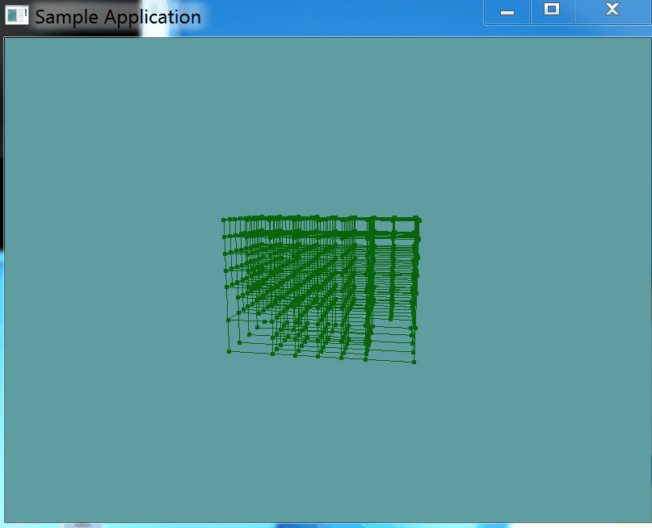

# Splitting

Splitting as you might imagine, is going to be a recursive process. We're actually going to implement 2 function, 1 public one that does not expose any recursion paramaters, and a private one that will. The paramater being passed in is recursion level.

The split function will first check that a node is a leaf node, as we can only split leaf nodes, non-leaf nodes are already split. 

The leaf node is only going to be split if it has triangles. This makes sense, there is no need to split an empty node. Just keep blank space empty.

If both of the above conditions are met, we check to make sure that we are not below the recursion limit, and if not then the BVHNode is split into 8 smaller ones.

Splitting a node is simple. We get the 8 corners of the bounding box (Top Fron Left corner in code is called TFL for example). Then we make 8 new AABB's using each of the corners and the center point of the AABB as the min and max points. 

Once a node has all of it's children, we loop torugh the triangles it contains, and test if the triangle fits inside one of the childern. If it does, it's added to the childs list of triangles. In this process, 1 triangle may belong to multiple children.

Once all triangles are assigned to children, we make the node a non-leaf node by clearing the triangle list it contains (Remember, the children have the triangles now) and then setting the list to null.

Finally, we loop trough every child and call the split function (this is the recursive part) on the child. This will continue the process until we've reached a certain depth.

This is the entire process in code:

```cs
// Public facing split function
public void Split() {
    Split(0);
}

// Private split function, recursivley calls its-self!
protected void Split(int depth) {
    // This node is currently a leaf, we can split it!
    if (Children == null && Triangles != null) {
        // Only split if the node actually contains triangles
        if (Triangles.Count > 0) {
            // Only split if we're below the maximum BVH depth
            if (depth < maxDepth) {
                Children = new List<BVHNode>();
                Vector3 center = AABB.Center.ToVector();
                Vector3 extent = AABB.Extents;

                Vector3 TFL = center + new Vector3(-extent.X, +extent.Y, -extent.Z);
                Vector3 TFR = center + new Vector3(+extent.X, +extent.Y, -extent.Z);
                Vector3 TBL = center + new Vector3(-extent.X, +extent.Y, +extent.Z);
                Vector3 TBR = center + new Vector3(+extent.X, +extent.Y, +extent.Z);
                Vector3 BFL = center + new Vector3(-extent.X, -extent.Y, -extent.Z);
                Vector3 BFR = center + new Vector3(+extent.X, -extent.Y, -extent.Z);
                Vector3 BBL = center + new Vector3(-extent.X, -extent.Y, +extent.Z);
                Vector3 BBR = center + new Vector3(+extent.X, -extent.Y, +extent.Z);

                Children.Add(new BVHNode(new AABB(new Point(TFL), new Point(center))));
                Children.Add(new BVHNode(new AABB(new Point(TFR), new Point(center))));
                Children.Add(new BVHNode(new AABB(new Point(TBL), new Point(center))));
                Children.Add(new BVHNode(new AABB(new Point(TBR), new Point(center))));
                Children.Add(new BVHNode(new AABB(new Point(BFL), new Point(center))));
                Children.Add(new BVHNode(new AABB(new Point(BFR), new Point(center))));
                Children.Add(new BVHNode(new AABB(new Point(BBL), new Point(center))));
                Children.Add(new BVHNode(new AABB(new Point(BBR), new Point(center))));
            }
        }
    }

    // IF this node was JUST split, it is neither a leaf or a
    // normal node, because it has both triangles and children!
    // Let's fix that and turn this into a non leaf node
    if (Triangles != null && Children != null) {
        foreach(Triangle triangle in Triangles) {
            foreach(BVHNode child in Children) {
                if (Collisions.Intersects(child.AABB, triangle)) {
                    child.Triangles.Add(triangle);
                }
            }
        }
        // Make sure this node is not a leaf
        Triangles.Clear();
        Triangles = null;
    }

    // Spliting is a recursive function. If this node is not a leaf,
    // split all of it's leaf nodes (If possible)
    if (Children != null) {
        foreach(BVHNode child in Children) {
            child.Split(depth + 1);
        }
    }
}
```

#### Test it!

Call that function in the OBJLoader constructor, right after the loop that adds all of the triangles to the BVH root node.

After that, go into the ```OBJSample``` class, and modify the render function so the actual model doesn't render, like so:

```cs
public override void Render() {
    base.Render();
    DrawOrigin();

    GL.PushMatrix();
    GL.Scale(3.0f, 3.0f, 3.0f);
    //obj.Render();
    GL.PolygonMode(MaterialFace.FrontAndBack, PolygonMode.Line);
    obj.RenderBVH();
    GL.PolygonMode(MaterialFace.FrontAndBack, PolygonMode.Fill);
    GL.PopMatrix();
}
```

Running the game now, the result should look like this:



Even tough the model is not rendered, you can kind of see the outline of where the model is inside the BVH structure. Sorry for the strange gif loop.....