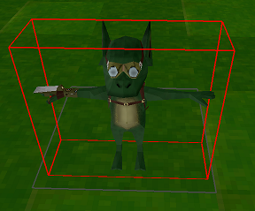
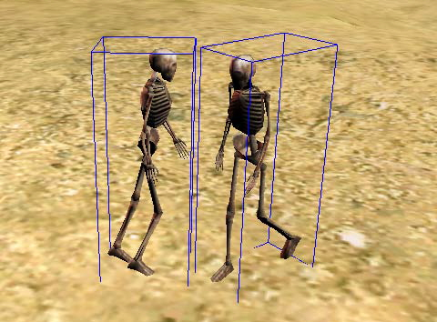

# Containers

You've seen exactly how expensive triangle checks can be! In order to test for collision against a model we have to check every single triangle of the model against the primitive! In pseudo-code that might look something like this:

```cs
bool Intersects(OBJModel model, Sphere sphere) {
    foreach(Triangle triangle in model.triangles) {
        if (Intersects(triangle, sphere)) {
            return true;
        }
    }
    return false;
}
```

It's so much worse if you try to do 2 models! You have to check each triangle against all triangles in the other model. That means that 2 models with 100 triangles will need to do 10,000 tests! That's 110,000 Seperating Axis!

```cs
bool Intersects(ObjModel m1, ObjModel m2) {
    for (int i = 0; i < m1.triangles.Length; ++i) {
        for (int j = 0; j < m2.triangles.Length; ++j) {
            if (Intersects(m1.triangles[i], m2.triangles[j])) {
                return true;
            }
        }
    }
    return false;
}
```

In a model that consists of 100 triangles that might not be a big deal. But in modern games, the triangle count is often in the hundreds of thousands if not millions!

Doing the per triangle testing is known as __narrow-phase collision__. 

Containers solve this problem by adding a bounding shape to the model. That way, when you test collisions, if the bounding shape of the model doesn't interact with the test, you don't waste precious resources.

An AABB around a model might look like this:



And the collision test could simplify into this:

```cs
bool Intersects(ObjModel m1, ObjModel m2) {
    // Early out if not touching
    if (!Intersects(m1.AABBContainer, m2.AABBContainer)) {
        return false;
    }
    
    for (int i = 0; i < m1.triangles.Length; ++i) {
        for (int j = 0; j < m2.triangles.Length; ++j) {
            if (Intersects(m1.triangles[i], m2.triangles[j])) {
                return true;
            }
        }
    }
    return false;
}
```

Adding a bounding volume to an object, and testing that before the actual triangle tests is known as __broad-phase collision__

Visually, that might look like this



That optimization will save so much processing power! With all that said, let's get started. In the next section we're going to add triangles to our loaded OBJ model.