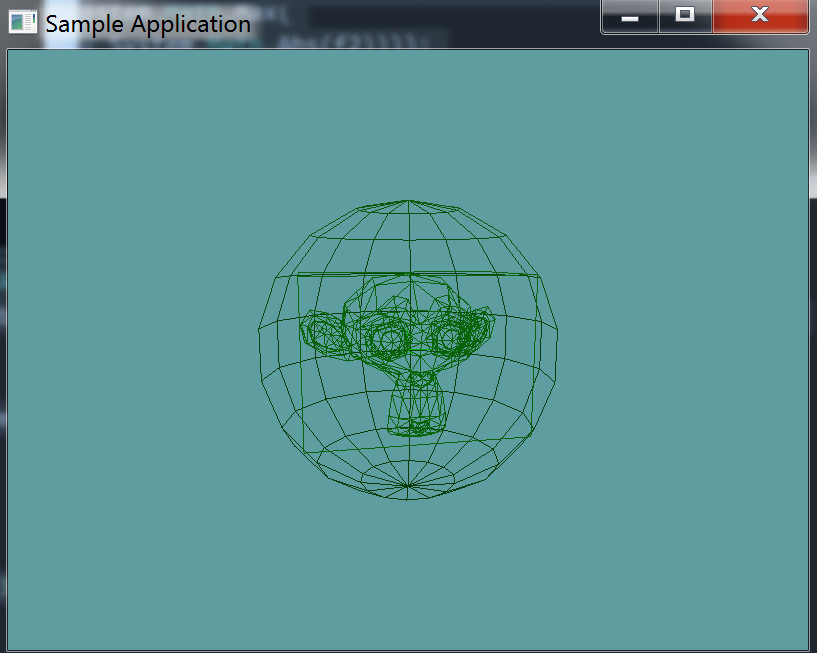

# Collision testing

In the last section of this document we added collision triangles to a model, a bounding box and a bounding sphere. Hopefully the debug render function we added will show the accuracy of the collision testing we do against the model at each level.

Before we dive into things, there is one getter that needs to be added to the ``ObjLoader``` class:

```cs
public Triangle[] CollisionMesh {
    get {
        return collisionMesh;
    }
}
```

## Spaces

The collision tests against a model are going to be a bit different than those against primitives, this is because the model is located in it's own model space. Model space is always located at the origin. So long as we render a model like this:

```cs
public override void Render() {
    base.Render();
    DrawOrigin();
    
    obj.Render();
}
```

Everything will be fine, because the model is at origin. But as soon as we scale, rotate or translate the model:

```cs
public override void Render() {
    base.Render();
    DrawOrigin();

    GL.PushMatrix();
    GL.Translate(1f, 0f, 0f);
    GL.Scale(3.0f, 3.0f, 3.0f);
    obj.DebugRender();
    GL.PopMatrix();
}
```

Now the collisions wont work. Visually, the model looks different than how it's represented in memory. And all of the bounding primitives (triangles, AABB, Sphere) that we built around it, we built around the model in memory, not the visual model.

Luckily, we can solve this using matrix operations. The translation-rotation-scale of a model can be used to create a transform matrix. This matrix represents where in world space the model is. 

If we take the inverse of that matrix, and multiply any point by it, the point will be transformed so that the model is at the origin of the points space.

This last bit can get a tad confusing, especially since we haven't done any matrix math in a while. If you need any help on any of it, give me a call on skype.

## The OBJ Class

To make the concept of spaces less confusing, we're going to create a new class, the ```OBJ``` class. This class is going to simply hold a ```OBJLoader``` object and the transform matrix of the object.  Let's implement the class as such:

```cs
using OpenTK.Graphics.OpenGL;
using Math_Implementation;

namespace CollisionDetectionSelector.Primitives {
    class OBJ {
        OBJLoader model = null;

        // VERY IMPORTANT THAT THESE HAVE DEFAULT VALUES
        protected Vector3 position = new Vector3(0f, 0f, 0f);
        protected Vector3 rotation = new Vector3(0f, 0f, 0f);
        protected Vector3 scale = new Vector3(1f, 1f, 1f);
        
        public OBJ(OBJLoader loader) {
            model = loader;
        }
    }
}
```

From this class, we can tell that an OBJ has a position, a rotation and a scale. It holds an OBJLoader, and can only be constructed if an OBJLoader is present. The whole point of this class was to hold a transform matrix. So far, we have all the components of that matrix, but not the matrix its-self. Let's add it.

The matrix is going to be a private variable, with a dirty flag. When getting the matrix trough a public accessor, if the dirty flag is true, the private matrix is re-calculated from position, rotation and scale, then the new correct matrix is returned

```cs
// Add this to the OBJ class
protected Matrix4 worldMatrix;
protected bool dirty = true; // MUST BE TRUE BY DEFAULT

public Matrix4 WorldMatrix {
    get {
        if (dirty) {
            Matrix4 translation = Matrix4.Translate(position);

            Matrix4 pitch = Matrix4.XRotation(rotation.X);
            Matrix4 yaw = Matrix4.YRotation(rotation.Y);
            Matrix4 roll = Matrix4.ZRotation(rotation.Z);
            Matrix4 orientation = roll * pitch * yaw;

            Matrix4 scaling = Matrix4.Scale(scale);

            worldMatrix = translation * orientation * scaling;
        }
        return worldMatrix;
    }
}
```

So, what is it that will set this matrix to be dirty? Ideally changing the position, rotation or scale of the object. Lets add getters and setters for these properties. Whenever one of them is set, we flip the dirty flag to true.

This way we can change all 3 properties in the intializer of the unit test (or your future game), and the world matrix will still only be re-calculated once.

```cs
// Add this to the OBJ class
public Vector3 Position {
    get { return position; }
    set {
        position = value;
        dirty = true;
    }
}

public Vector3 Rotation {
    get { return rotation; }
    set {
        rotation = value;
        dirty = true;
    }
}

public Vector3 Scale {
    get { return scale; }
    set {
        scale = value;
        dirty = true;
    }
}
```

Additionally, the OBJ class will be used to test collisions, so it needs to expose the collision related properties of the OBJLoader it contains, like so:

```cs
// Add this to the OBJ class
public AABB BoundingBox {
    get {
        return model.BoundingBox;
    }
}

public Sphere BoundingSphere {
    get {
        return model.BoundingSphere;
    }
}

public Triangle[] Mesh {
    get {
        return model.CollisionMesh;
    }
}
```

Finally, all primitives have a Render and a ToString function. It's important that we call the WorldMatrix getter when setting the matrix in the renderer, if we don't the dirty flag might not be notices and the matrix might not get re-calculated.

```cs
// Add this to the OBJ class
public void Render() {
    GL.PushMatrix();
    // IMPORTANT: Calling the getter, not raw accessing the array!
    GL.MultMatrix(WorldMatrix.OpenGL);
    model.DebugRender();
    GL.PopMatrix();
}

public void DebugRender() {
    GL.PushMatrix();
    // IMPORTANT: Calling the getter, not raw accessing the array!
    GL.MultMatrix(WorldMatrix.OpenGL);
    model.DebugRender();
    GL.PopMatrix();
}

public override string ToString() {
    return "Triangle count: " + model.NumCollisionTriangles;
}
```

## Unit Test

You can [Download](../Samples/3DModels.rar) the samples for this chapter to see if your result looks like the unit test.

The constructor only errors out if the bounding sphere is off. Otherwise the rest of the test is visual only. You should see susane in the test



```cs
using OpenTK.Graphics.OpenGL;
using Math_Implementation;
using CollisionDetectionSelector.Primitives;
using CollisionDetectionSelector;

namespace CollisionDetectionSelector.Samples {
    class OBJClassSample : Application {
        OBJLoader loader = null;
        OBJ[] objs = new OBJ[] { null, null, null };

        public override void Intialize(int width, int height) {
            GL.Enable(EnableCap.DepthTest);
            GL.Enable(EnableCap.CullFace);
            GL.Enable(EnableCap.Lighting);
            GL.Enable(EnableCap.Light0);

            GL.PolygonMode(MaterialFace.FrontAndBack, PolygonMode.Line);

            GL.Light(LightName.Light0, LightParameter.Position, new float[] { 0.0f, 0.5f, 0.5f, 0.0f });
            GL.Light(LightName.Light0, LightParameter.Ambient, new float[] { 0f, 1f, 0f, 1f });
            GL.Light(LightName.Light0, LightParameter.Diffuse, new float[] { 0f, 1f, 0f, 1f });
            GL.Light(LightName.Light0, LightParameter.Specular, new float[] { 1f, 1f, 1f, 1f });

            loader = new OBJLoader("Assets/suzanne.obj");
            objs[0] = new OBJ(loader);
            objs[1] = new OBJ(loader);
            objs[2] = new OBJ(loader);

            objs[0].Scale = new Vector3(3.0f, 3.0f, 3.0f);

            objs[1].Position = new Vector3(6.0f, 6.0f, 6.0f);
            objs[1].Scale = new Vector3(1.5f, 1.5f, 1.5f);

            objs[2].Position = new Vector3(-6.0f, -6.0f, -6.0f);
            objs[1].Scale = new Vector3(1.5f, 1.5f, 1.5f);
            objs[2].Rotation = new Vector3(90.0f, 0.0f, 0.0f);
        }

        public override void Render() {
            base.Render();
            DrawOrigin();

            foreach(OBJ obj in objs) {
                obj.Render();
            }
            //objs[0].Render();
        }
    }
}
```