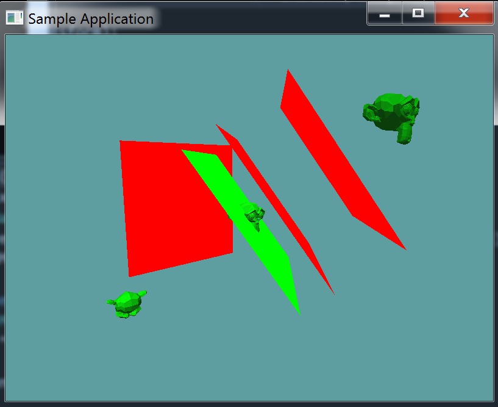

# Model Plane Collision

By now you can probably see the pattern of how model collisions are done. Model plane is the same way.

You must multiply the plane normal by the inverse world matrix of the model. This is a normal, not a point, so use the ```Matrix4.MultiplyVector``` method.

Scale the distance of the plane the same way we scaled the radius of the sphere.

## On Your Own

Add the following function to the ```Collisions``` class:

```cs
// conveniance method
public static bool Intersects(OBJ model, Plane plane) {
    return Intersects(plane, model);
}

public static bool Intersects(Plane plane, OBJ model) {
    // TODO
}
```

And provide an implementation for it!

### Unit Test

You can [Download](../Samples/3DModels.rar) the samples for this chapter to see if your result looks like the unit test.

This unit test is visual only, make sure your project looks like the screenshot. Pay special attention to the plane colors, green means there was a collision, red means there was not!



```cs
using OpenTK.Graphics.OpenGL;
using Math_Implementation;
using CollisionDetectionSelector.Primitives;
using CollisionDetectionSelector;

namespace CollisionDetectionSelector.Samples {
    class OBJPlaneIntersection : Application {
        OBJLoader loader = null;
        OBJ[] objs = new OBJ[] { null, null, null };

        Plane[] tests = new Plane[] {
            new Plane(new Vector3(1f, 1f, 1f), 2.0f),
            new Plane(new Vector3(1f, 1f, 1f), 0.0f),
            new Plane(new Vector3(-6f, -6f, -6f), -6.0f),
            new Plane(new Point(-4f, -8f, -8f), new Point(-5f, -4f, -8f), new Point(-7f, -4f, -8f))
        };

        public override void Intialize(int width, int height) {
            GL.Enable(EnableCap.DepthTest);
            GL.Enable(EnableCap.CullFace);
            GL.Enable(EnableCap.Lighting);
            GL.Enable(EnableCap.Light0);

            GL.Light(LightName.Light0, LightParameter.Position, new float[] { 0.0f, 0.5f, 0.5f, 0.0f });
            GL.Light(LightName.Light0, LightParameter.Ambient, new float[] { 0f, 1f, 0f, 1f });
            GL.Light(LightName.Light0, LightParameter.Diffuse, new float[] { 0f, 1f, 0f, 1f });
            GL.Light(LightName.Light0, LightParameter.Specular, new float[] { 1f, 1f, 1f, 1f });

            loader = new OBJLoader("Assets/suzanne.obj");
            objs[0] = new OBJ(loader);
            objs[1] = new OBJ(loader);
            objs[2] = new OBJ(loader);

            objs[1].Position = new Vector3(6.0f, 6.0f, 6.0f);
            objs[1].Scale = new Vector3(1.5f, 1.5f, 1.5f);

            objs[2].Position = new Vector3(-6.0f, -6.0f, -6.0f);
            objs[1].Scale = new Vector3(1.5f, 1.5f, 1.5f);
            objs[2].Rotation = new Vector3(90.0f, 0.0f, 0.0f);
        }

        public override void Render() {
            GL.Disable(EnableCap.Lighting);
            base.Render();
            DrawOrigin();
            GL.Enable(EnableCap.Lighting);

            GL.Color3(0f, 0f, 1f);
            foreach (OBJ obj in objs) {
                obj.Render();
            }

            GL.Disable(EnableCap.Lighting);
            GL.Disable(EnableCap.CullFace);
            foreach (Plane test in tests) {
                bool intersection = false;
                foreach (OBJ obj in objs) {
                    if (Collisions.Intersects(test, obj)) {
                        intersection = true;
                    }
                }
                if (intersection) {
                    GL.Color3(0f, 1f, 0f);
                }
                else {
                    GL.Color3(1f, 0f, 0f);
                }
                test.Render(5f);
            }
            GL.Enable(EnableCap.CullFace);
            GL.Enable(EnableCap.Lighting);
        }
    }
}
```