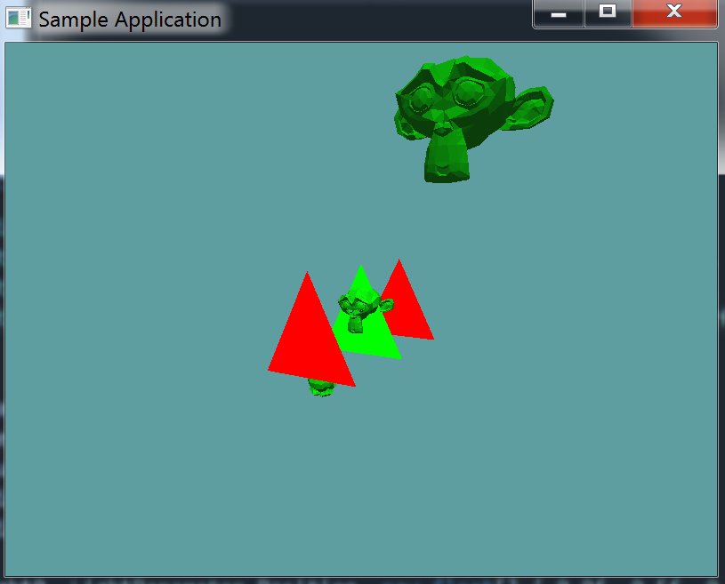

#Triangle model collision

At this point you should have enough practice with the collision test methods to implement this one without any help. I'm only going to provide the unit test for this.

## On Your Own

Add the following function to the ```Collisions``` class:

```cs
// Conveniance function
public static bool Intersects(OBJ model, Triangle triangle) {
    return Intersects(triangle, model);
}


public static bool Intersects(Triangle triangle, OBJ model) {
    // TODO: Implement this one!
}
```

And provide an implementation for it!

### Unit Test

You can [Download](../Samples/3DModels.rar) the samples for this chapter to see if your result looks like the unit test.

This unit test is visual only, make sure your project looks like the screenshot. Pay special attention to the triangle colors, green means there was a collision, red means there was not!



```cs
using OpenTK.Graphics.OpenGL;
using Math_Implementation;
using CollisionDetectionSelector.Primitives;
using CollisionDetectionSelector;

namespace CollisionDetectionSelector.Samples {
    class OBJTriangleIntersection : Application {
        OBJLoader loader = null;
        OBJ[] objs = new OBJ[] { null, null, null };

        Triangle[] tests = new Triangle[] {
            new Triangle(new Point(-2f, -2f, 0f), new Point(2f, -2f, 0f), new Point(0f, 2f, 0f)),
            new Triangle(new Point(-2f, -2f, 4f), new Point(2f, -2f, 4f), new Point(0f, 2f, 4f)),
            new Triangle(new Point(-2f, -2f, -4f), new Point(2f, -2f, -4f), new Point(0f, 2f, -4f)),
        };

        public override void Intialize(int width, int height) {
            GL.Enable(EnableCap.DepthTest);
            GL.Enable(EnableCap.CullFace);
            GL.Enable(EnableCap.Lighting);
            GL.Enable(EnableCap.Light0);

            GL.Light(LightName.Light0, LightParameter.Position, new float[] { 0.0f, 0.5f, 0.5f, 0.0f });
            GL.Light(LightName.Light0, LightParameter.Ambient, new float[] { 0f, 1f, 0f, 1f });
            GL.Light(LightName.Light0, LightParameter.Diffuse, new float[] { 0f, 1f, 0f, 1f });
            GL.Light(LightName.Light0, LightParameter.Specular, new float[] { 1f, 1f, 1f, 1f });

            loader = new OBJLoader("Assets/suzanne.obj");
            objs[0] = new OBJ(loader);
            objs[1] = new OBJ(loader);
            objs[2] = new OBJ(loader);

            objs[1].Position = new Vector3(6.0f, 6.0f, 6.0f);
            objs[1].Scale = new Vector3(1.5f, 1.5f, 1.5f);

            objs[2].Position = new Vector3(-6.0f, -6.0f, -6.0f);
            objs[1].Scale = new Vector3(1.5f, 1.5f, 1.5f);
            objs[2].Rotation = new Vector3(90.0f, 0.0f, 0.0f);
        }

        public override void Render() {
            GL.Disable(EnableCap.Lighting);
            base.Render();
            DrawOrigin();
            GL.Enable(EnableCap.Lighting);

            GL.Color3(0f, 0f, 1f);
            foreach (OBJ obj in objs) {
                obj.Render();
            }

            GL.Disable(EnableCap.Lighting);
            GL.Disable(EnableCap.CullFace);
            foreach (Triangle test in tests) {
                bool intersection = false;
                foreach (OBJ obj in objs) {
                    if (Collisions.Intersects(test, obj)) {
                        intersection = true;
                    }
                }
                if (intersection) {
                    GL.Color3(0f, 1f, 0f);
                }
                else {
                    GL.Color3(1f, 0f, 0f);
                }
                test.Render();
            }
            GL.Enable(EnableCap.CullFace);
            GL.Enable(EnableCap.Lighting);
        }
    }
}
```