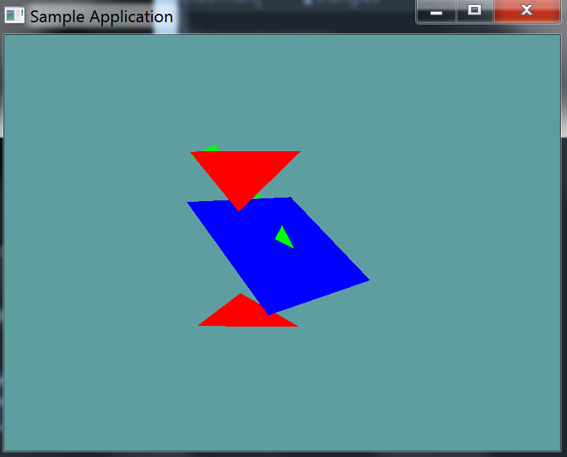

# Plane Triangle

Plane triangle intersections are fairly simple. There are two use cases

1. Use the dot-product to determine whether the triangle lies fully on one side of the plane and does not intersect the plane at all.
2. If there is an intersection, use a line-plane-intersection-algorithm for the two edges hitting the plane (algorithm on the same page)

Thats it. It's a lot like AABB-V-Plane, where we just tested if every point of the AABB was on the same side of the plane.

## The Algorithm

This one is fairly simple, i'm not going to provide an implementation for it. You need to test each point of the triangle against the plane, to see which side the points are on. 

You can use the ```DistanceFromPlane``` with each point, it will return a negative number, zero or a positive number.

* If all 3 distances are 0 (That is all 3 points are on the plane), there is a collision.
* If all 3 distances have the same sign (positive or negative) then there is no collision
* Otherwise there is a collision
  * This happens when at least one of the points is on the other side of the plan 

## On Your Own

Add the following function to the ```Collisions``` class:

```cs
public static bool Intersects(Triangle triangle, Plane plane)

public static bool Intersects(Plane plane, Triangle triangle) {
    return Intersects(triangle, plane);
}
```

And provide an implementation for it!

### Unit Test

You can [Download](../Samples/SAMPLE.rar) the samples for this chapter to see if your result looks like the unit test.

description of unit test



```cs
using OpenTK.Graphics.OpenGL;
using Math_Implementation;
using CollisionDetectionSelector.Primitives;

namespace CollisionDetectionSelector.Samples {
    class TrianglePlaneIntersection : Application {
        Plane plane = new Plane(new Point(5, 6, 7), new Point(6, 5, 4), new Point(1, 2, 3));
        Triangle[] triangles = new Primitives.Triangle[] {
            new Triangle(new Point(-1.0f, 5.0f, 0.0f), new Point(2.0f, 2.0f, -3.0f), new Point(5.0f, 5.0f, 0.0f)),
            new Triangle(new Point(-1, -1, 0), new Point(0, 1, 0), new Point(1, -1, 0)),
            new Triangle(new Point(-1.0f, -5.0f, 0.0f), new Point(2.0f, -2.0f, -3.0f), new Point(5.0f, -5.0f, 0.0f)),
            new Triangle(new Point(5, 6, 7), new Point(6, 5, 4), new Point(1, 2, 3)),
        };

        public override void Intialize(int width, int height) {
            GL.Enable(EnableCap.DepthTest);
            GL.PointSize(4f);
            GL.Disable(EnableCap.CullFace);

            bool[] expected = new bool[] { false, true, false, true };
            for (int i = 0; i < triangles.Length; ++i) {
                bool result = Collisions.Intersects(plane, triangles[i]);
                if (result != expected[i]) {
                    LogError("Expected triangle " + i + " to " +
                        (expected[i] ? " intersect" : " NOT intersect") +
                        " the plane");
                }
            }
        }

        public override void Render() {
            base.Render();
            DrawOrigin();

            GL.Color3(0.0f, 0.0f, 1.0f);
            plane.Render(4);

            foreach(Triangle triangle in triangles) {
                if (Collisions.Intersects(triangle, plane)) {
                    GL.Color3(0f, 1f, 0f);
                }
                else {
                    GL.Color3(1f, 0f, 0f);
                }
                triangle.Render();
            }
        }
    }
}
```