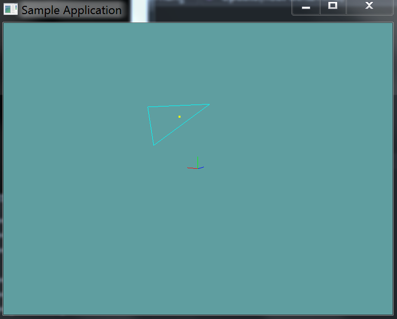
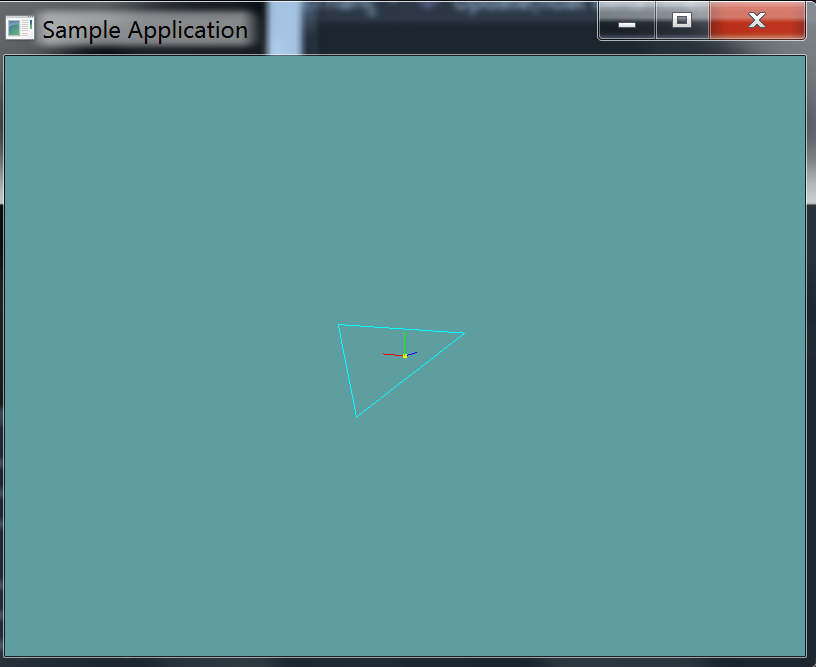
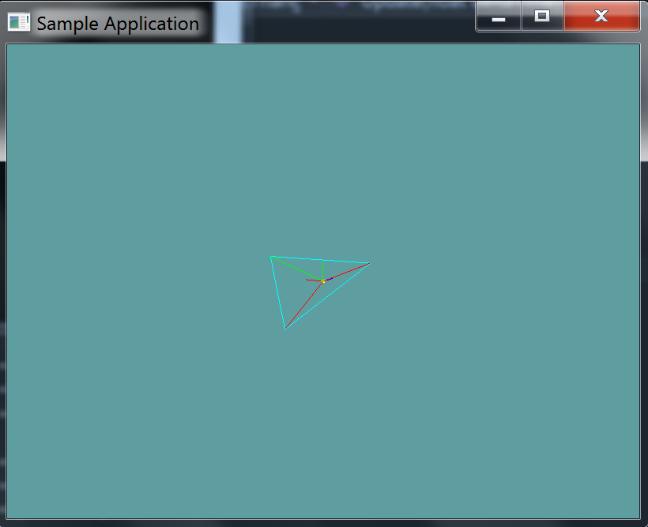
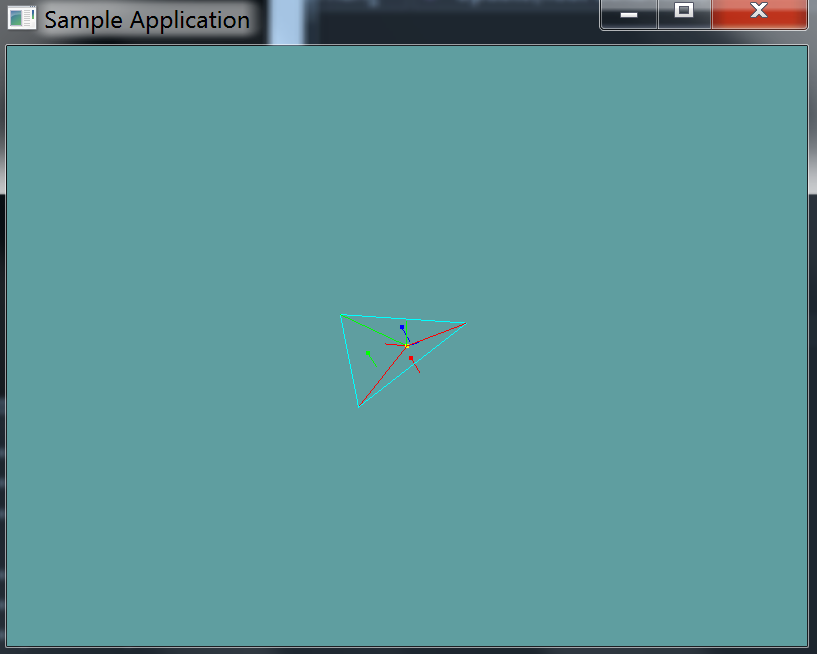
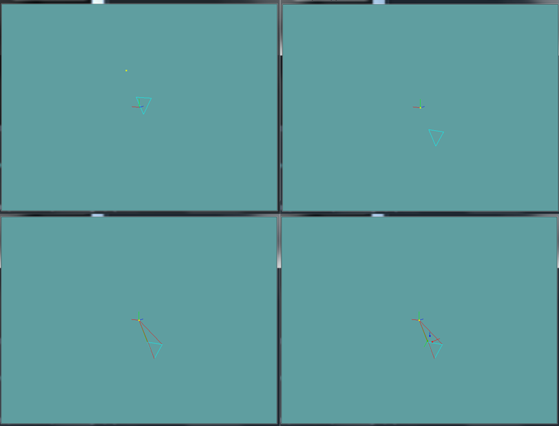

#Point in Triangle

## Same Side Test

The easyest way to test if a point is in a triangle is commonly refered to as the [Same Side](http://www.blackpawn.com/texts/pointinpoly/) technique. I suggest reading that article, only the Same Side portion, not the barycentric one. The only problem is, the method presented is a 2D method. In addition to the 3 side tests you must also check if the test point is on the plane formed by the triangle.

Given the above paragraph and the extra condition i gave you you could build a 3D point in triangle test, but it would be an expensive one. Instead, we can do the test much cheaper.

## Testing Normals

There is another intersection test we can perform, this one is easyer to read but harder to visualize. The first answer [Here](http://math.stackexchange.com/questions/51326/determining-if-an-arbitrary-point-lies-inside-a-triangle-defined-by-three-points) does a decent job of explaining the algorithm.

Given a triangle ABC and point P, we translate triangle ABC in a way that P lies on it's origin. The test now becomes checking if world origin is contained in the translated triangle (Still refered to as ABC).

P lies in the triangle ABC only if PAB, PBC and PCA are all clockwise, or counterclockwise. Because P is at the origin, this is now just a matter of checking cross products.

* Move the triangle so that the point becomes the triangle's origin space
* Create 3 new triangles between the triangle and the point (Making a pyramid)
* Check to see if all sides of the pyramid point in the same direction (Relative to world origin)

Let's see an example, we have a triangle and a point:



First, we translate the triangle so that the test point is it's origin:



Next we construct triangles PAB, PBC and PCA (You can only see the red and green ones, the blue one shares the same lines so it's not visible)



Now we check the normals of these 3 triangles



Because all of the normals are facing the same way, the triangles are wound the same. Because of this, the point is inside the triangle!

This is what the same steps look like when the point is not in a triangle:



Notice how the normals in the final image all face out!

## The Algorithm

All of the above might sound a bit complicated, but its all really simple. Consider the following pseudo-code:

```cs
bool PointInTriangle(Point p, Triangle t) {
  // Lets define some local variables, we can change these
  // without affecting the references passed in
  Vector3 p = point;
  Vector3 a = t.p0;
  Vector3 b = t.p1;
  Vector3 c = t.p2;
  
  // Move the triangle so that the point becomes the 
  // triangles origin
  a -= p;
  b -= p;
  c -=p;
  
  // The point should be moved too, so they are both
  // relative, but because we don't use p in the
  // equation anymore, we don't need it!
  // p -= p;
  
  // Compute the normal vectors for triangles:
  // u = normal of PBC
  // v = normal of PCA
  // w = normal of PAB
  
  Vector3 u = Cross(b, c);
  Vector3 v = Cross(c, a);
  Vector3 w = Cross(a, b);
  
  // Test to see if the normals are facing 
  // the same direction, return false if not
  if (Dot(u, v) < 0f) {
      return false;
  }
  if (dot(u, w) < 0.0f) {
      return false;
  }
  
  // All normals facing the same way, return true
  return true;
}
```

Using the dot product to check if two normals point the same way is standard. The only thing that might be confusing here is how we use the cross products to get a normal.

## On Your Own

Add the following function to the ```Collisions``` class:

```cs
public static bool PointInTriangle(Triangle triangle, Point point)
```

And provide an implementation for it!

### Unit Test

You can [Download](../Samples/3DModels.rar) the samples for this chapter to see if your result looks like the unit test.

This unit test will render a grid of points and a triangle. If any point is outside the triangle, it's red. Any point inside the triangle is green. If you have any errors in your collision code, the constructor will alert you.


```cs
using OpenTK.Graphics.OpenGL;
using Math_Implementation;
using CollisionDetectionSelector.Primitives;

namespace CollisionDetectionSelector.Samples {
    class PointInTriangle : Application {
        protected Point[] points = null;

        Triangle triangle = new Triangle(new Point(-1.0f, 1.0f, 1.0f), new Point(0.0f, -1.0f, 1.0f), new Point(1.0f, 1.0f, 1.0f));

        public override void Intialize(int width, int height) {
            GL.Enable(EnableCap.DepthTest);
            GL.PointSize(4f);
            GL.Disable(EnableCap.CullFace);
            GL.PolygonMode(MaterialFace.FrontAndBack, PolygonMode.Line);

            int i_min = -2;
            int i_max = 3;
            int j_min = -2;
            int j_max = 3;
            int k_min = -1;
            int k_max = 3;

            int indexer = 0;
            for (int i = i_min; i < i_max; ++i) {
                for (int j = j_min; j < j_max; ++j) {
                    for (int k = k_min; k < k_max; ++k) {
                        indexer++;
                    }
                }
            }

            points = new Point[indexer + 3];
            indexer = 0;

            for (int i = i_min; i < i_max; ++i) {
                for (int j = j_min; j < j_max; ++j) {
                    for (int k = k_min; k < k_max; ++k) {
                        points[indexer++] = new Point(i, j, k);
                    }
                }
            }

            points[indexer++] = new Point(0.5f, 0.5f, 1f);
            points[indexer++] = new Point(0.5f, -0.25f, 1f);
            points[indexer++] = new Point(-0.25f, -0.25f, 1f);


            int[] colliding = new int[] { 34, 46, 50, 54, 74, 100, 102 };
            int col_index = 0;

            for (int i = 0; i < points.Length; ++i) {
                if (col_index < colliding.Length && i == colliding[col_index]) {
                    if (!Collisions.PointInTriangle(triangle, points[i])) {
                        LogError("point " + i + " SHOULD be colliding!");
                    }

                    col_index++;
                }
                else {
                    if (Collisions.PointInTriangle(triangle, points[i])) {
                        LogError("point " + i + " should NOT be colliding!");
                    }
                }
            }
        }

        public override void Render() {
            base.Render();
            DrawOrigin();

            GL.Color3(0.0f, 0.0f, 1.0f);
            triangle.Render();

            foreach(Point point in points) {
                if (Collisions.PointInTriangle(triangle, point)) {
                    GL.Color3(0.0f, 1.0f, 0.0f);
                }
                else {
                    GL.Color3(1.0f, 0.0f, 0.0f);
                }

                point.Render();
            }
        }
    }
}
```
