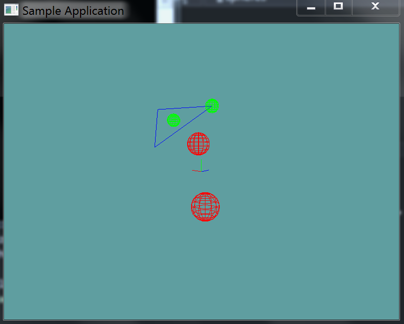

# Sphere triangle test

Testing for the intersection of a sphere and a trianlge is amazingly simple. Get the closest point on the triangle to the center of the sphere. Check the distance (squared) between the center of the sphere and this point. If the distance is less than the sphere's radius (squared), then there is a collision.

## The Algorithm

This one is so simple, i'm not going to be providing sample code for it. 

## On Your Own

Add the following function to the ```Collisions``` class:

```cs
// TODO: Implement this function
public static bool Intersects(Triangle triangle, Sphere sphere)

// This is just a conveniance function
public static bool Intersects(Sphere sphere, Triangle triangle) {
    return Intersects(triangle, sphere);
}
```

And provide an implementation for it!

### Unit Test

You can [Download](../Samples/3DModels.rar) the samples for this chapter to see if your result looks like the unit test.

This unit test will print errors if your collision code is off. Any sphere that intersects the triangle is rendered in green. All other spheres are rendered in red.



```cs
using OpenTK.Graphics.OpenGL;
using Math_Implementation;
using CollisionDetectionSelector.Primitives;

namespace CollisionDetectionSelector.Samples {
    class TriangleSphereIntersection : Application {
        Sphere[] spheres = new Sphere[] {
            new Sphere(new Point(2, 4, -1), 0.5f),
            new Sphere(new Point(-1.0f, 5.0f, 0.0f), 0.5f),
            new Sphere(new Point(2f, 2f, 2f), 1f),
            new Sphere(new Point(-2f, -2f, -2f), 1f)
        };

        Triangle triangle = new Triangle(new Point(-1.0f, 5.0f, 0.0f), new Point(2.0f, 2.0f, -3.0f), new Point(5.0f, 5.0f, 0.0f));

        public override void Intialize(int width, int height) {
            GL.Enable(EnableCap.DepthTest);
            GL.PointSize(4f);
            GL.Disable(EnableCap.CullFace);
            GL.PolygonMode(MaterialFace.FrontAndBack, PolygonMode.Line);

            bool[] expected = new bool[] { true, true, false, false };
            for (int i = 0; i < spheres.Length; ++i) {
                bool result = Collisions.Intersects(triangle, spheres[i]);
                if (result != expected[i]) {
                    LogError("Expected sphere " + i + " to " +
                        (expected[i] ? " intersect" : " NOT intersect") +
                        " the triangle");
                }
            }
        }

        public override void Render() {
            base.Render();
            DrawOrigin();

            GL.Color3(0.0f, 0.0f, 1.0f);
            triangle.Render();

            foreach(Sphere sphere in spheres) {
                if (Collisions.Intersects(triangle, sphere)) {
                    GL.Color3(0f, 1f, 0f);
                }
                else {
                    GL.Color3(1f, 0f, 0f);
                }
                sphere.Render();
            }
        }
    }
}
```