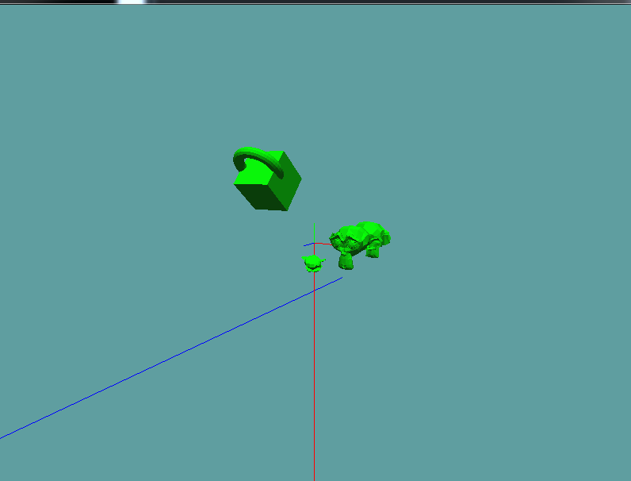

# Scene

Currently we have everything set up to create a transform hierarchy, but not a scene. A transform hierarchy is just a part of a scene. The scene provides a single interface for managing this crazy hierarchy. Let's make a new ```Scene``` class and implement a basic scene that will render it's transform hierarchy and perform a ray cast on it.

```cs
using OpenTK.Graphics.OpenGL;
using System.Collections.Generic;
using Math_Implementation;
using CollisionDetectionSelector.Primitives;

namespace CollisionDetectionSelector {
    class Scene {
        public OBJ RootObject = new OBJ(null);

        public void Render() {
            RootObject.Render();
        }

        public OBJ Raycast(Ray ray, out float t) {
            return RecursiveRaycast(RootObject, ray, out t);
        }

        public OBJ Raycast(Ray ray) {
            float t = 0.0f;
            return RecursiveRaycast(RootObject, ray, out t);
        }
}
```

We have a null object at the root of the scne. This is conveniant because now every single object will form a tree. The rendering function is fairly straight forward,  Because ```OBJ.Render``` is already recursive, so we just call it on the root object.

Raycast however, we are not so lucky with. Implement the 

```cs
protected OBJ RecursiveRaycast(OBJ current, Ray ray, out float t) {
 ```
 
helper function on your own. It should perform a ray cast against the current Obj being passed in. If the result of that ray cast is true, return the ```OBJ```. If the result of that ray cast is false, recursively call this function on all children of the ```OBJ```. If any of the children hit something, return the ```OBJ``` which was hit. If nothing was hit, return ```null```;
 
 We're going to have to modify the raycast obj function, in Collisions.cs, this one:
 
 ```cs
  public static bool Raycast(Ray ray, OBJ model, out float t) {
```

Change the function so it first checks if the model is empty ```model.IsEmpty```, if it is, set t to -1 and return false by default.

## Test it out!

It's time to test out your work. Use the following unit test code:

```cs
using OpenTK.Graphics.OpenGL;
using Math_Implementation;
using CollisionDetectionSelector.Primitives;
using CollisionDetectionSelector;

namespace CollisionDetectionSelector.Samples {
    class SceneSample01 : Application {
        Scene scene = new Scene();
        OBJ cubeNode = null;

        OBJLoader suzane = null;
        OBJLoader cube = null;
        OBJLoader torus = null;

        Ray[] rays = new Ray[] {
            new Ray(new Point(0.0f, 0.0f, 0.0f), new Vector3(0.0f, -1.0f, 0.0f)),
            new Ray(new Point(-1f, -3f, -5f), new Vector3(0f, 0f, 1f))
        };

        public override void Intialize(int width, int height) {
            GL.Enable(EnableCap.DepthTest);
            GL.Enable(EnableCap.CullFace);
            GL.Enable(EnableCap.Lighting);
            GL.Enable(EnableCap.Light0);
            GL.PointSize(5f);

            GL.Light(LightName.Light0, LightParameter.Position, new float[] { 0.0f, 0.5f, 0.5f, 0.0f });
            GL.Light(LightName.Light0, LightParameter.Ambient, new float[] { 0f, 1f, 0f, 1f });
            GL.Light(LightName.Light0, LightParameter.Diffuse, new float[] { 0f, 1f, 0f, 1f });
            GL.Light(LightName.Light0, LightParameter.Specular, new float[] { 1f, 1f, 1f, 1f });

            suzane = new OBJLoader("Assets/suzanne.obj");
            cube = new OBJLoader("Assets/cube.obj");
            torus = new OBJLoader("Assets/torus.obj");

            OBJ node = new OBJ(suzane);
            node.Parent = scene.RootObject;
            node.Parent.Children.Add(node);
            node.Position = new Vector3(2.0f, 0.0f, 0.0f);

            node = new OBJ(suzane);
            node.Parent = scene.RootObject.Children[0]; // suzane reference
            node.Parent.Children.Add(node);
            node.Position = new Vector3(-2.0f, -1.0f, 0.0f);
            node.Scale = new Vector3(0.5f, 0.5f, 0.5f);
            node.Rotation = new Vector3(90.0f, 0f, 0f);

            node = new OBJ(suzane);
            node.Parent = scene.RootObject.Children[0]; // suzane reference
            node.Parent.Children.Add(node);
            node.Position = new Vector3(0.0f, 0.0f, -2.0f);
            node.Rotation = new Vector3(0f, 180f, 0f);

            node = new OBJ(cube);
            node.Parent = scene.RootObject;
            node.Parent.Children.Add(node);
            node.Position = new Vector3(-2.0f, 3.0f, 1.0f);
            node.Rotation = new Vector3(45.0f, 0.0f, 0.0f);
            cubeNode = node;

            node = new OBJ(torus);
            node.Parent = cubeNode;
            node.Parent.Children.Add(node);
            node.Position = new Vector3(0.0f, 0.0f, -1.0f);

            bool[]  b_res = new bool[] { true, false };
            float[] t_res = new float[] { 2.730469f, 0f } ;

            float t = 0.0f;
            for (int i = 0; i < rays.Length; ++i) {
                bool result = scene.Raycast(rays[i], out t) != null;
                if (result != b_res[i]) {
                    System.Console.WriteLine("ray " + i + ", expected: " + b_res[i].ToString() + ", got: " + result.ToString());
                }
                if (!CMP(t, t_res[i])) {
                    System.Console.WriteLine("ray " + i + "t, expected: " + t_res[i].ToString() + ", got: " + t.ToString());
                }
            }
        }

        bool CMP(float x, float y) {
            return System.Math.Abs(x - y) < 0.00001f;
        }

        public override void Render() {
            base.Render();
            DrawOrigin();

            GL.Enable(EnableCap.Lighting);
            scene.Render();
            GL.Disable(EnableCap.Lighting);

            foreach (Ray r in rays) {
                if (scene.Raycast(r) != null) {
                    GL.Color3(1f, 0f, 0f);
                }
                else {
                    GL.Color3(0f, 0f, 1f);
                }
                r.Render();
            }
        }

        public override void Update(float deltaTime) {
            base.Update(deltaTime);
            Vector3 cubeRotation = cubeNode.Rotation;
            cubeRotation.X += 45.0f * deltaTime;
            cubeNode.Rotation = cubeRotation;
        }
    }
}
```

Your final scene should look like this, with the cube and torus rotating:


