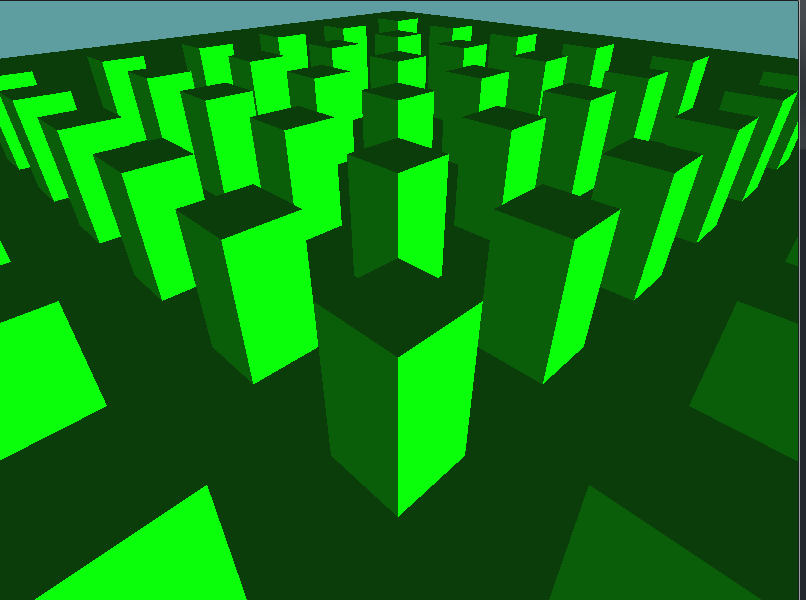
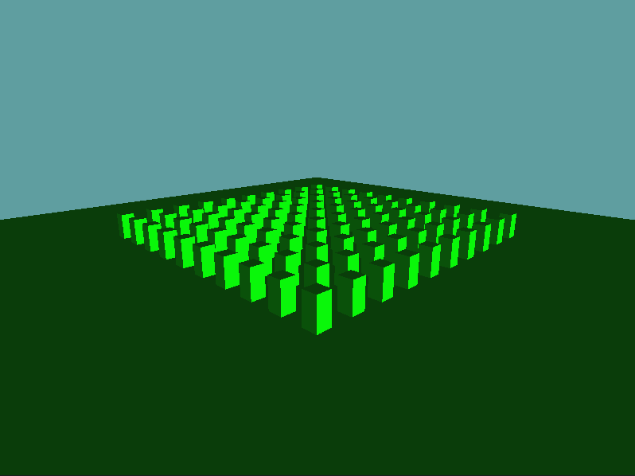

# Camera

So far, we've set the view matrix of every example scene manually. Now, it's time to implement a camera! We're going to implement a mouse controlled editor camera. Our controls are going to be:

* Left click + Drag - Move the camera around
* Right click + Drag - Rotate the camera around
* Mouse wheel - Zoom the camera in and out 

## Getting Ready

Let's set up a quick scene before we do anything

```cs
using OpenTK.Graphics.OpenGL;
using Math_Implementation;
using CollisionDetectionSelector.Primitives;
using CollisionDetectionSelector;

namespace CollisionDetectionSelector.Samples {
    class CameraSample : Application {
        Scene scene = new Scene();
        OBJLoader cube = null;

        void AddCubeToSceneRoot(Vector3 position, Vector3 scale) {
            scene.RootObject.Children.Add(new OBJ(cube));
            int count = scene.RootObject.Children.Count - 1;
            scene.RootObject.Children[count].Parent = scene.RootObject;
            scene.RootObject.Children[count].Position = position;
            scene.RootObject.Children[count].Scale = scale;
        }

        public override void Intialize(int width, int height) {
            GL.Enable(EnableCap.DepthTest);
            GL.Enable(EnableCap.Lighting);
            GL.Enable(EnableCap.Light0);
            GL.PointSize(5f);

            GL.Light(LightName.Light0, LightParameter.Position, new float[] { 0.5f, -0.5f, 0.5f, 0.0f });
            GL.Light(LightName.Light0, LightParameter.Ambient, new float[] { 0f, 1f, 0f, 1f });
            GL.Light(LightName.Light0, LightParameter.Diffuse, new float[] { 0f, 1f, 0f, 1f });
            GL.Light(LightName.Light0, LightParameter.Specular, new float[] { 1f, 1f, 1f, 1f });

            scene.Initialize(7f);
            cube = new OBJLoader("Assets/cube.obj");

            AddCubeToSceneRoot(new Vector3(0.0f, 0.0f, 0.0f), new Vector3(50.0f, 1.0f, 50.0f));
            for (int i = 0; i < 10; ++i) {
                for (int j = 0; j < 10; ++j) {
                    AddCubeToSceneRoot(new Vector3(25 - i * 5, 0.0f, 25 - j * 5), new Vector3(1.0f, 5.0f, 1.0f));
                }
            }
        }

        public override void Render() {
            Matrix4 viewMat = Matrix4.LookAt(new Vector3(10, 10, 10), new Vector3(0, 0, 0), new Vector3(0, 1, 0));
            GL.LoadMatrix(viewMat.OpenGL);
            DrawOrigin();

            GL.Enable(EnableCap.Lighting);
            scene.Render(false);
            GL.Disable(EnableCap.Lighting);
        }
    }
}
```

This is a simple scene with a bunch of cubes, should look like this when you run the app



## The Algorithm

Now it's time to implement the basic camera class. Make a new __Camera.cs__ file. I'll provide the skeleton here, and there will be a TODO after the code.


```cs
using System;
using OpenTK.Graphics.OpenGL;
using Math_Implementation;

namespace CollisionDetectionSelector.Primitives {
    class Camera {
        // Members to hold the position & orientation of the camera
        protected Vector3 position = new Vector3(0f, 0f, 0f);
        protected Vector3 forward = new Vector3(0f, 0f, 1f);
        protected Vector3 right = new Vector3(1f, 0f, 0f);
        protected Vector3 up = new Vector3(0f, 1f, 0f);
        
        // Cached matrices to avoid work every frame
        protected bool worldDirty = true;
        protected bool viewDirty = true;
        protected Matrix4 cachedWorld = new Matrix4();
        protected Matrix4 cachedView = new Matrix4();

        public Matrix4 Translation {
            get {
                // TODO: Return a translation matrix!
            }
        }

        public Matrix4 Orientation {
            get {
                // TODO: Return an orientation matrix
                // based on forward, right and up!
            }
        }
        
        // The World matrix is a combination of the translation and orientation matrices
        public Matrix4 WorldMatrix
        {
            get
            {
                if (worldDirty) {
                    // Remember, POST MULTIPLICATION!
                    // That means rotate first, translate second!
                    cachedWorld = Translation * Orientation;
                }
                worldDirty = false;
                return cachedWorld;
            }
        }

        // The view is just the inverse of the world matrix.
        public Matrix4 ViewMatrix
        {
            get
            {
                if (viewDirty) {
                    cachedView = Matrix4.Inverse(WorldMatrix);
                }
                viewDirty = false;
                return cachedView;
            }
        }

        // Read Only Position
        public Point Position {
            get {
                return new Point(position.X, position.Y, position.Z);
            }
        }

        // Read only forward
        public Vector3 Forward {
            get {
                return new Vector3(forward.X, forward.Y, forward.Z);
            }
        }

        // Read only right
        public Vector3 Right {
            get {
                return new Vector3(right.X, right.Y, right.Z);
            }
        }
        
        // Read only up
        public Vector3 Up {
            get {
                return new Vector3(up.X, up.Y, up.Z);
            }
        }
        
        // Does the same thing that Matrix4.LookAt does
        public void LookAt(Vector3 camPosition, Vector3 camTarget, Vector3 camUp) {
            worldDirty = true;
            viewDirty = true;

            forward = Vector3.Normalize(camTarget - camPosition);
            right = Vector3.Normalize(Vector3.Cross(forward, camUp));
            up = Vector3.Cross(right, forward);

            // Set to a copy, not a reference!
            position = new Vector3(camPosition.X, camPosition.Y, camPosition.Z);
        }
    }
}
```

There are two TODO's in this code. First, you have to create a translation matrix based on the position of the camera. This should be fairly simple.

Next, you must return a new orientation matrix. This one might be a little harder. You should be hand-filling in the elements of the matrix. Remember, the upper 3x3 matrix is the rotation matrix. Within the upper 3x3 matrix, each column is a basis vector. The X axis for example is the right vector. Also, becuase this is OpenGL, and we are in a right-handed coordinate system, you have to negate the forward basis when constructing the matrix.

Add the following unit test code to the end of the scene class (```CameraSample```) Initialize function

```cs
// Set the camera look at!
            camera.LookAt(new Vector3(50.0f, 20.0f, 50.0f), new Vector3(0.0f, 0.0f, 0.0f), new Vector3(0.0f, 1.0f, 0.0f));

            // Unit tests!
            Matrix4 expectedTrans = new Matrix4();
            expectedTrans[0, 3] = expectedTrans[2, 3] = 50f;
            expectedTrans[1, 3] = 20f;
            if (expectedTrans != camera.Translation) {
                System.Console.WriteLine("Error! Translation matrix is wrong!");
            }

            Matrix4 expectedRot = new Matrix4();
            expectedRot[0, 0] = 0.7071068f;
            expectedRot[2, 0] = -expectedRot[0, 0];
            expectedRot[1, 1] = 0.9622504f;
            expectedRot[2, 2] = expectedRot[0, 2] = 0.6804138f;
            expectedRot[0, 1] = expectedRot[2, 1] = -0.1924501f;
            expectedRot[1, 2] = 0.2721655f;
            if (expectedRot != camera.Orientation) {
                System.Console.WriteLine("Error! Rotation matrix is wrong!");
            }

            Matrix4 camView = camera.ViewMatrix;
            Matrix4 matView = Matrix4.LookAt(new Vector3(50, 20, 50), new Vector3(0, 0, 0), new Vector3(0, 1, 0));
            if (camView != matView) {
                System.Console.WriteLine("ERROR! expected camera and matrix view's to be the same!");
            }
```

And change the render function to use the cameras matrix:

```cs
        public override void Render() {
            GL.LoadMatrix(camera.ViewMatrix.OpenGL);
            DrawOrigin();

            GL.Enable(EnableCap.Lighting);
            scene.Render(false);
            GL.Disable(EnableCap.Lighting);
        }
```

If no errors are thrown, your scene should have a slightly different perspective and look like this:



## Interaction

Finally, lets make the camera interactive! There are 3 key motions that the camera will need to do. The left mouse button will __Pan__, the middle mouse wheel will __Zoom__ and the right mouse button will __Pivot__. With that estabolished, add the following functions to the __Camera__ class.

```cs
public void Pan(float horizontal, float vertical) {
    worldDirty = true;
    viewDirty = true;
    // TODO: Implement
}

public void Zoom(float value) {
    worldDirty = true;
    viewDirty = true;
    // TODO: Implement
}

public void Pivot(float yaw, float pitch) {
    worldDirty = true;
    viewDirty = true;
    // TODO: Implement
}
```

Before we implement anything, let's add the code to ```CameraSample``` that calls these methods. That way you can test one method as a time as you are implementing each. Add the following ```Update``` method to the ```CameraSample``` scene:

```cs
public override void Update(float deltaTime) {
    float xDelta = (float)Window.Mouse.XDelta / (float)Window.Width;
    float yDelta = (float)Window.Mouse.YDelta / (float)Window.Height;
    float zoom = (float)Window.Mouse.WheelDelta;

    if (Window.Mouse[OpenTK.Input.MouseButton.Left]) {
        if (xDelta != 0.0f || yDelta != 0.0f) {
            float xPan = xDelta * deltaTime * -900.0f;
            float yPan = yDelta * deltaTime * 900.0f;
            camera.Pan(xPan, yPan);
        }
    }

    if (zoom != 0) {
        zoom = zoom < 0 ? -1f : zoom;
        zoom = zoom > 0 ? 1f : zoom;
        camera.Zoom(zoom * deltaTime * 50.0f);
    }

    if (Window.Mouse[OpenTK.Input.MouseButton.Right]) {
        if (xDelta != 0.0f || yDelta != 0.0f) {
            float xPan = xDelta * deltaTime * -900.0f;
            float yPan = yDelta * deltaTime * 900.0f;
            camera.Pivot(xPan, yPan);
        }
    }
}
```

### Implement Pan

Pan is simple. You have to modify the position vector. Basically, any horizontal movement will modify the horizontal vector along the right normal by that amount. Any vertical movement should modify the position vector along the up normal by that amount. If this is confusing (I can't think of a better way to explain it) talk to me.

### Implement zoom

Zoom works the same way pan does. But, instead of moving on the right or up normals, zoom works along the forward normal

### Implement Pivot

Pivot is by far the hardest camera transform we have to do. But, we can make it happen. The key is, there are actually two pivots happening. One about the yaw and one about the pitch.