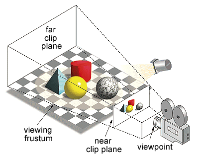

# Frustum

The frustum structure is actually an acceleration structure. It's a primitive shape (Like an AABB or any other primitive). A frustum structure is usually built out of a view matrix as a series of 6 planes.



## The Algorithm

If this all sounds a bit familiar, it should. We have actually done this exact same thing when we [made a frustum in OpenGL](https://gdbooks.gitbooks.io/legacyopengl/content/Chapter8/frustum.html).

To recap, the plane equation is

```cs
a * x + b * y + c * z + d = 0
```

## On Your Own

Add the ```Frustum``` getter to the ```Camera``` class

```cs
public Plane[] Frustum {
    get {
        Plane[] frustum = new Plane[6];

        // TODO: Populate all 6 planes

        return frustum;
    }
}
```

And provide an implementation for it!

### Unit Test

You can [Download](../Samples/SAMPLE.rar) the samples for this chapter to see if your result looks like the unit test.

description of unit test


```cs
code
```