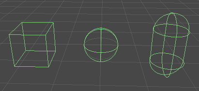
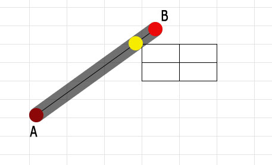

#Capsule



The basic collider types for any game are usually AABB, Sphere and Capsule. We use capsules because they can closly fit a human body.

So, what do you need to know about a capsule? It's basically a line with an infinate number of circles on it!



A capsule has a start point, end point and a radius.

```cs
class Capsule {
  Point start;
  Point end;
  float radius;
}
```

To test collision against a capsule, you must find the closest point to it's line segment to whatever it is you are testing, then construct a spehre at that point. Then it becomes a whatever / sphere test.