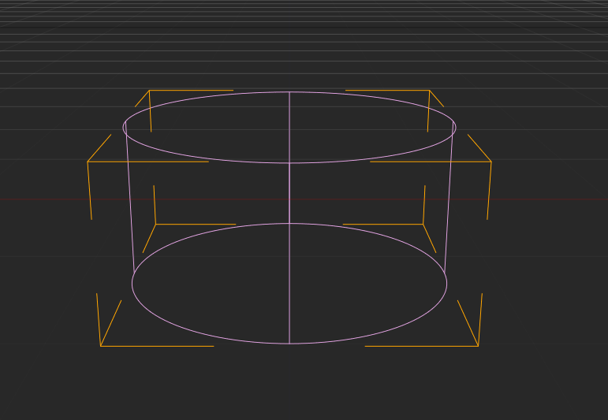

#Cylinder

A cylinder is like a capsule, but without the caps.

There is usually nothing that this collider is too great for. If you need a cylinder shaped collider, you are better off just using a cylinder shaped mesh.

