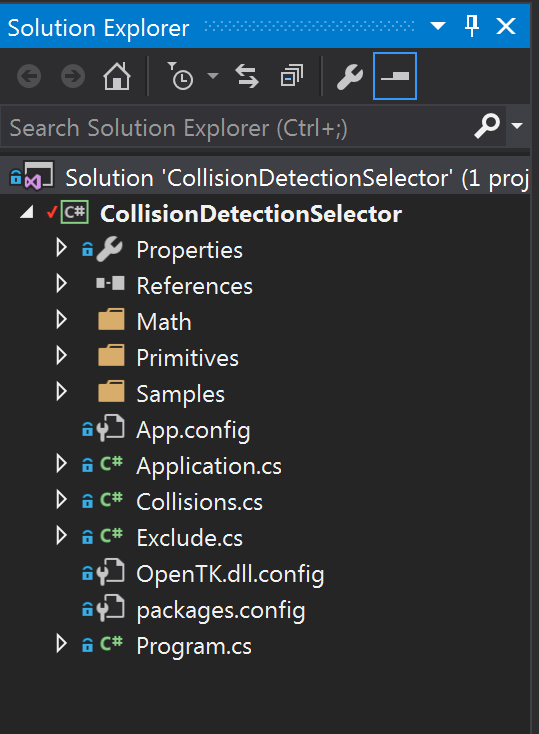

#Intermission

This is a good stopping point to stop and reflect on your code-base. Make any changes that you feel are necessary for moving forward, then proceed. Iteration and reflection like this is key to writing clean, well organized code.

## Application Behaviours

One of the things that bothers me is that all of our sample code contains a lot of copy/paste code. So i want to move a lot of that into the base ```Application``` class. The things i really want to move are: Rendering the origin, resizing the window and making the camera rotate. 

Additionally, the unit tests write red text constantly, i want to add a LogError function to make writing unit tests less verbose.

We have to move this functionality into the ```Application``` class without breaking the existing samples. I propose we just copy / paste the code into the implementation of the base class, with new variable names. 

This way, new functions can call the inherited base class functions to do what we want them to, but because old code doesn't call the base functions (for example, ```base.Update(dt);```) it will not be affected.

The new ```Application``` class becomes:

```cs
using System;
using OpenTK;
using System.Drawing;
using OpenTK.Graphics.OpenGL;

// Lives in global namespace
public class Application {
    // We need to fully scope Math_Implementation.Vector3
    // because a Vector3 class exists in the OpenTK namespace
    private Math_Implementation.Vector3 _baseCameraAngle = 
        new Math_Implementation.Vector3(120.0f, -10f, 20.0f);
    private float _baseRads = (float)(System.Math.PI / 180.0f);

    public static Application Instance {
        get; private set;
    }

    public OpenTK.GameWindow Window = null;

    public Application() {
        Instance = this;
    }

    #region Common methods
    public void LogError(string error) {
        Console.ForegroundColor = ConsoleColor.Red;
        Console.WriteLine("Error: " + error);
        Console.ResetColor();
    }
    
    public void DrawOrigin() {
        GL.Begin(PrimitiveType.Lines);
        GL.Color3(1f, 0f, 0f);
        GL.Vertex3(0f, 0f, 0f);
        GL.Vertex3(1f, 0f, 0f);
        GL.Color3(0f, 1f, 0f);
        GL.Vertex3(0f, 0f, 0f);
        GL.Vertex3(0f, 1f, 0f);
        GL.Color3(0f, 0f, 1f);
        GL.Vertex3(0f, 0f, 0f);
        GL.Vertex3(0f, 0f, 1f);
        GL.End();
    }
    #endregion

    /// These are the logic driving functions that classes whom subclass application
    /// will need to override. There is no need to call the base versions!
    #region Inheritable Logic
    public virtual void Intialize(int width, int height) {

    }

    // Has a default implementation, making the need to override in child
    // classes purley optional
    public virtual void Resize(int width, int height) {
        GL.Viewport(0, 0, width, height);
        GL.MatrixMode(MatrixMode.Projection);
        float aspect = (float)width / (float)height;
        Math_Implementation.Matrix4 perspective =
            Math_Implementation.Matrix4.Perspective(60, aspect, 0.01f, 1000.0f);
        GL.LoadMatrix(Math_Implementation.Matrix4.Transpose(perspective).Matrix);
        GL.MatrixMode(MatrixMode.Modelview);
        GL.LoadIdentity();
    }

    // If the example wants a default rotating camera, it needs to call base.Update();
    public virtual void Update(float deltaTime) {
        _baseCameraAngle.X += 45.0f * deltaTime;
    }

    // If the example wants a default rotating camera, it needs to call base.Render();
    public virtual void Render() {
        // Again, Vector3 and Matrix4 must be fully scoped, because
        // the OpenTK namespace contains both classes already
        Math_Implementation.Vector3 eyePos = new Math_Implementation.Vector3();
        eyePos.X = _baseCameraAngle.Z * -(float)System.Math.Sin(_baseCameraAngle.X * _baseRads * (float)System.Math.Cos(_baseCameraAngle.Y * _baseRads));
        eyePos.Y = _baseCameraAngle.Z * -(float)System.Math.Sin(_baseCameraAngle.Y * _baseRads);
        eyePos.Z = -_baseCameraAngle.Z * (float)System.Math.Cos(_baseCameraAngle.X * _baseRads * (float)System.Math.Cos(_baseCameraAngle.Y * _baseRads));

        Math_Implementation.Matrix4 lookAt = 
            Math_Implementation.Matrix4.LookAt(eyePos, 
            new Math_Implementation.Vector3(0.0f, 0.0f, 0.0f), 
            new Math_Implementation.Vector3(0.0f, 1.0f, 0.0f));
        GL.LoadMatrix(Math_Implementation.Matrix4.Transpose(lookAt).Matrix);
    }

    public virtual void Shutdown() {

    }
    #endregion

    /// Entery point of the application, by default it creates a new window
    /// Your subclasses should not have to override this, but if you want a
    /// sample that does not have a window, you need to. 
    #region Entery Point
    public virtual void Main(string[] args) {
        Window = new OpenTK.GameWindow();
        Window.Load += new EventHandler<EventArgs>(OpenTKInitialize);
        Window.UpdateFrame += new EventHandler<FrameEventArgs>(OpenTKUpdate);
        Window.RenderFrame += new EventHandler<FrameEventArgs>(OpenTKRender);
        Window.Unload += new EventHandler<EventArgs>(OpenTKShutdown);

        Window.Title = "Sample Application";
        Window.ClientSize = new System.Drawing.Size(800, 600);
        Instance.Resize(800, 600);
        Window.VSync = VSyncMode.On;
        Window.Run(60.0f);

        Window.Dispose();
    }
    #endregion

    /// If the default entery point (Main function) is used, these are the OpenTK callbacks
    /// Which are issued, they in turn call member functions that subclasses need to override
    #region OpenTK Callbacks
    protected void OpenTKInitialize(object sender, EventArgs e) {
        Console.Clear();
        Console.ForegroundColor = ConsoleColor.DarkGray;
        Console.WriteLine("OpenGL Vendor: " + GL.GetString(StringName.Vendor));
        Console.WriteLine("OpenGL Renderer: " + GL.GetString(StringName.Renderer));
        Console.WriteLine("OpenGL Version: " + GL.GetString(StringName.Version));
        Console.ResetColor();
        Instance.Intialize(800, 600);
    }

    protected void OpenTKUpdate(object sender, FrameEventArgs e) {
        float dTime = (float)e.Time;
        Instance.Update(dTime);
    }

    protected void OpenTKRender(object sender, FrameEventArgs e) {
        GL.ClearColor(Color.CadetBlue);
        GL.Clear(ClearBufferMask.ColorBufferBit | ClearBufferMask.DepthBufferBit | ClearBufferMask.StencilBufferBit);
        Instance.Render();
        Window.SwapBuffers();
    }

    protected void OpenTKShutdown(object sender, EventArgs e) {
        Instance.Shutdown();
    }

    protected void OpenTKResize(EventArgs e) {
        Instance.Resize(Instance.Window.Width, Instance.Window.Height);
    }
    #endregion
}
```

## Collision Handling Code

I noticed you have different files to handle different collision types:

* AABBCollisions.cs
* PlaneCollision.cs
* SphereCollisions.cs

I only have 1 file

* Collisions.cs

And it only contains 1 class named ```Collisions```, this is where i put all my collision functions.

I'm not saying you need to change anything, you should proceed with whatever method makes more sense to you! I just wanted to point out what my code is looking like. This is what my hierarchy is:



Take a minute, make sure your hierarchy is one you are happy with and that you are happy with how your code is formatted.